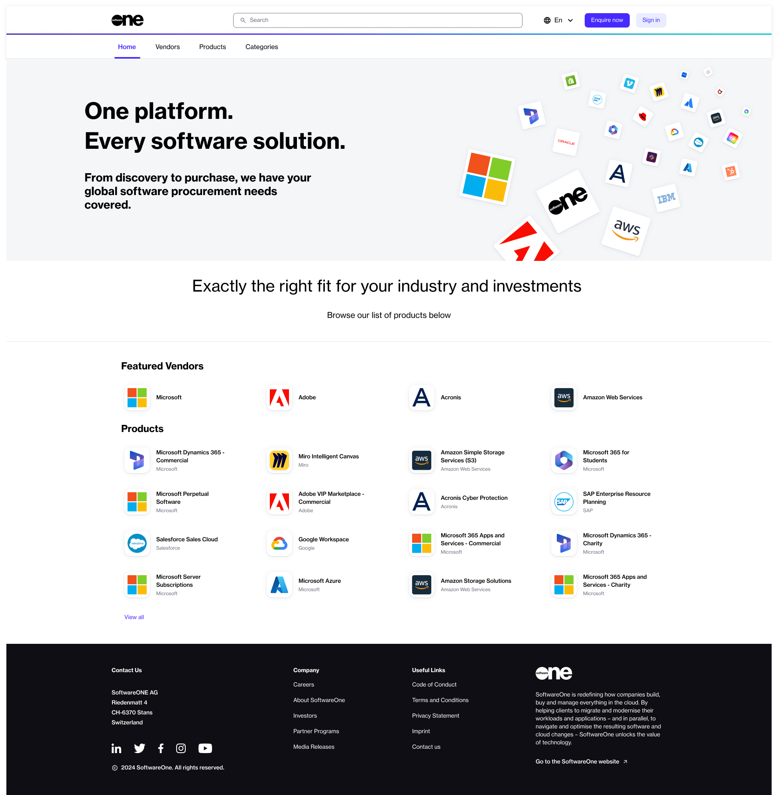

# Release Notes v4

**Release Date: 12 May 2025**

Our latest release, Marketplace Platform v4, is here. This release introduces several new features to enhance our platform's capabilities and improve existing functionalities.

## Enhanced Billing Management

In this release, we are introducing billing statements.

In addition to invoices, you'll now receive statements containing a detailed record of charges for the subscriptions in your agreement. Billing statements are provided in the XLSX format. Unlike invoice PDFs, which only contain a summary of charges, statements include a comprehensive breakdown of all charges. See [Understand Your Billing Documents](../../modules-and-features/marketplace/billing/understand-your-billing-documents.md) to learn more.

We've also updated the platform's navigation menu to include a new **Billing** module, making it easy for you to access your [statements](../../modules-and-features/marketplace/billing/statements.md).&#x20;

<figure><figcaption>
New Billing option in the navigation menu
</figcaption></figure>

## Support for AWS Extension

We are pleased to announce the launch of the AWS extension in the Marketplace. The extension allows you to purchase AWS services through the platform by creating new AWS accounts, connecting existing ones, or transferring entire AWS organizations.&#x20;

Features include monthly invoicing aligned with AWS billing cycles, flexible support options, including partner-led or AWS-resold for technical and billing queries, and a native spend management module for tracking your cloud consumption.&#x20;

Complete documentation on how to order AWS services will be available soon.

## SoftwareOne Cloud FinOps Integration

FinOps for Cloud is a new solution designed to help you optimize costs and manage your resources effectively.

<figure><figcaption>
FinOps for Cloud
</figcaption></figure>

With FinOps for Cloud, you can explore and analyze your cloud expenses, monitor resource usage, and implement policies to ensure efficient and cost-effective cloud management. With a user-friendly interface and robust features, the solution provides greater visibility and control over cloud infrastructure. To learn more, see [FinOps for Cloud](https://docs.finops.softwareone.com/).

## Improved Partner Management

We are excited to announce that we are integrating reseller capabilities into the Marketplace Platform, enabling clients and reseller partners to operate seamlessly within a single platform.&#x20;

As part of this release, existing partners will transition from the current Partner Portal to the Marketplace Platform. This migration will take place in phases to ensure a smooth transition and minimal disruption. New partners will now be onboarded directly into the Marketplace.&#x20;

In addition to all the existing functionalities, partners will also have access to specific features designed to support resale activities. These features include the ability to [Configure Licensees for Resale](../../marketplace-platform/getting-started/marketplace-for-partners/how-to-configure-licensees-for-resale.md), [View Vendor Programs](../../modules-and-features/marketplace/programs.md), [Add Certificates](../../modules-and-features/marketplace/certificates/add-certificate.md), and [Access Enrollments](../../modules-and-features/marketplace/enrollments/).

## Notifications Management

The new Notifications feature allows account administrators to configure and manage notification emails for their accounts.

<figure><figcaption>
Notifications page
</figcaption></figure>

Admins can set recipients for these emails and manage categories to start or stop receiving notifications. This feature is available under **Settings** in the main navigation menu. To learn more, see [Notifications](../../modules-and-features/settings/notifications/).

Individual users can also customize notification settings through their profile to determine what notifications to receive. See [Manage Notification Preferences](../../marketplace-platform/getting-started/interface/manage-notification-preferences.md) for details.

## Object Spotlight

The new **Spotlight** feature simplifies task management by highlighting key business objects that require your attention. These objects include your agreements, invoices, subscriptions, and more.

For instance, if there are saved orders in your account, those orders are spotlighted so you can manage them easily. Similarly, subscriptions that are nearing expiration are also shown so you can take timely action. To learn more, see [View Object Spotlight](../../marketplace-platform/getting-started/interface/view-pending-tasks.md).

You can find the **Spotlight** feature on the **Home** page, and it can also be accessed by selecting the spotlight icon  in the status bar.&#x20;

<figure><figcaption>
Spotlight widget
</figcaption></figure>

## Public Catalog

We are excited to announce the launch of our public catalog, available at [platform.softwareone.com](https://platform.softwareone.com/).

Designed for intuitive navigation, our catalog ensures a seamless browsing experience and simplifies your software procurement journey.

The catalog is available to everyone and provides easy access to a wide range of software products and services. You can explore products from over 56,000 vendors across categories, including healthcare, finance, analytics, and more.

<figure><figcaption>
SoftwareOne public catalog
</figcaption></figure>

## Subscription Automatic Renewals

You can now easily manage the automatic renewal of your subscriptions through the platform.

If you prefer not to have your subscription renewed automatically, you can disable the auto-renewal. Additionally, if you previously disabled automatic renewal, you can re-enable it at any time. To learn more, see [Manage Automatic Renewals](../../modules-and-features/marketplace/subscriptions/manage-automatic-renewals.md).

## Order Reminder Emails

If there's an order in your account that has been created but not placed yet, you can now send an order reminder email to remind an individual about this order.

Reminders can be sent to users within your account and to those who are not in your account but are registered users on the platform. Reminders can be sent for orders in the **Quoted** status only. To learn more, see [Send Order Reminder Email](../../modules-and-features/marketplace/orders/send-order-reminder-email.md).

## Search Query in Data Grids

As part of our ongoing effort to make our platform easier to work with, we've introduced a new filter condition called **Search Query**. You can find this condition within the **Filter** option in the data grid.

<figure><figcaption>
Search query filter
</figcaption></figure>

This new condition allows you to enter a search term, which is then used to find matching records across other filter conditions, such as orders, agreements, and more. To learn more about the other operations within the data grid, see [Customize the data grid](https://docs.platform.softwareone.com/marketplace-platform/getting-started/interface/customize-the-data-grid).

## New Status for Saved Orders

Previously, the **Draft** status was used to identify orders you intentionally saved for later.

We have now introduced a new status called **Quoted**, which will apply to orders, including purchase, change, and termination orders, saved for later. The **Draft** status is now only used for orders created by the platform for validation. To learn more, see [Order States](../../modules-and-features/marketplace/orders/order-states.md).

## Other Updates

The following features have been deprecated and are no longer supported by the Marketplace Platform:

* 365EA + Unified Support
* Unified Support for Multivendor
