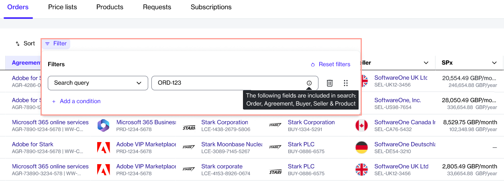

# Release Notes v4

**Release Date: xx xx 2025**

Our latest release, Marketplace Platform v4, is here. This release introduces several new features to enhance our platform's capabilities and improve existing functionalities.

Watch the following video or continue reading to learn about this release:

## Billing Invoices and Statements&#x20;

In this release, we are introducing billing statements. In addition to invoices, you'll now receive statements containing a detailed record of charges for the subscriptions in your agreement. Billing statements are available in XLSX format.&#x20;

Unlike invoice PDFs, which only contain a summary of charges, statements include a comprehensive breakdown of all charges. You can learn more about invoices and statements on the [Understand Your Billing Documents](../../modules-and-features/marketplace/billing/understand-your-billing-documents.md) page.

As part of this release, we've also added a **Billing** module, which you can access from the main menu within the platform. The module contains pages for accessing your [Invoices ](../../modules-and-features/inventory/invoices.md)and [Statements](../../modules-and-features/marketplace/billing/statements.md) through the interface.

## Deprecated Features

The following features have been deprecated and are no longer supported by the Marketplace Platform:

* 365EA + Unified Support
* Unified Support for Multivendor

## FinOps for Cloud

FinOps for Cloud is a new solution designed to help you optimize your costs and manage resources effectively.&#x20;

With FinOps for Cloud, you can explore and analyze your cloud expenses, monitor resource usage, and implement policies to ensure efficient and cost-effective cloud management. With a user-friendly interface and robust features, FinOps for Cloud empowers organizations to achieve greater visibility and control over cloud infrastructure. This enables smarter decision-making and improved financial planning. To learn more, see [FinOps for Cloud](../../extensions/finops-for-cloud/).

## New Spotlight Feature

Our new **Spotlight** feature simplifies task management by highlighting key objects that require your attention. These key objects include your agreements, invoices, subscriptions, and more.&#x20;

You can find the **Spotlight** feature on the **Home** page, and it can also be accessed by selecting the spotlight icon  in the status bar.

<figure><figcaption>
Spotlight widget
</figcaption></figure>

If you have saved orders, those orders are spotlighted so you can manage them easily. Similarly, subscriptions that are nearing expiration are also shown so you can take timely actions. To learn more, see [View Spotlighted Objects](../../marketplace-platform/getting-started/interface/view-pending-tasks.md).&#x20;

## Notifications Management

The new Notifications feature allows account administrators to configure and manage notification emails for their accounts. Admins can set recipients for these emails, enable or disable specific notification categories, and customize global email settings. This feature is accessible through the **Settings** menu in the platform. To learn more, see [Notifications](../../modules-and-features/settings/notifications/).

Individual users can also customize their notification settings through their profile to start or stop receiving email updates. For information on managing notifications for your profile, see [Manage Notification Preferences](../../marketplace-platform/getting-started/interface/manage-notification-preferences.md).

## Public Catalog

We are excited to announce the launch of our public catalog, available at marketplace. softwareone.com.&#x20;

Designed for intuitive navigation, our catalog ensures a seamless browsing experience and simplifies your software procurement journey.

The catalog is available to everyone and provides easy access to a wide range of software products and services. You can explore products from over 56,000 vendors across categories, including healthcare, finance, analytics, and more.&#x20;

<figure><figcaption>
SoftwareOne Public Catalog
</figcaption></figure>

## **Quoted** Order Status

We have introduced a new order status called **Quoted**. This status is used when you save an order to place it at a later time. It's designed to help you identify orders you've intentionally saved and applies to purchase orders, change orders, and termination orders.&#x20;

The new **Quoted** status replaces the **Draft** status, which is now used for orders that have been created by the system.

## Search Query in Data Grids

Data grids now include a new condition called Search Query, which is available in the <path d=&#x22;M400-240v-80h160v80H400ZM240-440v-80h480v80H240ZM120-640v-80h720v80H120Z&#x22;/></svg>" data-size="line">**Filter** option. This new condition allows you to enter a search term, which is then used to find matching records across other filter conditions, such as orders, agreements, and more.

<figure><figcaption>
Search Query filter 
</figcaption></figure>

## Subscription Automatic Renewals

You can now manage the automatic renewal of your subscriptions through self-service.&#x20;

Currently, we automatically renew subscriptions for your convenience and to prevent any service interruptions. If you prefer not to have your subscription renewed automatically, you can disable the auto-renewal. If you previously disabled automatic renewal, you can also re-enable it as necessary at any time. To learn more, see [Manage Automatic Renewals](../../modules-and-features/marketplace/subscriptions/manage-automatic-renewals.md).

