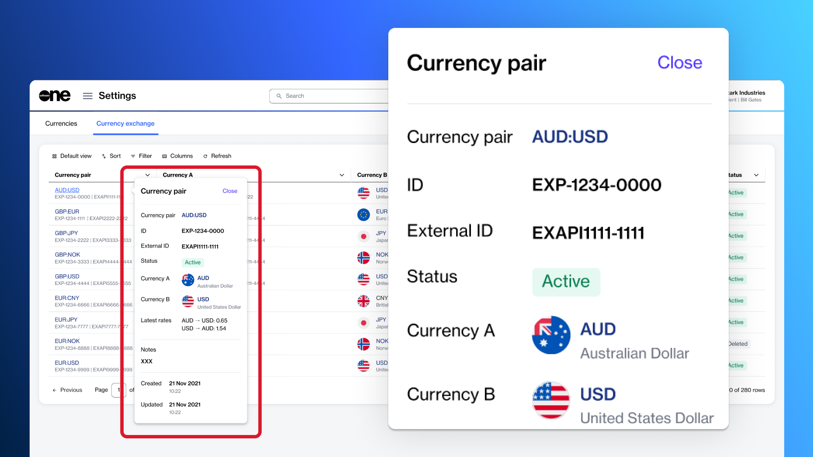
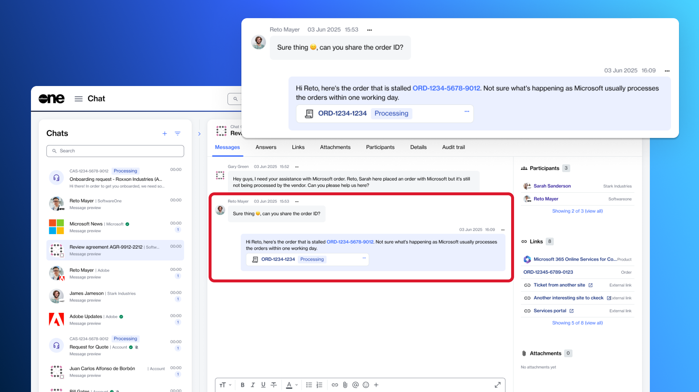
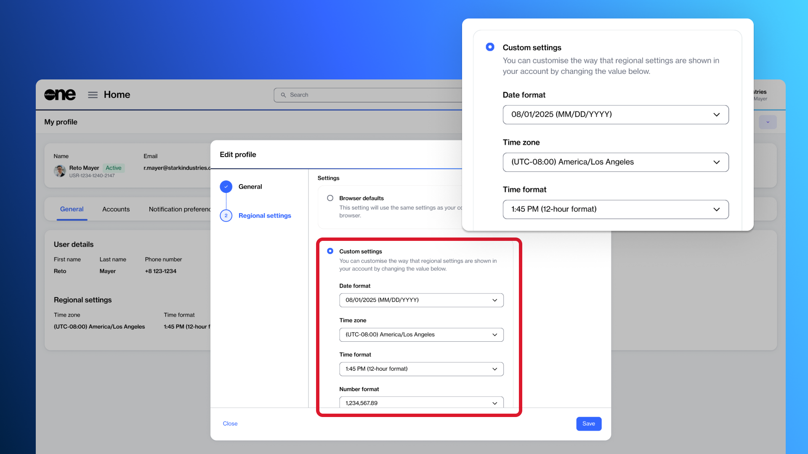
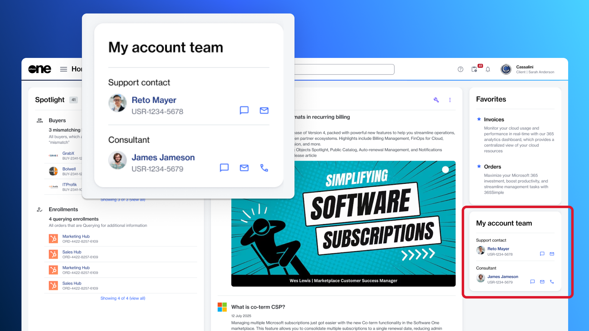
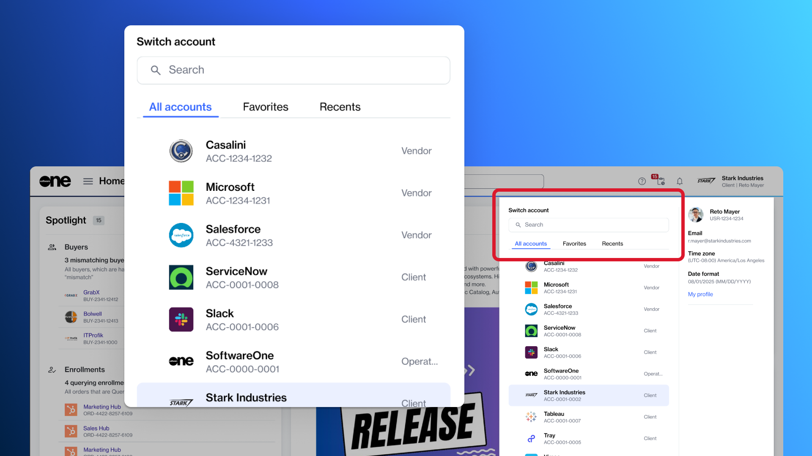
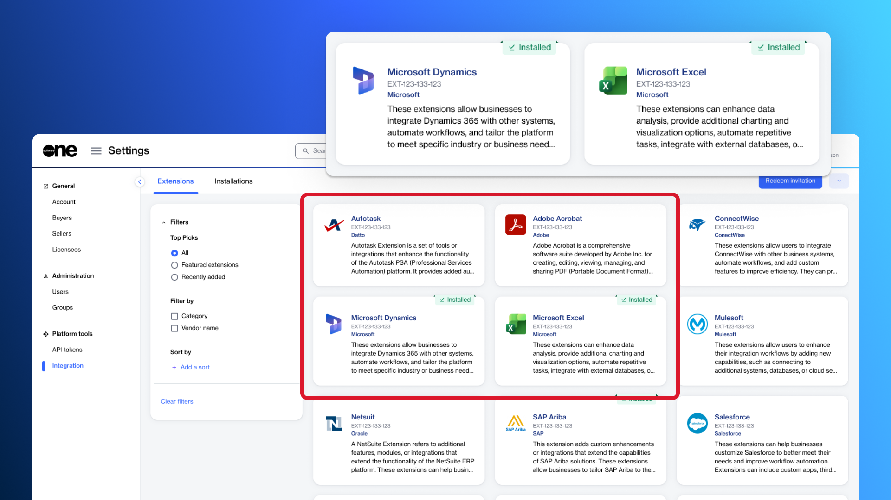

# Release Notes v5

**Release Date: 7 April 2026**

We are pleased to announce the latest release of SoftwareOne's Marketplace Platform. v5 introduces a range of new features and functionalities, along with enhancements to provide a more seamless experience across the platform.

### Analytics for Your Billing Data

Analytics is a new feature that allows you to visualize your billing data. You can access this feature from the main menu by selecting **Billing** > **Analytics**.

Analytics uses interactive charts and filters to help you understand charges from your invoices and credit memos so you can monitor spending, forecast budgets, and manage your expenditure. &#x20;

The feature offers robust grouping options to help you group data across dimensions, such as **Agreement**, **Item**, **Product**, and more. It provides a visual summary of your top 10 entities based on your selected grouping, and automatically combines the remaining entities under a single category called Others / Unmatched for readability. You can also export your data to Excel and choose a target currency for your financial reporting. For more information, see [Analytics](../../modules-and-features/billing/analytics/).

<figure><figcaption>
Monitor your billing data using Analytics.
</figcaption></figure>

### Microsoft Extended Service Terms

Starting 8 April 2026, SoftwareOne Marketplace will provide self-service capabilities, allowing you to choose whether subscriptions should go to Extended Service Terms (EST) at renewal time. You will have the option to **Renew**, **Cancel at expiration**, or **Move to EST**:

* **Renew the subscription** - This works like it always has, supporting scheduled changes or renewing as is.
* **Cancel at expiration** - This stops the services at the end of the term. Data retention is preserved, but the subscription can't be recovered or reactivated.
* **Move to EST** - This new option converts your subscription into a monthly term that continues until you decide to cancel or convert it to a regular subscription. Licenses can't be modified under EST. Additionally, the extended service term bills monthly at the current monthly term rate plus a 3% uplift (or 23% if no monthly plan exists). EST applies only to eligible subscriptions that are renewed or expire after 4 May 2026.

For information on the eligibility criteria for EST, see [What subscription renewal options are available?](../../extensions/microsoft-cloud-solution-provider/additional-resources/faqs/what-subscription-renewal-options-are-available.md)

### Assets and Entitlements in the Marketplace

You can now view and manage your assets and entitlements directly in the Marketplace.

* Assets, also known as one-time purchased items or perpetual licenses, are products you buy once and own indefinitely. The **Assets** page provides a centralized view of all such items and allows you to manage them easily. For more information, see [Assets](../../modules-and-features/marketplace/assets/).
* Entitlements include all items associated with your account, showing the quantity you are entitled to use. This covers both subscription-based items and one-time purchases (assets). The **Entitlements** page gives a comprehensive overview of your entitlements. For more information, see [Entitlements](../../modules-and-features/marketplace/entitlements/).

### New AWS & Cloud Managed Services Essentials Offering

We've launched a new AWS product in the SoftwareOne Marketplace.&#x20;

This new product, **Amazon Web Services and SoftwareOne Cloud Managed Services Essentials**, combines the newly launched AWS Billing Transfer feature with SoftwareOne service offerings related to AWS.&#x20;

The product is available in all AWS regions that support billing transfer, including all public AWS regions, except AWS GovCloud (US) and China regions, including Beijing and Ningxia. For more information, see [Amazon Web Services](../../extensions/amazon-web-services/).

### Currency & Billing Updates

This release includes the following currency and billing updates:

* **Billing currency support** - You can now select the currency in which you want to receive your Marketplace invoices, either when creating a new agreement for a new purchase order or after placing your order. For more information, see [How to set or change your billing currency](../../marketplace-platform/getting-started/marketplace-for-clients/how-to-set-or-change-your-billing-currency.md).
* **Currencies & exchange updates** - The new **Currencies** & **Currency exchange** pages, located under **Settings** > **Exchange**, provide visibility into how currencies and exchange rates are managed. You can view all supported currencies, configured currency pairs (for example, GBP: EUR), the latest exchange rates in both directions, usage across agreements, status, and last updated date. For more information, see [Exchange](../../modules-and-features/settings/exchange/).

<figure><figcaption>
View the list of currencies and exchange information.
</figcaption></figure>

### Marketplace Mobile App for iOS

Our brand-new app is now available for iOS devices. This app has been designed to provide seamless access to your Marketplace account anytime and anywhere.

For this initial release, the app is invite-only, and it's available to the existing users of the platform. It includes a selected set of features you can access conveniently on the go. For more information, see [App Overview](../../marketplace-mobile-app/app-overview/).

<figure><figcaption>
Use the Marketplace mobile app to conveniently access your account.
</figcaption></figure>

### New Helpdesk & Chat Modules

We've introduced a new **Helpdesk** module in Marketplace to make it easier for you to get support and track your requests. You can use this module to create and manage [cases](../../modules-and-features/helpdesk/cases/) and [share feedback](../share-feedback.md).

Additionally, the new **Chat** module allows you to start conversations with users in your account and your SoftwareOne account managers. Designed to streamline collaboration, Chat keeps all communication secure and within your account. You can create group chats, share attachments and links, and manage conversations with features like adding participants, muting/unmuting, or leaving a chat. For more information, see [Chat](../../modules-and-features/chat/).

<figure><figcaption>
Start chat conversations with users in your account.
</figcaption></figure>

### New Options for Customizing Regional Settings

We've enhanced the regional settings in the SoftwareOne Marketplace to give you greater control over locale-specific information, making your experience more intuitive and localized.

Now, when customizing your regional settings, you can choose whether to use the same settings as your browser or apply your own custom preferences:

* **Browser defaults** - The option is selected by default, and it follows the regional settings of your browser.
* **Custom settings** - This option allows you to configure your preferences for language, date and time, time zone, and number formats. For more information, see [Manage your profile](../../marketplace-platform/getting-started/interface/manage-profile.md).

<figure><figcaption>
Customize the regional settings for your account.
</figcaption></figure>

### New Account Team Feature

​You can now view your SoftwareOne account team directly within the platform via the **Account team** widget on the **Home** page.&#x20;

The widget displays the names of your account team members and allows you to contact them. For more information, see [Home page widgets](../../marketplace-platform/getting-started/interface/#home-page-widgets). ​You can also view your account team from the main menu by selecting **Settings** > **Account team**.

<figure><figcaption>
View your SoftwareOne account team directly within the platform.
</figcaption></figure>

### Enhanced Account Switcher Experience

You can now add specific accounts to your favorites and quickly access recently accessed accounts. To support this experience, we’ve made the following improvements to the account switcher in your profile menu:

* **​Favorites** - This tab displays the accounts you’ve added as favorites. You can also remove an account from your favorites directly from this tab. For more information, see [Using Favorites](../../marketplace-platform/getting-started/interface/mark-favorite-pages.md).
* ​**Recents** - This tab shows all accounts you’ve recently accessed. You can also mark an account as a favorite directly from the **Recents** tab.

<figure><figcaption>
Add favorites and view recently accessed accounts.
</figcaption></figure>

### Simplified Add User Process

We've streamlined the process for adding users to your Marketplace account.&#x20;

When adding users, administrators no longer need to provide the user’s phone number. The **Phone number** field has been removed from the workflow. Invited users can now enter their phone number themselves during registration after accepting the invitation.&#x20;

This change makes the process simpler for administrators while still allowing individuals to provide their contact information when setting up their account. For more information, see [Add new users](../../modules-and-features/settings/users/add-new-users.md).

### Send Feedback Form

You can now share your experience, suggestions, and improvement ideas with us using the **Send feedback** form. This new form offers a structured, transparent way to communicate with SoftwareOne.

When submitting feedback, you can provide a rating and detailed comments, attach supporting files, or screenshots. After submitting feedback, you can view a list of your feedback entries and view the status of each submission. For more information, see [Share feedback](../share-feedback.md).

<figure><figcaption>
Share your feedback and ideas for improvement.
</figcaption></figure>

### Global Settings for Notification Emails

Account administrators can now customize notification email settings.

When configuring these settings, admins can define a custom sender name displayed to recipients and add a custom footer to all notification emails.&#x20;

Administrators can also view the preferred language for notification emails and update it using the **Edit** option on the **Account** page. For more information, see [Customize notification settings](../../modules-and-features/settings/notifications/edit-notification-settings.md).

### Vendor & Product Profile Pages

We are introducing **Vendor profiles** and **Product profiles** pages in the platform to enhance discovery and create a more seamless experience in the SoftwareOne Marketplace.&#x20;

* [Vendor profiles](../../modules-and-features/catalog/vendor-profiles/) are centralized marketing and informational pages for each vendor. These profiles allow you to learn about the vendors and the products they offer.
* [Product profiles](../../modules-and-features/catalog/product-profiles/) are marketing-focused representations of a product or a grouping of products. They are designed to help you understand the product and start the ordering process directly from within the profile.

You can access these pages through the **Catalog** option in the main menu.

### Alga PSA Integration with Marketplace Platform

The Marketplace Platform now integrates with [Alga PSA](../../extensions/alga-psa/).&#x20;

Our new extension allows partners to bring data, including agreements, subscriptions, and orders from the SoftwareOne Marketplace, directly into their PSA environment.&#x20;

This integration helps partners simplify operations and manage their resale business and workflows in one place, without switching between different systems.&#x20;

### Extensions Framework

Our new **Extensions** directory, accessible through **Settings** in the main navigation menu, is a central place to search, browse, and filter available extensions.&#x20;

This new directory allows account administrators to discover and install extensions across all supported account types, including client and vendor accounts. Each extension includes a dedicated details page with a comprehensive description, documentation, terms of service, and the permissions required for installation.&#x20;

Once an extension is installed, it can be viewed on the **Installations** page. From there, administrators can also see who installed an extension, when it was installed, and check the installation status. For more information, see [Integration](../../modules-and-features/settings/integration/).

<figure><figcaption>
Discover and install extensions<strong>.</strong>
</figcaption></figure>

### Procurement Management

You can now access your sales orders and sales quotes directly in the Marketplace by navigating to the **Procurement** section in the main menu.

* The [Sales orders](../../modules-and-features/procurement/sales-orders/) page offers an improved, transparent way to manage your sales orders. You can narrow down your orders based on your specific criteria, select an order to view its detailed information, and download a PDF of your sales order.&#x20;
* The [Sales quotes reporting](../../modules-and-features/procurement/sales-quotes-reporting/) page provides a unified, easy-to-understand view of what has been quoted and what is currently in progress. From this page, you can view your pending, accepted, and historical sales quotes, along with corresponding sales orders as they move through fulfilment and billing. You can also select a quote to see its detailed information and download the sales quote PDF.

For former PyraCloud users, the **Sales orders** and **Sales quotes reporting** pages provide an upgraded experience. If you previously used PyraCloud for your sales orders and quotes, you can take advantage of the new interface, which includes enhanced search capabilities, PDF downloads, advanced filters, and the option to **Switch to classic view**.

### New APIs & Business Objects Reference

You can now access platform data programmatically using our new APIs, enabling seamless integrations and automation. To view the full list of APIs, see [Explore the APIs](../../developer-resources/rest-api/#explore-the-apis-1).

We've also added a centralized reference called [Business Objects & API Collection Reference](../../developer-resources/rest-api/business-objects-and-api-collection-reference.md), which lists all business objects available in the SoftwareOne Marketplace Platform REST API along with their corresponding collection endpoints. Use this reference to identify the correct object types and endpoints when designing integrations or exploring platform capabilities.

### Interface & User Experience Enhancements

This release includes the following Interface and filtering enhancements:

* **Second-level condition group filter** - All tables (data grids) now support a second-level filter condition called **Add a conditional group**, allowing you to create advanced filters by combining multiple rules and conditions. You can access this feature by selecting the **Filter** option and choosing **Add a conditional group**. For more information, see [Customize the data grid](../../marketplace-platform/getting-started/interface/customize-the-data-grid.md).
* **Collapsible side navigation bar** - Where available (for example, the [Settings](../../modules-and-features/settings/) module), the side navigation bar can now be collapsed or expanded. When collapsed, the bar reduces in size to provide a more streamlined interface. When expanded, it displays all the pages within this module, enabling you to access them easily.
* **Automatic page refresh** - The pages within the platform now refresh automatically when information changes in the system, so you no longer need to manually refresh them to see the latest updates.
* **Multi-account tabs** - You can now work with multiple accounts in different browser tabs without them interfering with each other. Each tab keeps its own account, so actions in one tab won’t affect another. This enhancement applies to new modules in the SoftwareOne Marketplace only.

### Extension Improvements

We’ve made several updates to our extensions, including [Microsoft CSP](../../extensions/microsoft-cloud-solution-provider/), [FinOps for Cloud](../../extensions/finops-for-cloud/), and [Adobe VIP Marketplace](../../extensions/adobe-vip-marketplace/).&#x20;

Each extension has its own set of new features and enhancements designed to improve your experience and workflow. For details on what has changed in each extension, refer to their individual release notes: [Microsoft CSP release notes](../../extensions/microsoft-cloud-solution-provider/additional-resources/release-notes.md), [FinOps for Cloud release notes](https://docs.finops.softwareone.com/help-and-support/release-notes), and [Adobe VIP Marketplace release notes](../../extensions/adobe-vip-marketplace/release-notes.md)

### Other Updates

The following modules have been deprecated and are no longer supported by the Marketplace Platform:

* ​Requests Management
* ​Collaboration Site
* ​Software Downloads

Additionally, the **Contact Person** setting for Buyers and Licensees has been removed. This change means that you will no longer need to maintain a single contact person at the Buyer or Licensee level. Contact handling is now covered by Agreement contacts and other parameters in the platform.
