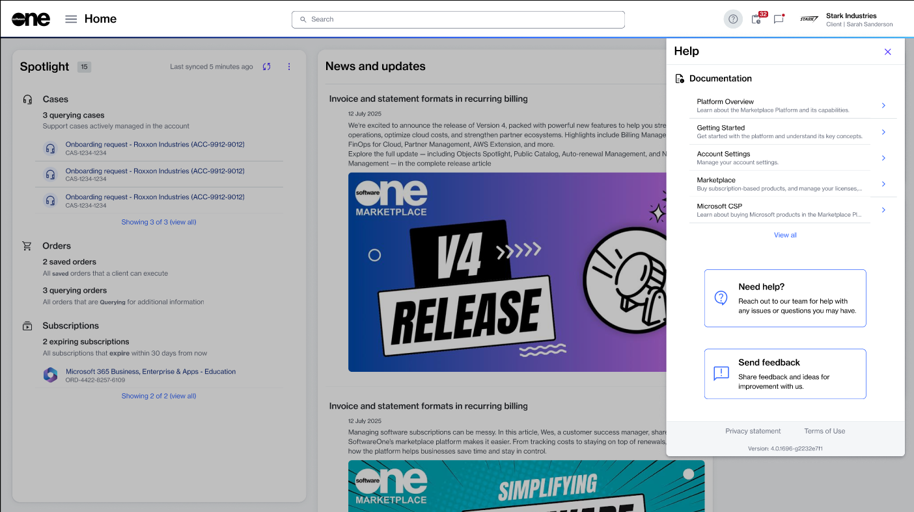

# Share Feedback

You can share your thoughts directly with the Marketplace Product team to help us improve. We welcome your feedback on what you liked and didn't like, as well as any ideas for product enhancements.&#x20;

When submitting feedback, you can rate your experience using any of the five emoticons, ranging from very dissatisfied to very satisfied. Additionally, you can provide a detailed description of your feedback and attach screenshots or video files.&#x20;

When writing your feedback, consider the following best practices:

* **Be concise** - Limit your review to 2000 characters, including spaces.
* **Attach files** - Include images or screen recordings to help us visualize your feedback.
* **Be specific** - Share both the positive and negative aspects of your experience. For new features and enhancements, explain your use case and how it would benefit you.
* **Focus on actions, not individuals** - Describe your experience with the platform, its features, and workflows, instead of naming individuals.


Do not use the feedback form to request assistance. If you encounter an issue with the Marketplace Platform or [SoftwareOne FinOps for Cloud](https://docs.finops.softwareone.com/), contact Marketplace Platform Support instead.&#x20;


### Sharing your feedback

To share feedback:

1. Select the help menu  in the header, then select **Share feedback**.

<figure><figcaption>
Select Send feedback to share your feedback.
</figcaption></figure>

2. In the **Feedback** wizard, complete the following steps:
   1. **Rate your experience** - (Optional) Choose an appropriate rating for your experience.
   2. **Subject** - (Required) Enter a subject line for your feedback.
   3. **Share your feedback** - (Required) Describe your feedback with as much detail as possible.
   4. **Attachment** - (Optional) By default, a screenshot of the page you’re viewing is added. You can keep this screenshot or replace it with another file. Only one file can be attached here; to add more, use the **Add** option on the [feedback details page](../modules-and-features/helpdesk/feedback/#viewing-your-submitted-feedback) after submission.

<figure><figcaption>
Rate your experience and describe your feedback.
</figcaption></figure>

3. Select **Submit** to finalize and submit your feedback.
4. Select **View details** to view your feedback. Otherwise, select **Close**.

To modify your feedback after submission, see [Edit or delete feedback](../modules-and-features/helpdesk/feedback/edit-or-delete-feedback.md).
