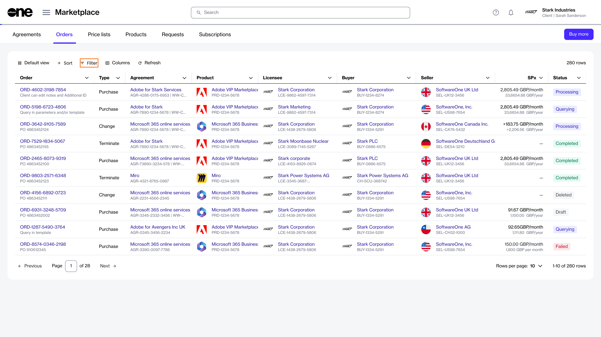

# How to filter orders

This tutorial describes how to use filters to quickly find specific orders.

The Marketplace offers several filter options to help you find orders. You can apply a single filter or create a combination of filters by selecting different fields, operators, and values.

### Filter by status

To filter orders by status, such as **Draft**:

1. Go to **Marketplace** > **Orders**.
2. Select the  **Filter** icon.

<figure><figcaption>
Open the filter panel to narrow the list of orders.
</figcaption></figure>

3. Select **Add another condition**.
4. Define the filter:
   1. In the first field, select **Status**.
   2. In the second field, select the operator. For this example, leave it set to **Equal**.
   3. In the third field, select **Draft**.
5. Add more conditions if you need to narrow the results further.

The list of orders refreshes automatically when you apply the filter.

### Filter by order ID

To find an order by ID:

1. Go to **Marketplace** > **Orders**.
2. Select the  **Filter** icon, then define the filter:
   1. In the first field, select **Order ID**.
   2. In the second field, choose the operator. For this example, leave it set to **Contains**.
   3. In the third field, enter all or part of the order ID.

The list of orders refreshes automatically.

### Search orders

Use **Search query** to find matching records across orders, agreements, and related details.

To search for an order:

1. Go to **Marketplace** > **Orders**.
2. Select the  **Filter** icon.
3. Enter the desired search term.

The list of orders refreshes automatically to show matching records. To clear all filters and return to the default view, select **Reset filters**.
