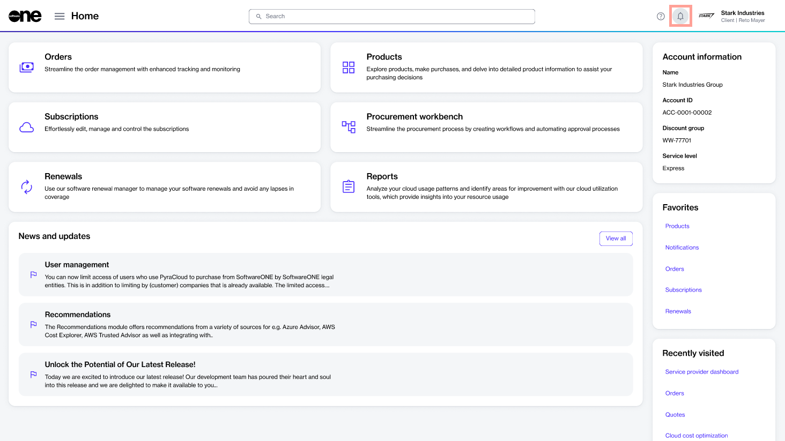
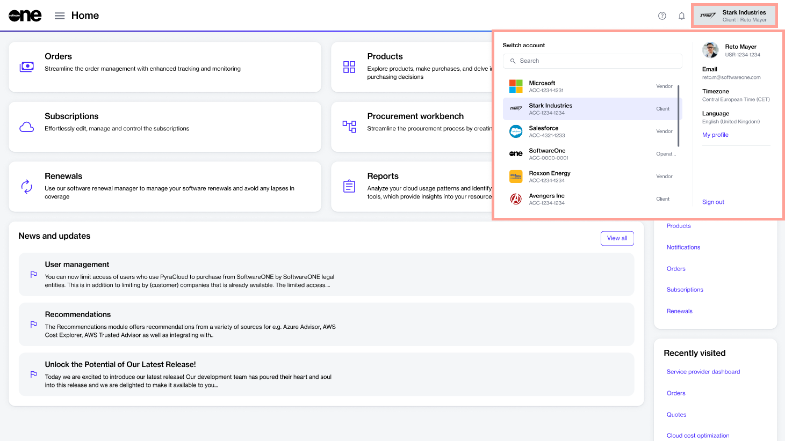

# Platform Interface

The Marketplace Platform is a SaaS application with three user interfaces, each catering to specific user types. These interfaces ensure that all [actors](key-concepts.md#platform-actors) can interact with the platform according to their specific requirements. 

The platform provides three distinct user interfaces namely, the Client Portal, Vendor Portal, and Operations Portal. 

<figure><figcaption>
Marketplace Platform
</figcaption></figure>

* **Client Portal** - Accessed by our clients and partners for software procurement.&#x20;
* **Vendor Portal** - Used by vendors for setting up and configuring products.
* **Operations Portal** - Utilized by our internal SoftwareOne associates for administration-related activities.

## Accessing the interface

The platform can be accessed from an up-to-date desktop or mobile browser. For a list of supported browsers, see [Which browsers do you support?](../../help-and-support/faqs/which-browsers-do-you-support.md).

To access the platform, follow these steps:

1. Navigate to the sign-in page: [https://portal.platform.softwareone.com/](https://portal.platform.softwareone.com/).
2. Enter the email address associated with your account and click **Continue**.
3. Enter your password and click **Continue**. If the sign-in is successful, the **Home** page is displayed.

If you provide inaccurate credentials, an error message is displayed.&#x20;

<figure><figcaption></figcaption></figure>

If you can’t remember your password, select the **Forgot password?** link on the **Sign-in** page and then follow the instructions. For more information, see [Update password](basics/update-password.md).

## Navigating the interface

The platform provides a seamless and intuitive interface, allowing access to the different modules and features within those modules.&#x20;

After signing in to your account, you can navigate through various modules, manage account settings, access the marketplace, view agreements, and track your orders.

### **Main navigation menu**

The main navigation menu in the top left is the starting point for accessing the modules enabled for your account. Click the navigation icon  to access the modules and manage your account settings.

<figure><figcaption>
Main navigation menu
</figcaption></figure>

### **Help icon**

The help icon  contains links to various content resources, such as the [SoftwareOne blog](https://www.softwareone.com/en/blog/articles), product documentation, [news and updates](https://www.softwareone.com/en/media-releases), and our legal pages. You can also [Contact Support](../../help-and-support/getting-support.md) by clicking the **Support** option.

<figure><figcaption>
Help icon
</figcaption></figure>

### Notifications

The notifications iconopens up the **Notifications** page where you can view your read and unread notifications, and update your notification preferences. To learn more notifications in general and how to manage them, see [View Notifications](basics/view-notifications.md).

<figure><figcaption>
Notifications icon
</figcaption></figure>

### Account selector and profile menu

The account selector and your profile information can be accessed through the menu in the upper right. Select the menu to display your account name, type of account, and your username.&#x20;

The menu also contains options for you to [manage your profile](basics/manage-profile.md), [switch accounts](basics/switch-account.md) (only if you belong to multiple accounts), and sign out of your account.&#x20;

<figure><figcaption>
Account selector and your profile
</figcaption></figure>
