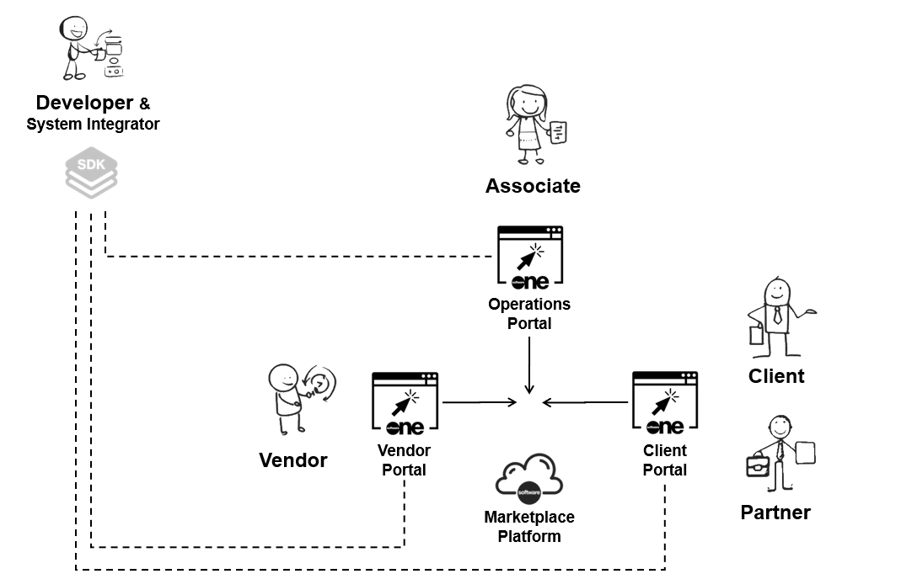
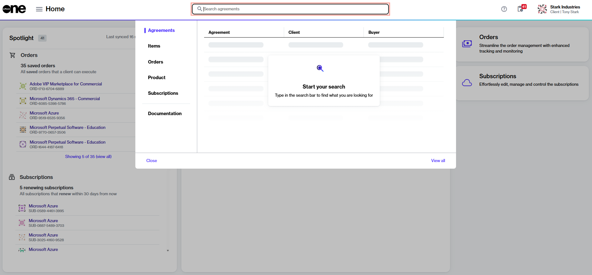
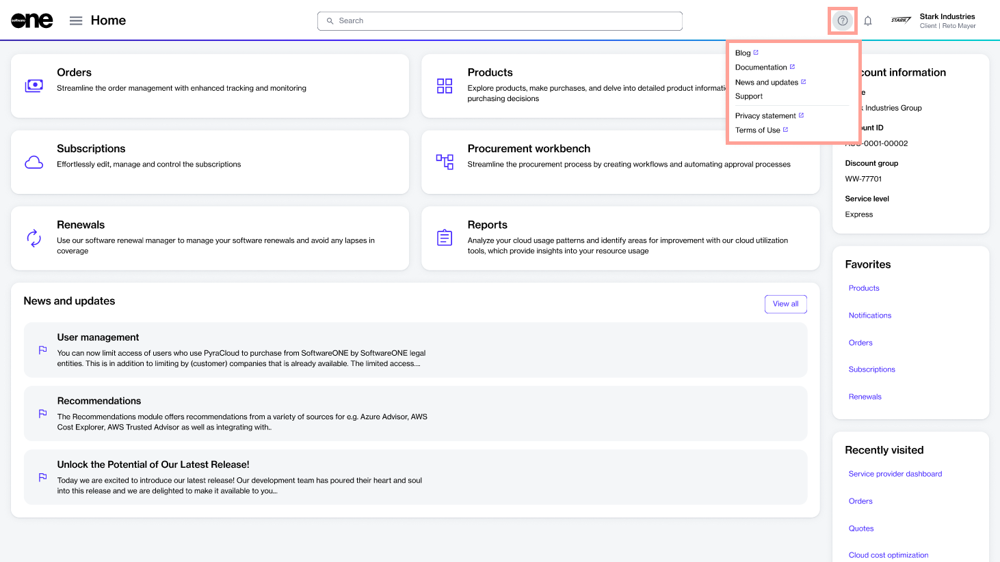
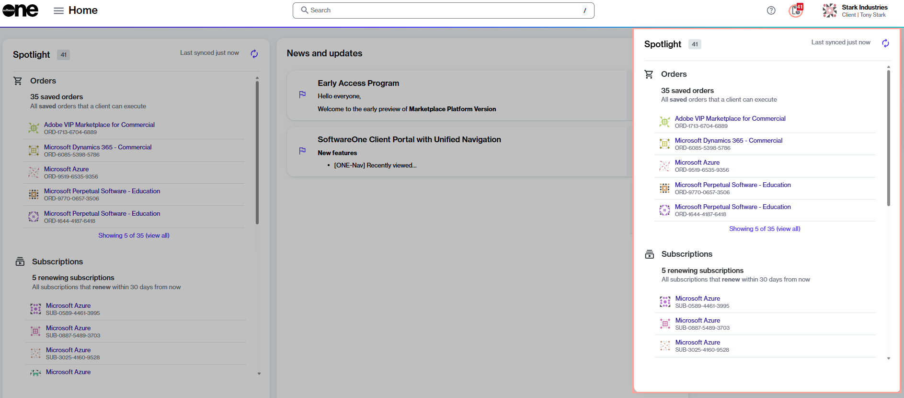
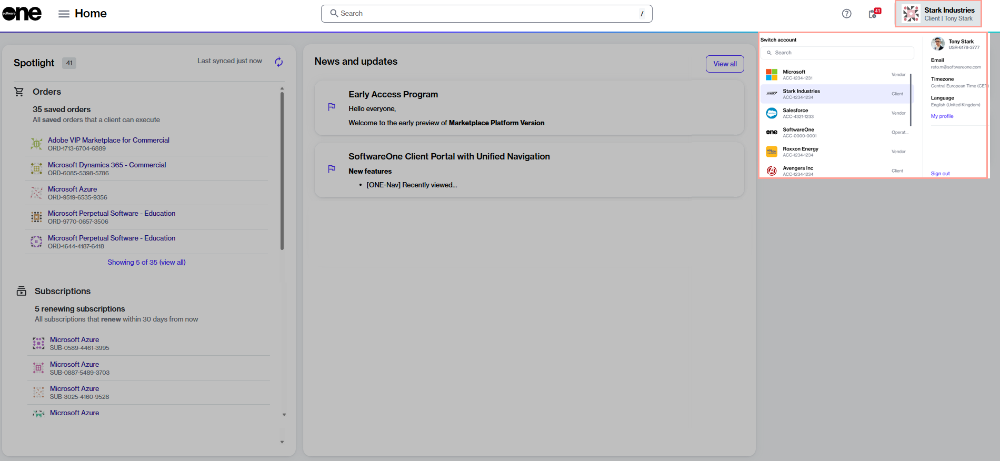

# Platform Interface

The Marketplace Platform is a SaaS application with three user interfaces, each catering to specific user types. These interfaces ensure that all [actors](../key-concepts.md#platform-actors) can interact with the platform according to their specific business requirements.&#x20;

The platform provides three distinct user interfaces, namely the Client Portal, Vendor Portal, and Operations Portal.&#x20;

<figure><figcaption>
Marketplace Platform
</figcaption></figure>

* **Client Portal** - Accessed by our clients and partners for software procurement.&#x20;
* **Vendor Portal** - Used by vendors for setting up and configuring products.
* **Operations Portal** - Used by internal SoftwareOne associates for administration-related activities.

## Access the interface

You can access the platform from an up-to-date desktop or mobile browser. For a list of supported browsers, see [Which browsers do you support?](../../../help-and-support/faqs/which-browsers-do-you-support.md).

To access the Marketplace Platform user interface (UI):

1. Navigate to the sign-in page: [https://portal.platform.softwareone.com/](https://portal.platform.softwareone.com/).
2. Enter the email address associated with your account and select **Continue**.
3. Enter your password and select **Continue**. If the sign-in is successful, the **Home** page is displayed.

If you provide inaccurate credentials, an error message is displayed.&#x20;

<figure><figcaption>
Sign in page
</figcaption></figure>

If you can’t remember your password, select the **Forgot password?** link on the **Sign-in** page and then follow the instructions. For more information, see [Update password](../../../help-and-support/faqs/update-password.md).

## Navigate the interface

The platform provides a seamless and intuitive interface, allowing access to the different modules and features within those modules. This section describes how to navigate the platform.

### Main navigation menu

The  **Home** menu at the top left opens the main navigation menu, provides access to all modules enabled for your account.&#x20;

<figure><figcaption>
Main navigation menu
</figcaption></figure>

### Search

The Search bar lets you search for various objects in the platform, such as your orders, agreements, subscriptions, and more. You can also search for specific products and items in our catalog.

You can also use search to find user documentation. For example, you can search for "manage subscriptions" to read documentation about how to manage your subscriptions.

<figure><figcaption>
Search bar in the platform
</figcaption></figure>

When performing a search, start by choosing the category you want to search across and then enter the search term. Our platform supports free text, which means you can enter all or part of the object's ID or name. For example, when searching for an agreement using its ID, select the **Agreements** category and then enter the full order ID (such as ‘AGR-8981-7039-6781’) or part of it (such as 6781). The platform will then display results matching your specified search term.

### Help icon

The Help icon  contains links to various resources, including the [SoftwareOne blog](https://www.softwareone.com/en/blog/articles), product documentation, [news and updates](https://www.softwareone.com/en/media-releases), and our legal pages.&#x20;

It also contains a **Support** option, allowing you to easily [contact Marketplace Platform Support](../../../help-and-support/contact-support.md).

<figure><figcaption>
Help icon in the header
</figcaption></figure>

### Spotlight actions

The Spotlight icon  opens the Spotlight widget, containing all tasks requiring your attention. To learn more about this feature, see [View Object Spotlight](view-pending-tasks.md).

<figure><figcaption>
Spotlight widget on the Home page
</figcaption></figure>

### Account selector and profile menu

The profile menu lets you [switch between your accounts](switch-account.md) and [manage your profile](manage-profile.md). It also contains the **Sign out** option.

<figure><figcaption>
Account selector and profile menu
</figcaption></figure>

