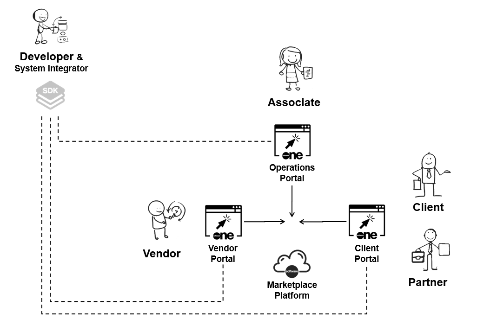
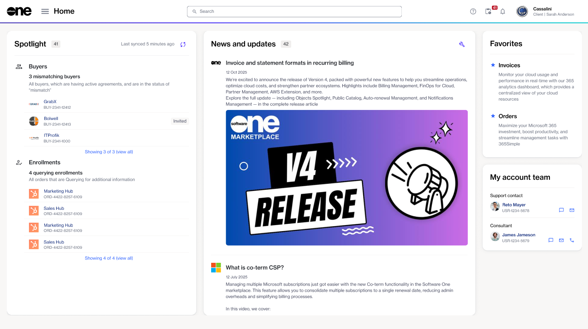
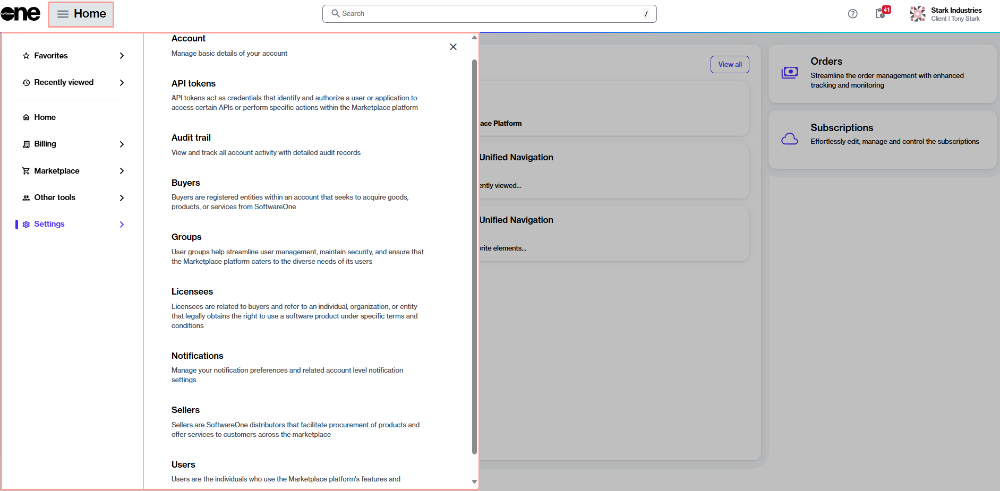
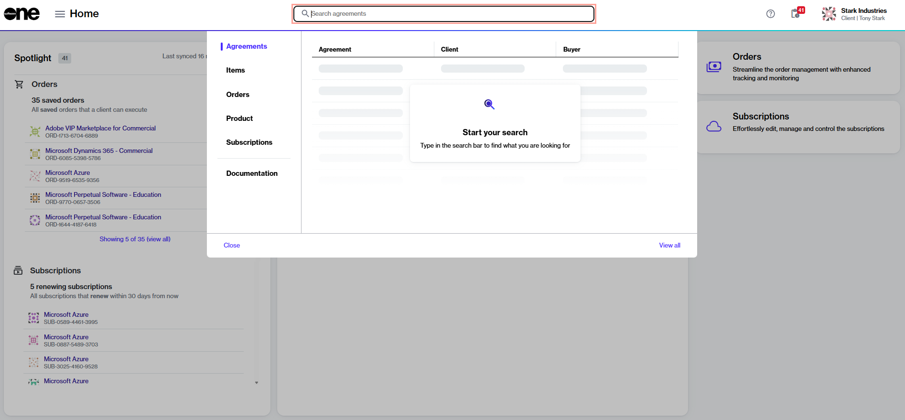
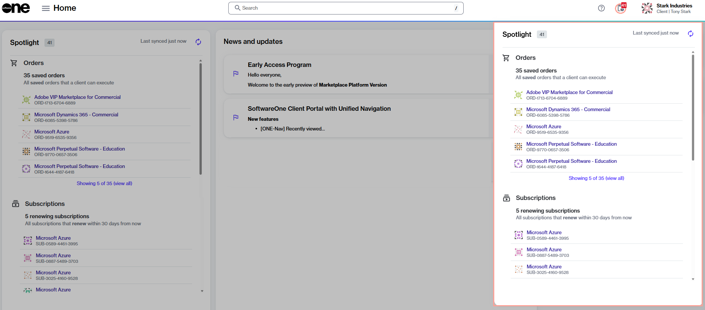

# Interface Overview

The Marketplace Platform is a SoftwareOne SaaS solution that enables users to procure and manage software solutions. This page provides a high-level overview of the platform interface and explains how to navigate and use its core features.

This content applies to all Marketplace Platform users, including Client Portal users (clients and partners), Vendor Portal users (software vendors), and Operations Portal users (SoftwareOne internal associates).

<figure><figcaption>
SoftwareOne Marketplace Platform
</figcaption></figure>

## Signing in to your account

You can access the platform from an up-to-date desktop or mobile browser. For a list of supported browsers, see [Which browsers do you support?](../../../help-and-support/faqs/which-browsers-do-you-support.md).

To sign in to your SoftwareOne Marketplace account:

1. Open the [sign-in page](https://portal.platform.softwareone.com/).
2. Enter the email address associated with your account, then select **Continue**.
3. Enter your password and select **Continue**.&#x20;

Upon successful sign-in, the platform's **Home** page is displayed.

If you provide inaccurate credentials, an error message is displayed. If you don’t remember your password, select **Forgot password?** and follow the instructions to recover it.

## Understanding the interface layout

The Marketplace Platform interface is designed to provide consistent navigation across all portals.

While the layout is consistent, the available modules and content depend on your role and portal (Client, Vendor, or Operations).

<figure><figcaption>
The SoftwareOne Marketplace Home page
</figcaption></figure>

### Header

The header is always visible and contains the following components:

Hamburger menu

The hamburger menu provides access to all the modules enabled for your account. Select  **Home** in the header to open the menu.

When you are viewing a page within a specific module, the menu label changes to match that context (for example, it displays **Billing** when viewing invoices, **Marketplace** when viewing subscriptions, and so on).

Menu items with chevrons<path d=&#x22;M504-480 320-664l56-56 240 240-240 240-56-56 184-184Z&#x22;/></svg>" data-size="line">can be expanded to reveal additional pages within that category.

<figure><figcaption>
The main navigation menu.
</figcaption></figure>

Search

The **Search** bar in the header enables you to search for details, such as your orders, agreements, subscriptions, and more. You can also search for specific products and items in our catalog.

Additionally, you can use search to access product documentation, including resources such as tutorials, FAQs, and procedures. For example, you can search for 'manage subscriptions' to read documentation about how to manage your subscriptions.

<figure><figcaption>
The global search bar.
</figcaption></figure>

When performing a search, start by choosing the category you want to search across and then enter the search term. Our platform supports free text, which means you can enter all or part of the object's ID or name.&#x20;

For example, when searching for an agreement using its ID, select the **Agreements** category and then enter the full order ID (such as ‘AGR-8981-7039-6781’) or part of it (such as 6781). The platform will then display results matching your specified search term.

Help

The **Help** option  allows you to quickly access documentation, request assistance, and share feedback directly from the platform.&#x20;

* The **Documentation** section displays a list of recommended topics from our product documentation. You can browse suggested topics and select a topic to view detailed guidance. To access all documentation resources, select **View all**.
* Use **Need help?** if you require additional assistance. This option directs you to our **Get help** wizard, where you can get help with platform issues or questions.&#x20;
* Use **Send feedback** to share your comments, suggestions, and experiences about the SoftwareOne Marketplace directly with us. For more details, see [Share feedback](../../../help-and-support/share-feedback.md).

Spotlight

The **Spotlight** option  highlights tasks that require action, helping you stay on top of important tasks.&#x20;

Examples of such tasks include subscriptions nearing expiration, orders querying for more information, and more.&#x20;

<figure><figcaption>
The spotlight widget on the Home page.
</figcaption></figure>

Profile menu

Your user profile menu in the header displays your profile settings and allows you to manage them using the **My profile** option.&#x20;

If you belong to multiple accounts, the profile menu also includes an account switcher that enables you to:

* Search for an account by its name or ID.
* [Select an account to switch to](switch-account.md). For more information, see [Switch Accounts](switch-account.md).
* Mark an account as a favorite for easy access later from the **Favorites** tab.&#x20;
* View all recently accessed accounts on the **Recents** tab.

<figure><figcaption>
Your user profile menu in the platform.
</figcaption></figure>

### Home page widgets

The widgets on the **Home** page provide a centralized overview of key information and shortcuts.

Spotlight widget

The **Spotlight** widget displays key platform objects requiring your attention. These objects include your agreements, orders, subscriptions, invoices, and more.&#x20;

For more information, see [Object spotlight](view-pending-tasks.md).

News and updates widget

The **News and updates** widget contains the latest product announcements and video guides from our YouTube channel. Each video includes a brief description, the date it was posted, and links to related documentation. &#x20;

You can watch videos directly within the platform or open them on YouTube.

Favorites widget

The **Favorites** widget provides quick access to pages you have marked as favorites.

For information on adding and managing favorites, see [Using Favorites](mark-favorite-pages.md).

Account team widget

The **Account Team** widget displays the SoftwareOne account team responsible for supporting your account. The widget also displays the options to contact a member.&#x20;

You can also access this information on the **Helpdesk** > [Account team](../../../modules-and-features/helpdesk/account-team.md) page.&#x20;

