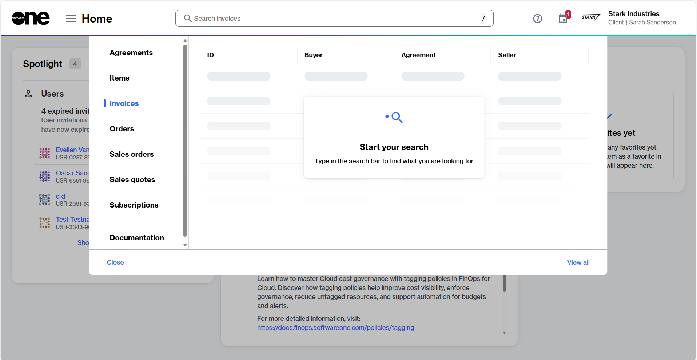

# Navigate the interface

The Marketplace Platform is a SoftwareOne SaaS solution that allows users to procure and manage software solutions. It offers a consistent navigation experience for different roles, including clients, vendors, and partners.&#x20;

This topic explains how to navigate the platform, access features, and move between various modules.

<figure><figcaption>
The Home page of the SoftwareOne Marketplace Platform.
</figcaption></figure>

### Header

The header is always visible as you move through the platform.&#x20;

Main menu

The main menu gives you access to the modules enabled for your account. Select <i class="fa-bars">:bars:</i> **Home** in the header to open it.

The menu label changes with your current context. For example, it shows **Billing** on invoice pages and **Marketplace** on subscription pages.

Items with chevrons <i class="fa-chevron-right">:chevron-right:</i> expand to show more pages in that section.

<figure><figcaption>
Use the main navigation menu to access different modules.
</figcaption></figure>

Search

Use **Search** to find orders, agreements, subscriptions, invoices, and other records.

<figure><figcaption>
Use the Search bar to find your orders, invoices, and much more.
</figcaption></figure>

You can also search documentation, including tutorials, FAQs, and procedures. For example, search for `manage subscriptions` to open related guidance.

Start by choosing a category. Then enter a full or partial name or ID.

For example, to find an agreement, select **Agreements** and enter the full ID, such as `AGR-8981-7039-6781`, or a partial value, such as `6781`.

Help

The **Help** option  gives you quick access to documentation, support, and feedback.

* **Documentation** shows recommended help topics. Select **View all** to open the full documentation set.
* **Need help?** opens the **Get help** wizard for platform questions or issues.
* **Send feedback** lets you share comments and suggestions. For details, see [Share feedback](../../../help-and-support/share-feedback.md).

Spotlight

The **Spotlight** option  highlights items that need action.

Examples include expiring subscriptions and orders waiting for more information.

<figure><figcaption>
Use the spotlight widget to view and manage urgent tasks.
</figcaption></figure>

Profile menu

Use the profile menu to manage your account and personal settings.

Select **My profile** to open your profile settings.

If you belong to multiple accounts, the menu also includes an account switcher. You can:

* Search for an account by name or ID.
* Switch accounts from the list. For details, see [Switch accounts](../switch-account.md).
* Use the **Favorites** and **Recents** tabs for faster access.

<figure><figcaption>
Use the profile menu to access your profile, manage settings, switch accounts, and more.
</figcaption></figure>

### Home page widgets

The widgets on the **Home** page give you quick access to key information.

Spotlight widget

The **Spotlight** widget shows platform objects that need attention. These include agreements, orders, subscriptions, invoices, and more.

For more information, see [Spotlight widget](view-pending-tasks.md).

News and updates widget

The **News and updates** widget shows recent product announcements and video guides from our YouTube channel.

Each item includes a short description, a publish date, and links to related guidance. You can watch videos in the platform or open them on YouTube.

Favorites widget

The **Favorites** widget provides quick access to pages you have marked as favorites.

For more information, see [Using favorites](../mark-favorite-pages.md).

Account team widget

The **Account Team** widget shows the SoftwareOne team that supports your account.

You can contact a team member directly from the widget.

You can also open the **Helpdesk** > [Account team](../../../modules-and-features/helpdesk/account-team.md) page.

