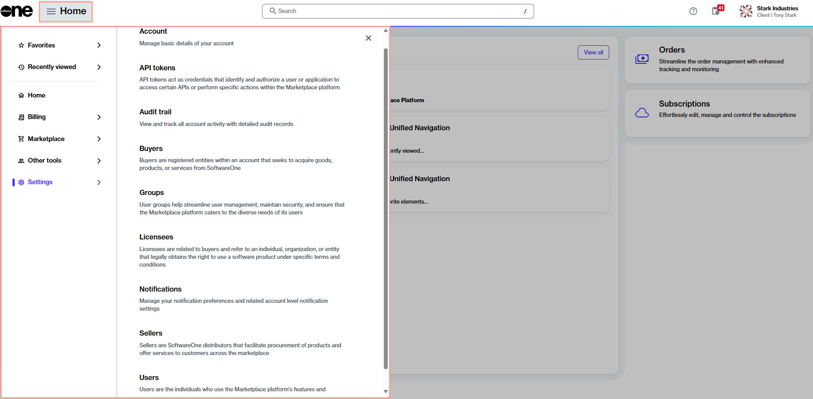

# Interface Overview

The Marketplace Platform is a SoftwareOne SaaS solution that enables users to procure and manage software solutions. This page provides a high-level overview of the platform interface and explains how to navigate and use its core features.

This content applies to all Marketplace Platform users, including Client Portal users (clients and partners), Vendor Portal users (software vendors), and Operations Portal users (SoftwareOne internal associates).

<figure><figcaption>
SoftwareOne Marketplace Platform
</figcaption></figure>

## Signing in to your account

You can access the platform from an up-to-date desktop or mobile browser. For a list of supported browsers, see [Which browsers do you support?](../../../help-and-support/faqs/which-browsers-do-you-support.md).

To sign in to your SoftwareOne Marketplace account:

1. Navigate to the [sign-in page](https://portal.platform.softwareone.com/).
2. Enter the email address associated with your account, then select **Continue**.
3. Enter your password and select **Continue**.&#x20;

Upon successful sign-in, the **Home** page of the platform is displayed.

If you provide inaccurate credentials, an error message is displayed. If you don’t remember your password, select **Forgot password?** and follow the instructions to recover it.

## Understanding the interface layout

The Marketplace Platform interface is designed to provide consistent navigation across all portals.

While the layout is consistent, the available modules and content depend on your role and portal (Client, Vendor, or Operations).

### Header

The header is always visible and contains the following components:

Main navigation menu

The main navigation menu provides access to the modules that are enabled for your account. Select  **Home** in the header to open the menu.

When you are viewing a page within a specific module, the menu label changes to match that context (for example, it displays **Billing** when viewing invoices, **Marketplace** when viewing subscriptions, and so on).

Menu items with chevrons<path d=&#x22;M504-480 320-664l56-56 240 240-240 240-56-56 184-184Z&#x22;/></svg>" data-size="line">can be expanded to reveal additional pages within that category.

<figure><figcaption>
The main navigation menu.
</figcaption></figure>

Global search

The **Search** bar in the header enables you to search for objects, such as your orders, agreements, subscriptions, and more. You can also search for specific products and items in our catalog.

Additionally, you can use search to access product documentation, including resources such as tutorials, FAQs, and procedures. For example, you can search for 'manage subscriptions' to read documentation about how to manage your subscriptions.

<figure><figcaption>
The global search bar.
</figcaption></figure>

When performing a search, start by choosing the category you want to search across and then enter the search term. Our platform supports free text, which means you can enter all or part of the object's ID or name.&#x20;

For example, when searching for an agreement using its ID, select the **Agreements** category and then enter the full order ID (such as ‘AGR-8981-7039-6781’) or part of it (such as 6781). The platform will then display results matching your specified search term.

Help and support

The **Help** option  provides access to various resources, including the [SoftwareOne blog](https://www.softwareone.com/en/blog/articles), product documentation, [news and updates](https://www.softwareone.com/en/media-releases), and our legal pages.&#x20;

Additionally, it also contains a **Support** option that allows you to contact our [Support team](../../../help-and-support/contact-support.md) by creating a support case.&#x20;

<figure><figcaption>
The help icon in the header.
</figcaption></figure>

Spotlight

The Spotlight option highlights tasks that require action, helping you stay on top of important tasks. Examples include subscriptions nearing expiration, orders querying for more information, and more.

To learn more, see [Object Spotlight](view-pending-tasks.md).

<figure><figcaption>
The spotlight widget on the Home page.
</figcaption></figure>

Profile menu

Your user profile menu in the header displays your profile settings and allows you to manage them using the **My profile** option. To learn more, see [Manage Your Profile](manage-profile.md).

If you belong to multiple accounts, the profile menu also includes an account switcher that enables you to [switch between your accounts](switch-account.md). It also contains the **Sign out** option.

<figure><figcaption>
The account selector and your profile menu.
</figcaption></figure>

### Home page widgets

The widgets on the **Home** page provide a centralized overview of key information and shortcuts:

Spotlight

The **Spotlight** widget displays key platform objects requiring your attention. These objects include your agreements, orders, subscriptions, invoices, and more.

For more information, see [Object Spotlight](view-pending-tasks.md).

News and updates

The **News and updates** widget contains video guides from our [YouTube channel](../../../help-and-support/youtube-channel.md). Each video includes a brief description, the date it was posted, and links to related documentation.

You can watch videos directly within the platform or open them on YouTube.

Favorites

The **Favorites** widget provides quick access to pages you have marked as favorites.

For information on how to add and manage favorites, see [Using Favorites](mark-favorite-pages.md).

