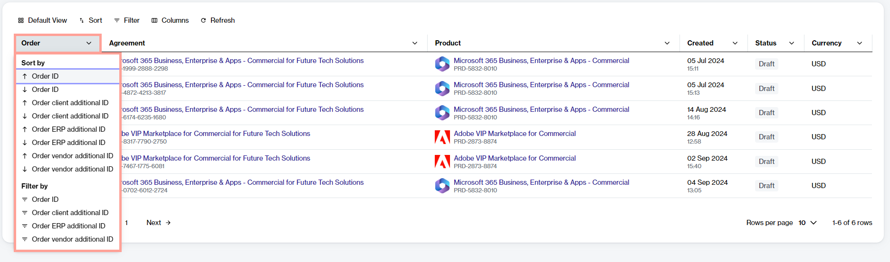
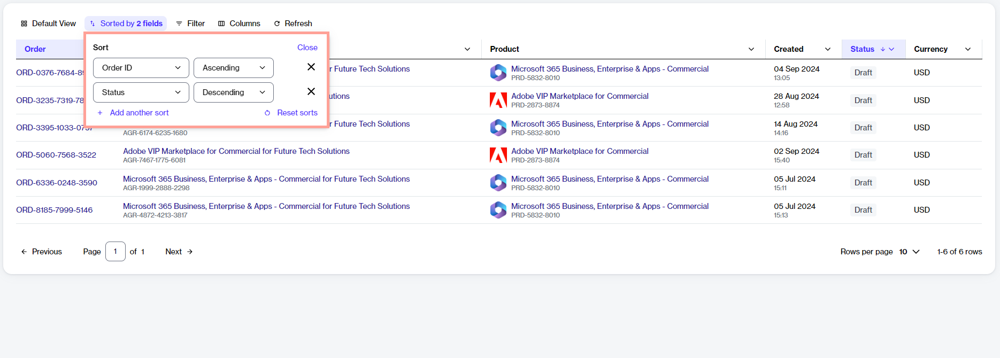
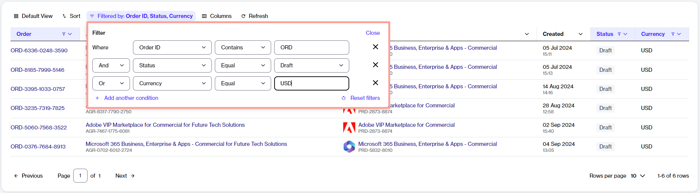
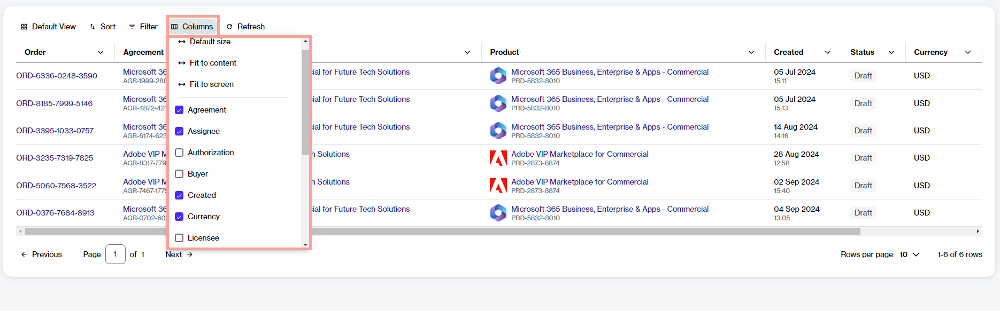
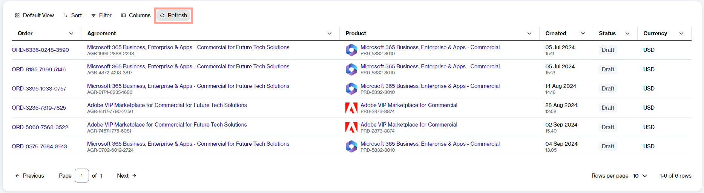
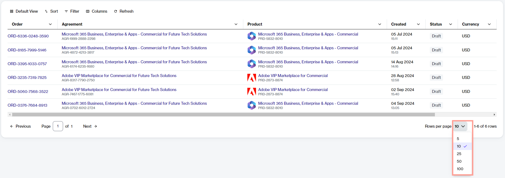
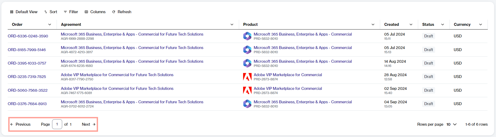

# Customize the Data Grid

The Marketplace Platform uses data grids to display data.&#x20;

A data grid is a table with rows and columns, and it contains several operations that allow you to customize the display of information.

You can sort and filter data, show or hide columns, adjust the column width, change the default rows per page, and more. This topic describes each of these tasks.

<figure><figcaption>
Data grid on the Orders page
</figcaption></figure>

## Sort data

Sorting enables you to reorganize your data in ascending or descending order so you can understand and visualize it better. There are two ways to use the sort function in the grid.

**Sort a single column**

You can sort the data for a column by selecting the column header. When you select the header, the preconfigured sort options are displayed. You can choose any option from the list.

<figure><figcaption>
Sort a single column
</figcaption></figure>

**Sort multiple columns**

If you want to apply multiple sorts, select<path d=&#x22;M320-440v-287L217-624l-57-56 200-200 200 200-57 56-103-103v287h-80ZM600-80 400-280l57-56 103 103v-287h80v287l103-103 57 56L600-80Z&#x22;/></svg>" data-size="line">**Sort** in the grid and then follow these steps:&#x20;

1. In the **Sort** box, select **Add another sort**.&#x20;
2. Choose the required property and select the display order (**Ascending** or **Descending**). To add another sorting rule, select **Add another sort**. You can add multiple rules.
3. Select **Close**. All columns that have sort conditions applied will be highlighted in the grid.

<figure><figcaption>
Sort multiple columns
</figcaption></figure>

## Filter data

Filters help you to narrow down data based on specific attributes. Depending on the type of data you are searching for, you can use a single filter or create multiple filters using different conditions and AND/OR operators.&#x20;

For instance, when ordering new items, you could create a filter to show only the items with a specific name. Similarly, if you have multiple subscriptions, you could use the AND/OR operators to view subscriptions that are active AND have auto-renewal enabled.&#x20;

Follow these steps to create filters:

1. Select the <path d=&#x22;M400-240v-80h160v80H400ZM240-440v-80h480v80H240ZM120-640v-80h720v80H120Z&#x22;/></svg>" data-size="line">**Filter** option in the grid.
2. In the **Filters** box, select **Add another condition**, then define the conditions:
   1. Choose the required property.
   2. Select the condition, such as equal, contains, starts with, and so on.
   3. Choose a value from the list of preconfigured values or type the keyword.
3. If needed, select **Add another condition** to add another condition and combine those conditions using the AND or OR operators.&#x20;
   * **AND** - If you select this operator, the results are displayed only if both conditions are met.&#x20;
   * **OR** - If you select this operator, only one of the conditions needs to be met for the results to be displayed.&#x20;

<figure><figcaption>
Filter options in the grid
</figcaption></figure>

As you define filters, the data in the grid refreshes automatically. If the platform doesn't find any data matching the filters, it displays a message.&#x20;

## Manage columns

**Show or hide columns**

The <path d=&#x22;M121-280v-400q0-33 23.5-56.5T201-760h559q33 0 56.5 23.5T840-680v400q0 33-23.5 56.5T760-200H201q-33 0-56.5-23.5T121-280Zm79 0h133v-400H200v400Zm213 0h133v-400H413v400Zm213 0h133v-400H626v400Z&#x22;/></svg>" data-size="line">**Columns** selector in the data grid lets you show or hide a column. Using this option, you can view only the information you need and hide other columns from the page.&#x20;

You can use the checkbox next to each column name to hide or display a column. If you have hidden a column, you can make it visible again by selecting the same checkbox. Note that some columns are shown by default, and you cannot hide them.

<figure><figcaption>
Columns selector in the grid
</figcaption></figure>

**Adjust column widths**

The **Columns** selector also contains options to adjust the column width. These options include:

* **Default size** - This option resets each column in the table to its default size. You can use this option if you've made adjustments and want to return all columns to their original state.
* **Fit to content** - This option resizes each column in the table to fit its specific content. It means that the width is adjusted to the content within the column.
* **Fit to screen** - This option resizes each column to make the entire table fit your screen.

## Refresh data

If the data in the grid has changed, you can refresh the data to make sure you are working with the latest data at all times. Use the <path d=&#x22;M121-280v-400q0-33 23.5-56.5T201-760h559q33 0 56.5 23.5T840-680v400q0 33-23.5 56.5T760-200H201q-33 0-56.5-23.5T121-280Zm79 0h133v-400H200v400Zm213 0h133v-400H413v400Zm213 0h133v-400H626v400Z&#x22;/></svg>" data-size="line">**Refresh** option to fetch the latest data from the system.

<figure><figcaption>
Refresh option in the grid
</figcaption></figure>

## Change default rows per page

By default, the Marketplace Platform displays 10 rows of data on a page.&#x20;

You can change the default value by selecting another value from the **Rows per page** option on the lower-right side of the grid. You can choose to show 5, 10, 25, 50, or 100 rows per page.

<figure><figcaption>
Rows selector in the grid
</figcaption></figure>

## Navigate between pages

If the grid contains several rows, the rows are split into pages, and page numbers are displayed on the lower-left side of the table.

You can view the page number you are currently on and navigate between pages using the **Next** and **Previous** options. You can also go to a page directly by entering the number in the **Page** field and pressing **Enter**.

<figure><figcaption>
Navigation options
</figcaption></figure>
