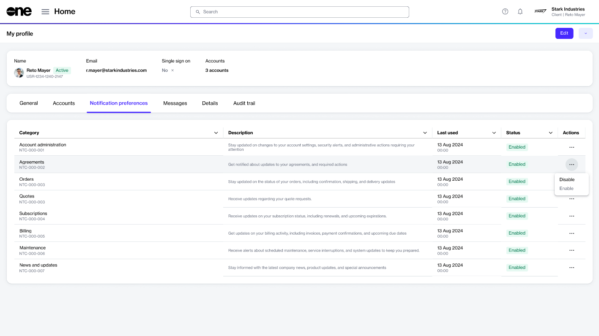
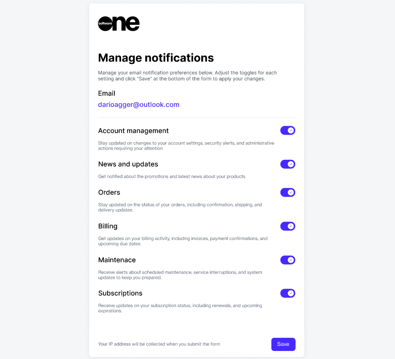

# Manage Notification Preferences

The Marketplace Platform sends notification emails when a specific event occurs, such as when someone places a new order in your account.&#x20;

These emails are sent based on the [notification categories](../../../modules-and-features/settings/notifications/#notification_types) enabled for your account and the recipients set up by your account administrator. If you received a notification email, it means you are either part of the group set up to receive these emails or your administrator selected you individually.&#x20;

However, you have the flexibility to update your notifications preferences. There are two ways to manage your preferences:&#x20;

* By signing in to your account and using the **My profile** option.
* By selecting the **Manage notifications** link in the footer of your notification email.&#x20;

## Managing your notification preferences

### Using the **My profile** option

Follow these steps to update your preferences using the **My profile** option:

1. Sign in to your account and click your profile menu in the upper right.
2. Select **My profile**.
3. On your profile page, select the **Notifications** **preferences** tab. All notification categories for your account, along with status, are displayed.
4. Click the actions icon (**•••**) and select **Enable** or **Disable**.

<figure><figcaption>
Notification preferences
</figcaption></figure>

5. Confirm that you want to enable or disable the category. Your preferences are saved.

### Using the notification email

Follow these steps if you wish to update your preferences from your notification email:

1. Open the notification email.
2. Scroll down to the footer and click the **Manage notifications** link. The **Manage notifications** form opens in your browser.
3. In the **Manage notifications** form, use the buttons to enable or disable a category.
4. Click **Save** to submit your preferences.&#x20;

<figure><figcaption>
Manage notifications form
</figcaption></figure>
