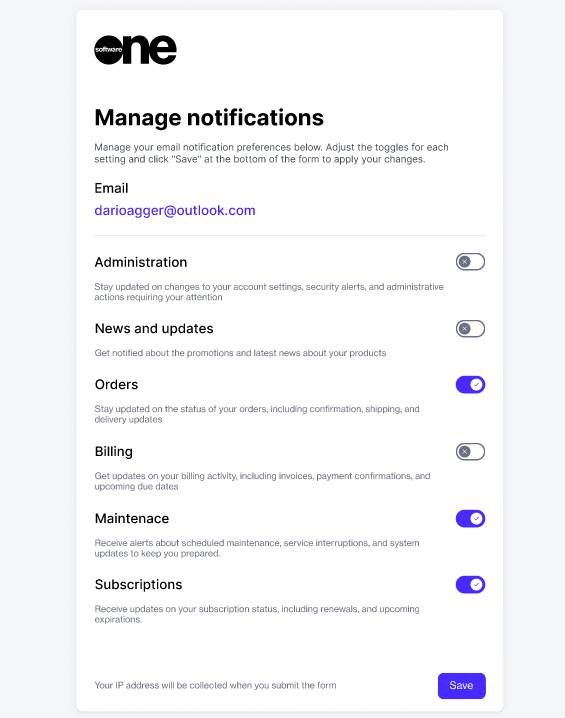

# Manage Notification Preferences

The Marketplace Platform sends notification emails when a specific event occurs, for instance, when a new order is placed or if your agreement has been terminated.&#x20;

These emails are sent depending on the notification category and recipients set up to receive these notifications.&#x20;

The list of recipients is configured by your account administrator. However, the platform gives you the flexibility to define your preferences and enable or disable emails. &#x20;

There are two ways to manage notifications. You can either manage them by signing in to your account and updating the settings or using the **Manage notifications** link in the footer of the email you received.&#x20;

## Managing your notification preferences

### By using your account

Follow these steps if you have an account on the Marketplace Platform:

1. Sign in to your account and click your profile menu in the upper right.
2. Select **My profile**.
3. On your profile page, select the **Notifications** **preferences** tab. All notification categories for your account are displayed along with the status.
4. Click the actions icon (**•••**) and select **Enable** or **Disable**.

<figure><figcaption>
Notification preferences
</figcaption></figure>

5. Confirm that you want to enable or disable the category. Your preferences are saved.

### By using the notification email

Follow these steps if you wish to manage your preferences through the notification email:

1. Open the notification email.
2. Scroll down to the footer and click the **Manage notifications** link.
3. In the **Manage notifications** form, use the individual buttons to enable or disable the category.
4. Click **Save** to submit your references. Your preferences are saved.

<figure><figcaption>
Manage notifications form
</figcaption></figure>
