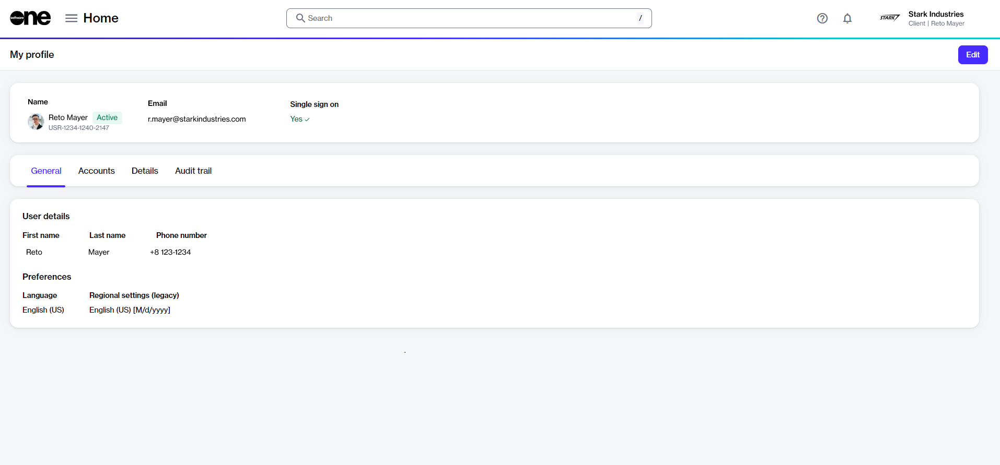

# Manage Your Profile

Your profile page contains basic information about your account, including your account name, first and last name, profile photo, and email address. It also shows your language and date preferences.&#x20;

You can access your profile and make changes as necessary through the **My profile** option. To access the option click your profile menu in the upper right and select **My profile**. This will open your profile overview page.

<figure><figcaption>
Profile overview page
</figcaption></figure>

Your profile settings are organized by tabs:

* **General** - Displays your general details, such as name and phone number, and account preferences.
* **Accounts** - Displays the accounts and groups you belong to. Your account type is also displayed.
* **Details** - Displays all events that have taken place within your account.
* **Audit trail** - Displays a detailed record of each event in your account. To learn more, see [Audit Trail](../../../modules-and-features/settings/audit-trail.md).&#x20;

## Update your profile settings 

You can use the **Edit** option on your profile page to update your account settings and preferences, including:

* Your profile picture.
* Your first name and last name.
* Your phone number.&#x20;
* The language of your account.
* The date format.


Click to see the supported languages.

Supported languages

* Chinese (Simplified)
* Chinese (Traditional)
* Czech
* Dutch
* English (UK)
* English (US)
* French
* German
* Hungarian
* Italian
* Japanese
* Korean
* Norwegian
* Portuguese
* Polish
* Russian
* Spanish
* Swedish



Follow these steps to update your profile:

1. On your profile overview page, click **Edit** in the upper right. The **Edit user** page opens.

<figure><figcaption>
Edit user page
</figcaption></figure>

2. Change the **General** settings as necessary:
   * **Profile picture** - Add or update your profile picture. You can add a photo of yourself, a logo, or anything that represents you and helps others identify you easily on the platform. Your image must be in PNG or JPG format. The maximum file size is 5 MB.
   * **First name** - Update your first name.
   * **Last name** - Update your last name.
   * **Country code** - Select the country code for your phone number.
   * **Phone number** - Enter your phone number.
3. Update your **Preferences** as necessary:
   * **Language** - Choose your language preference.
   * **Regional settings** - Select the date format you want to use.

<figure><figcaption>
Preferences section
</figcaption></figure>

4. Click **Save**. A message is displayed stating your profile has been updated successfully.
