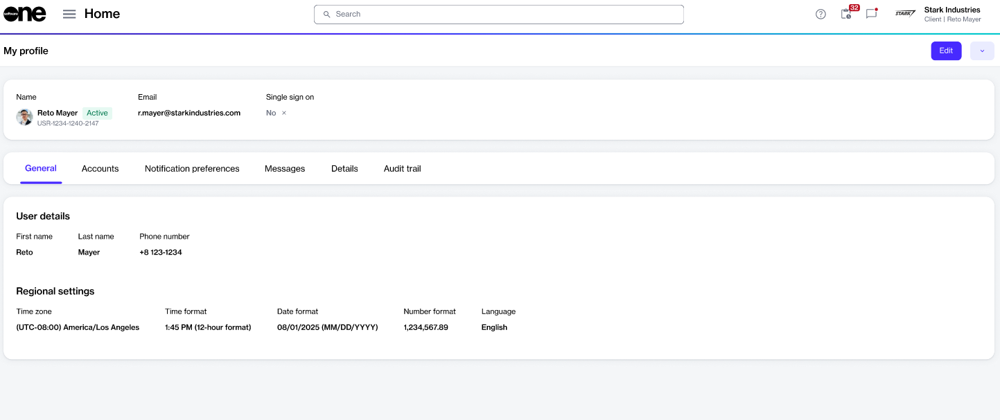

# Manage your profile

Your profile contains the information associated with your account, including your name, email address, and preferences.&#x20;

You can edit your profile to keep your information accurate and up to date and manage your preferences, like display language and other regional settings.&#x20;


The updated regional settings only apply to the Marketplace interface and do not affect platform‑generated attachments, such as PDF documents (including invoices) and Excel files, which follow Excel’s own local settings when formatting data.


### Managing your profile

To update your profile:

1. Sign in to your account.&#x20;
2. Select your profile menu in the upper right, then select **My profile**.&#x20;
3. On your profile overview page, select **Edit**.&#x20;

<figure><figcaption>
The Edit option on the My Profile page for updating your profile
</figcaption></figure>

4. In **Edit user**, update the general settings as necessary:
   * **Profile picture** - Add or update your profile picture. You can add a photo of yourself, a logo, or anything that represents you and helps others identify you on the platform. Your image must be in the PNG or JPG format. The maximum file size is 5 MB.
   * **First name** - Update your first name.
   * **Last name** - Update your last name.
   * **Country code** - Select the country code for your phone number.
   * **Phone number** - Enter your phone number.
5. Update your preference as necessary:
   * **Language** - Choose your preferred display language.
   * **Settings** - Choose if you want to use the same regional settings as your browser or customize formats for time, date, and numbers.&#x20;
     * **Browser defaults** - This setting uses your browser's language and regional settings automatically.
     * **Custom settings** - This setting allows you to choose your own settings for the **Time Zone**, **Time format**, **Date Format**, and **Number Format**.&#x20;
6. **Save** your changes.&#x20;

A message is displayed stating your profile has been updated successfully. Once saved, you can view your preferences under **Regional settings** on the **General** tab of the **My profile** page, or via the **Account switcher** menu.
