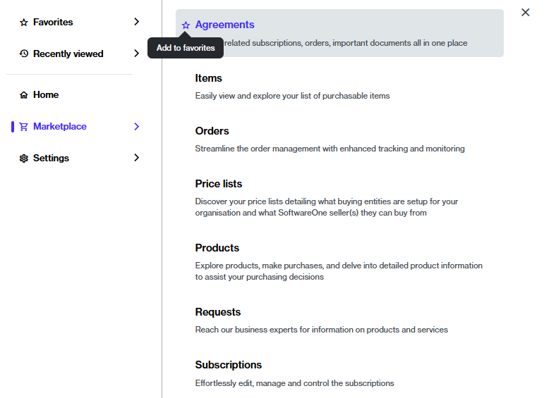
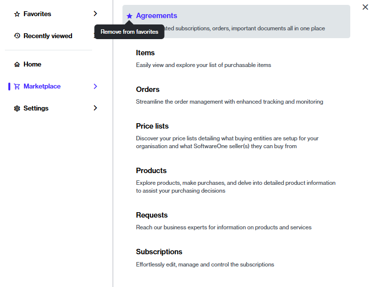

# Manage Favorites

If you use certain pages very often, you can mark those pages as your favorites. This way, you can find your most-used pages easily.&#x20;

Once added, favorites appear in the **Favorites** section within the main navigation menu and on the **Home** page.

### Adding a page to your favorites

To add a page to your favorites:

1. In the main menu, navigate to the required page, for example, **Agreements**.&#x20;
2. Hover over the page, then select the star icon. The icon changes from empty to filled, and the page is marked as a favorite.

<figure><figcaption>
The option to add a page to your favorites.
</figcaption></figure>

### Removing a page from your favorites

You can remove a page from your favorites by selecting the same star you used to mark it as a favorite.&#x20;

When the star icon changes from filled to empty, it implies that the page is removed from your favorites.&#x20;

<figure><figcaption>
The option to remove a page from your favorites.
</figcaption></figure>
