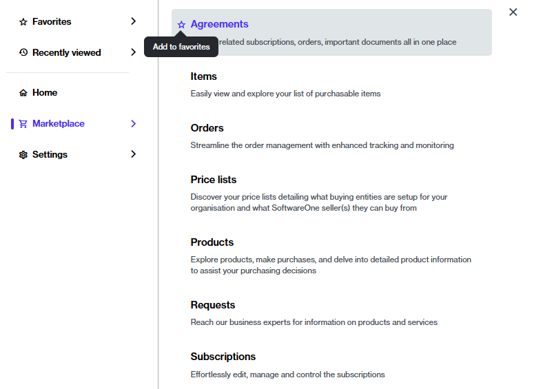
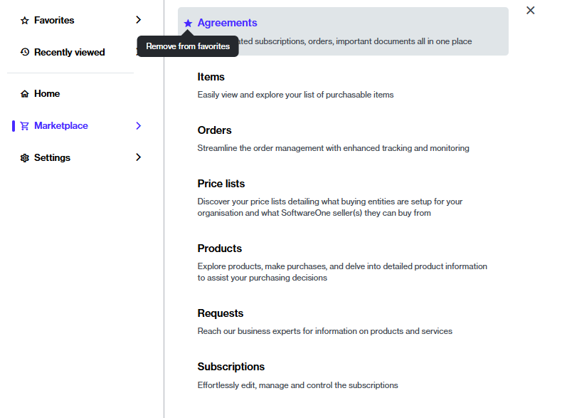

# Mark Favorite Pages

If you use certain pages very often, you can mark those pages as your favorites. This way, you can find your most-used pages easily. Once added, favorites appear in the **Favorites** section of the main menu.

## Add a page to your favorites

To add a page to your favorites:

1. Click the main menu and navigate to the required page.&#x20;
2. Hover over the page and select the star icon. The star icon changes from empty to filled, and the page is displayed under **Favorites**.

<figure><figcaption>
Add to favorites
</figcaption></figure>

## Remove a page from your favorites

You can remove a page from your favorites by clicking the star that you used to mark the favorite.&#x20;

When the star icon changes from filled to empty, it implies that the page has been removed from your favorites.&#x20;

<figure><figcaption>
Remove from favorites
</figcaption></figure>
