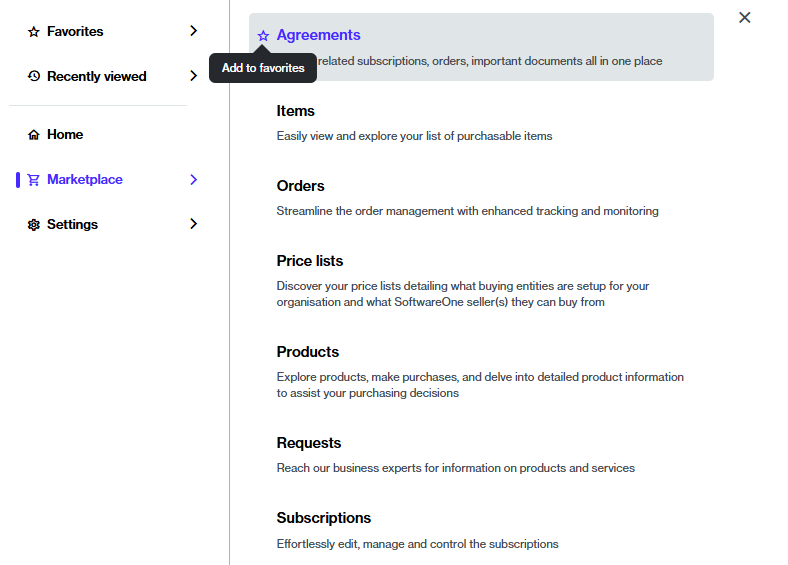

# Using favorites

You can mark pages and accounts as favorites to access them quickly in the SoftwareOne Marketplace.

* Favorite pages appear in the **Favorites** section of the main menu and on the **Home** page.
* Favorite accounts appear in the [account switcher](switch-account.md) within your user profile menu.

### Adding or removing a page from your favorites

To add or remove a page from your favorites:

1. In the main menu, navigate to the required page (for example, **Agreements**).
2. Hover over the page, then select the star icon . The icon changes from empty to filled, indicating that the page has been added to your favorites.

<figure><figcaption>
Use the star icon to add a page to your favorites.
</figcaption></figure>

3. To remove the same page from your favorites, select the same star you used to mark it as a favorite. When the icon changes from filled to empty, the page is removed from your favorites.

### Adding or removing an account from your favorites

To add or remove an account from your favorites:

1. Select your profile menu in the header.
2. Under **All accounts**, find the account you want to favorite. If required, use the **Search** option to locate the account.
3. Select the star icon . When the icon changes from empty to filled, the account is added to your favorites and displayed on the **Favorites** tab.

<figure><figcaption>
Use the star icon to add an account to your favorites.
</figcaption></figure>

4. To remove the account from your favorites, select the same filled star icon. When the icon changes from filled to empty, the account is removed from your favorites.
