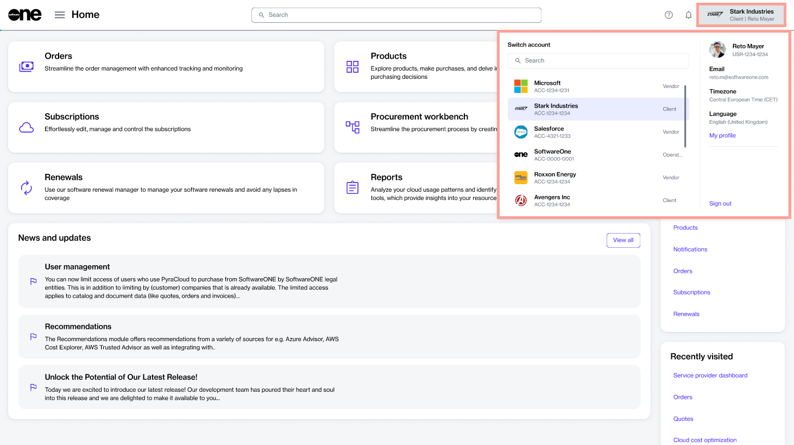

# Switch Accounts

The Marketplace Platform allows an individual to be linked to several accounts and switch between those accounts without signing out of the platform. Switching can be done through your profile menu.


The option to switch accounts is only available for members with multiple accounts.


### Switching between your accounts

To switch between your accounts:

1. Sign in to your account.
2. Select your profile menu in the header. All accounts you currently belong to are displayed under **Switch account**.

<figure><figcaption>
Switch between your Marketplace accounts.
</figcaption></figure>

3. Select the account you want to switch to. To easily find the required account, use the **Search** field. You can search by account name or identifier.

Your account is switched, giving you access to the modules and settings linked to your profile.&#x20;
