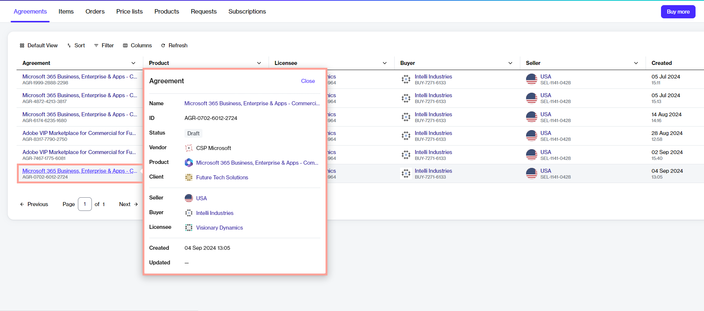
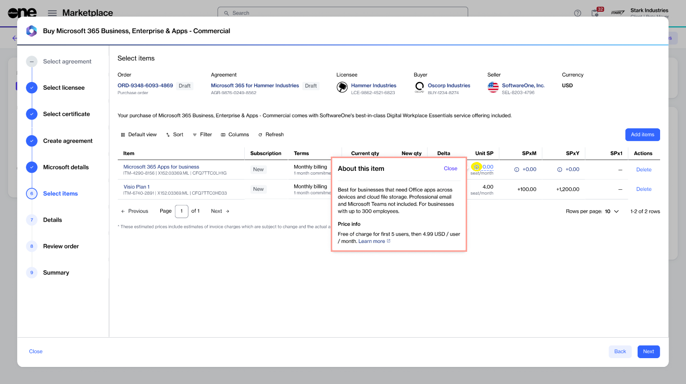

# Information & description cards

Information and description cards provide a quick way to view key properties and contextual details directly within the interface.

### Information cards

Information cards help you quickly view key details about an item without leaving your current page. When you hover over an object’s name (for example, an agreement), a small card appears showing important information such as the object name, ID, and other relevant properties. The exact details vary depending on the object.

Information cards also include links to related objects. Selecting a link takes you directly to that object's details page. For example, selecting the licensee name opens the licensee’s details page. You can close a card by selecting **Close** or pressing **Esc**.

<figure><figcaption>
Use information cards when you want to quickly view key propeties and metadata.
</figcaption></figure>

### Description cards

Description cards are tooltip-style components used throughout the SoftwareOne Marketplace to provide short and contextual information directly within the interface. These cards offer additional guidance to help you understand key details and make informed decisions while using the platform.

When description cards are available, you’ll see an info icon (<i class="fa-circle-info">:circle-info:</i>). For example, during the purchasing process, the info icon appears next to the price when item pricing details are available. You can hover over the icon to view the description card containing additional pricing information. To close a card, select **Close** or press **Esc**.

<figure><figcaption>
Use description cards when you need more context or explanation.
</figcaption></figure>

