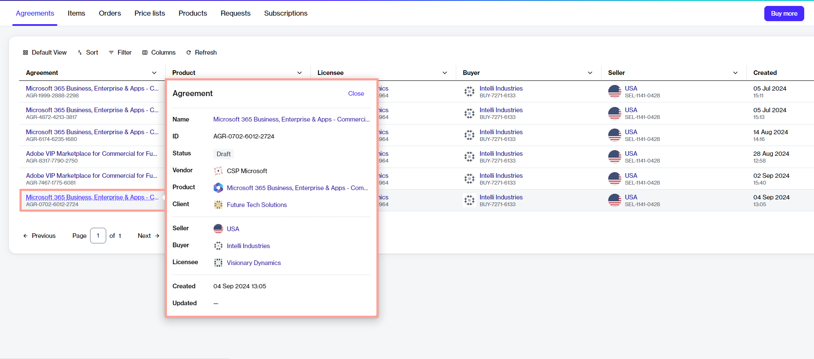

# Information Cards

Information cards are small, interactive cards that display the key properties of an object within the platform.&#x20;

These cards appear when you hover over an object's name. For instance, if you hover over an agreement, you'll notice that an information card appears and it shows you more information about that agreement.&#x20;

<figure><figcaption>
The information card on the Agreements page.
</figcaption></figure>

Information cards make it easy to access information quickly. They display all the key attributes in one place, allowing you to learn more about the object without navigating to its details page.

The information displayed within a card might vary depending on the object, but each card contains general details, such as the object's name and ID, as well as the created and updated dates.&#x20;

Information cards also contain quick links to the related objects. Selecting these links redirects you to the details page of the related object. For instance, if you select the licensee name, the details page of the licensee opens.

You can close a card by selecting **Close** in the upper right or by selecting anywhere outside the card. Alternatively, pressing the **Esc** key also closes the card.
