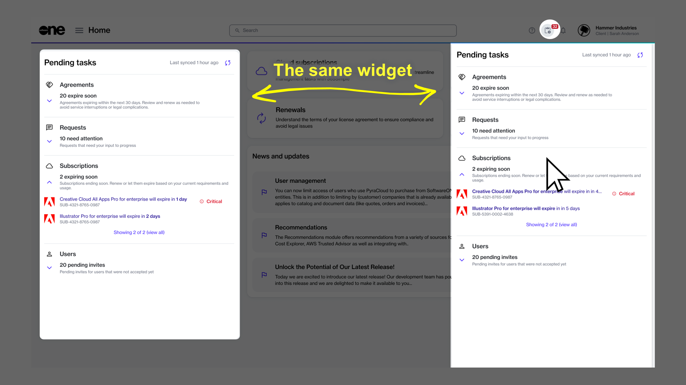

# View Spotlighted Objects

The **Spotlight** widget in the Marketplace Platform is designed to highlight key items, like your agreements, orders, subscriptions, invoices, and more. It highlights all items that need your attention. For example, if you have subscriptions that are nearing expiration, they will be spotlighted so you can manage them easily.

You can find the **Spotlight** widget on the **Home** page, and it can also be accessed by clicking the Spotlight icon  in the status bar.

<figure><figcaption>
<strong>PLACEHOLDER: TO BE REPLACED</strong>
</figcaption></figure>

Within the widget, the information is organized by object type; for example, renewing and expiring subscriptions are displayed under **Subscriptions**, orders that may be querying for additional information are shown under **Orders**, and so on.&#x20;

The widget also provides a total count of items for each category, so you always know how many items need your attention. By default, a maximum of five items are displayed. If there are more items in a category, you can select the **view all** link to view those items on the object's main page.

All details in the widget are synced periodically to ensure you stay informed and always have the latest information. You can also refresh the list manually by selecting the Sync icon .
