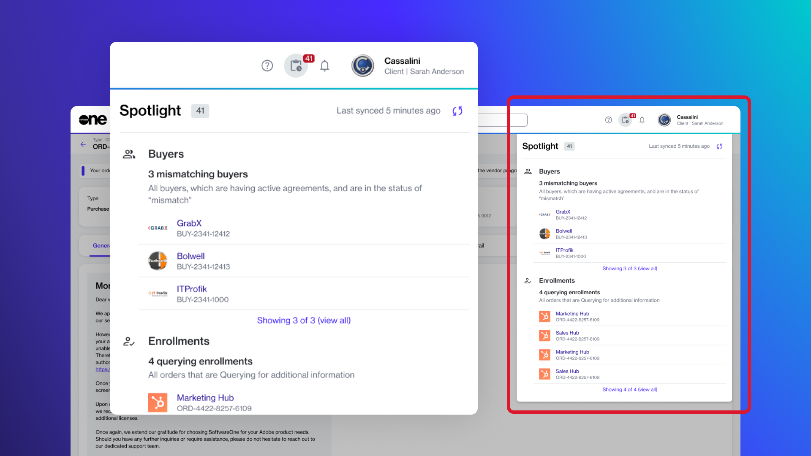

# View Object Spotlight

The **Spotlight** widget on the **Home** page is designed to highlight key platform objects that may require your attention. These objects include your agreements, orders, subscriptions, invoices, and more.  For example, if you have any overdue invoices, they will be spotlighted so you can take the necessary action. Similarly, expiring subscriptions are also included, so you can manage the renewal on time.&#x20;

The widget is displayed on the Home page by default, but you can also access it by selecting the spotlight icon  in the status bar.

<figure><figcaption>
<strong>Spotlight widget</strong>
</figcaption></figure>

Within the widget, the information is organized by object type; for example, renewing and expiring subscriptions are displayed under **Subscriptions**, orders that may be querying for additional information are shown under **Orders**, and so on.&#x20;

The widget also provides a total count of items for each category, so you always know how many items need your attention. By default, a maximum of five items is displayed. If there are more items in a category, you can select the **view all** link to view those items on the object's main page.

All object details within the section are synced periodically to ensure you stay informed and always have the latest information. You can also refresh the list manually by selecting the sync icon .
