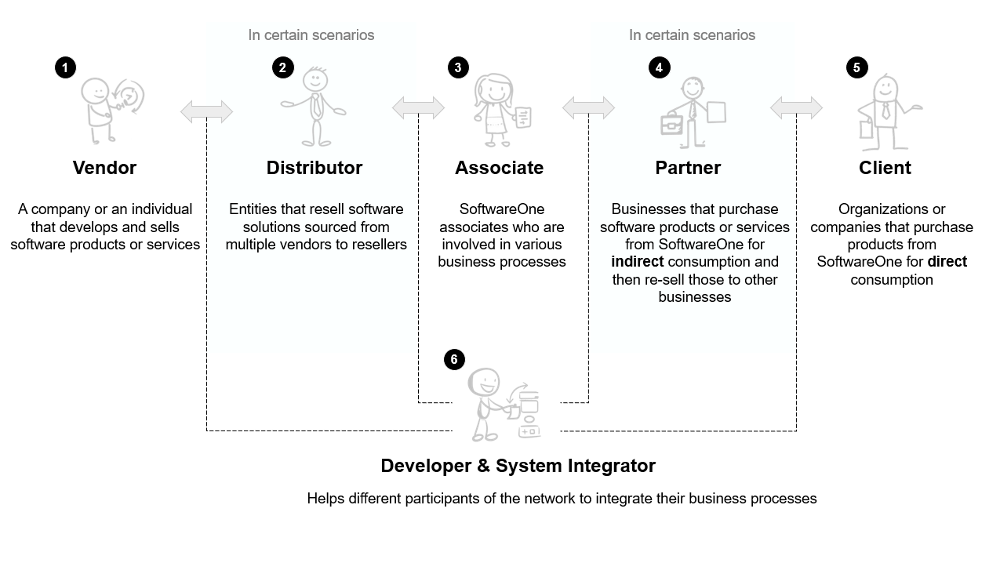
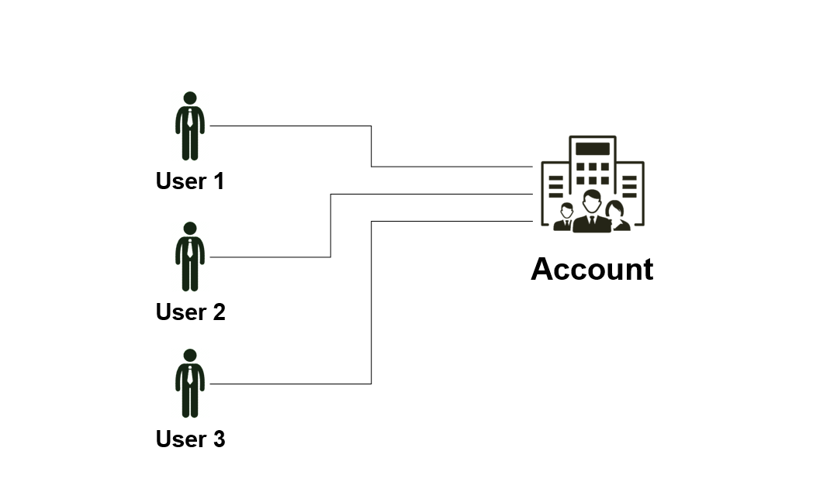
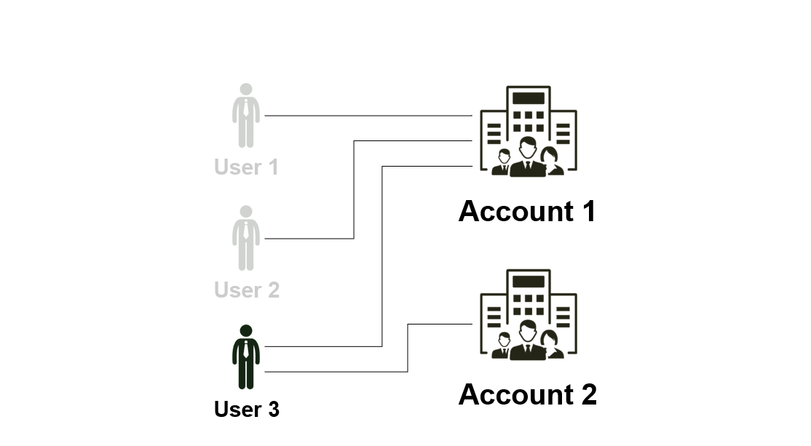
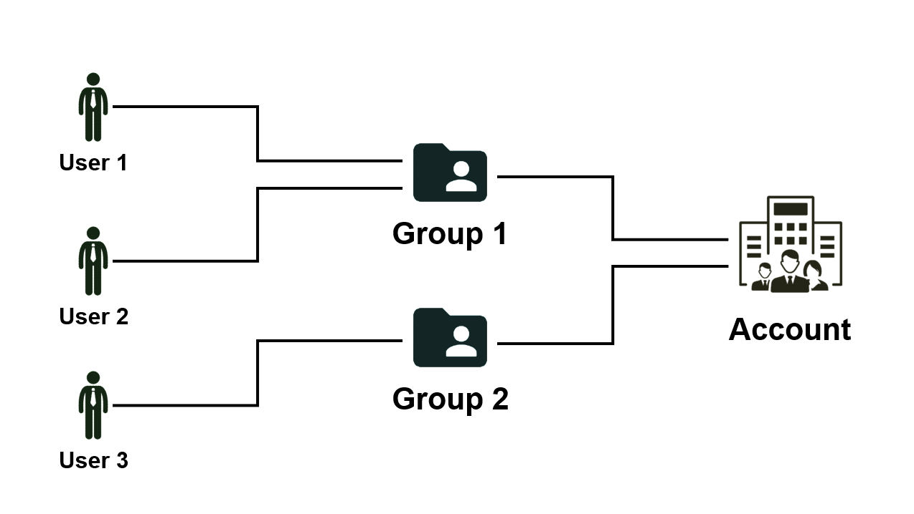
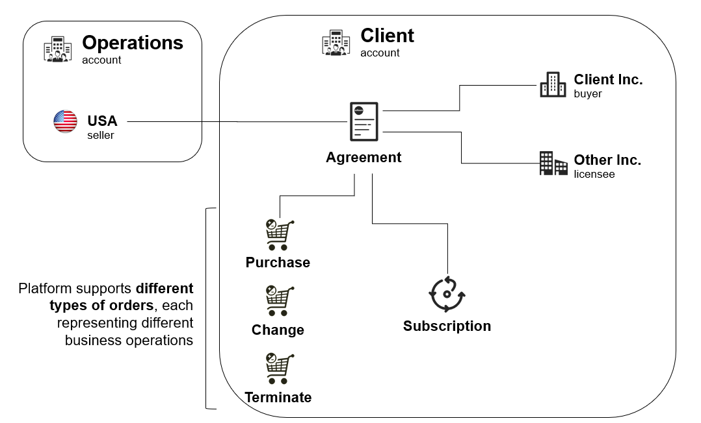
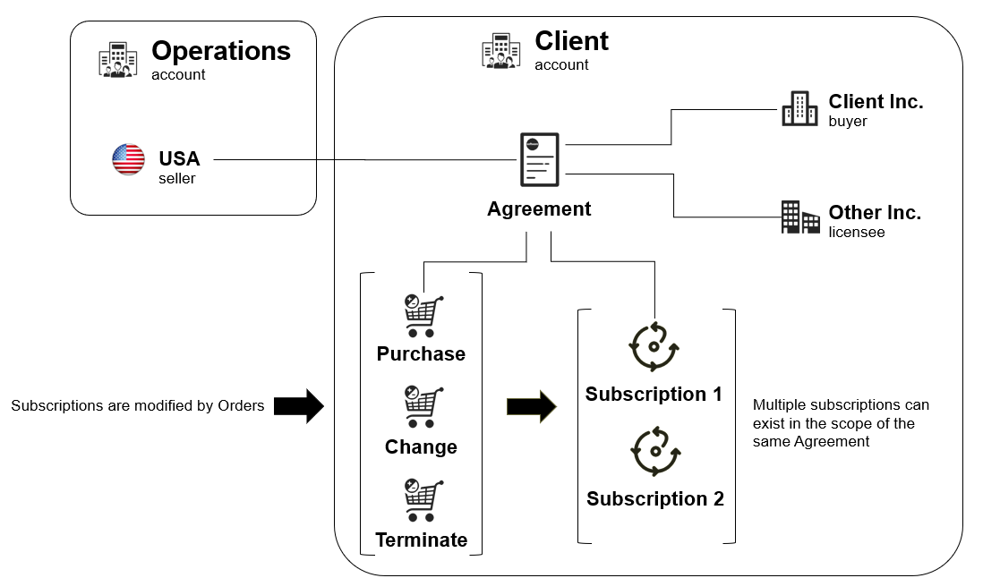

# Concepts

Certain concepts and terms are central to the functionality and design of the Marketplace Platform. We recommend that you familiarize yourself with the terminology, as it's often referenced in our platform and documentation. This will allow you to interact with the platform and maximize its use.&#x20;


You can also watch the [Getting Started Video Guide ](https://youtu.be/LrMOMN8sjM4)on YouTube to understand the concepts listed on this page. The guide also outlines what makes our platform unique for your enterprise software procurement.&#x20;


## Actors

The Marketplace Platform seamlessly brings together various actors to facilitate the buying, selling, provisioning, and billing of software products.&#x20;

Actors represent different entities that interact with the platform for procurement and fulfillment-related activities, as well as other operations specific to the platform.&#x20;

<figure><figcaption>
The key actors in the Marketplace Platform.
</figcaption></figure>

The following are the key actors using our platform:

**Vendors** - A vendor is a company or person from whom SoftwareOne buys software solutions. Vendors develop and sell their products and services. Examples include Microsoft, Dropbox, and more.

**Distributors** - A distributor is an entity that resells software solutions sourced from multiple vendors to resellers. Distributors facilitate software procurement in cases where direct relationships with vendors are not feasible.

**Associates** - Associates are internal SoftwareOne associates who administer the business network. Our associates are involved in various processes throughout your journey with both SoftwareOne and the Marketplace Platform.

**Partners** - Partners represent entities or businesses that buy products or services from SoftwareOne for resale to other businesses.&#x20;

**Clients** - A client is a company or organization that uses our platform to buy software products for their own use or direct consumption.

**Developers and system integrators** - Developers and system integrators represent entities involved in building integrations within the business network.

## Users, Accounts, and Groups  

**Users** - Users represent individuals or persons who can sign in to the platform using their credentials and perform operations associated with their permissions. Users include individual users as well as account administrators responsible for managing account-wide configuration and properties.&#x20;

**Account** - An account represents a company or an organization that's using the Marketplace Platform. Three types of accounts exist in our platform, including:&#x20;

* **Client account** - Represents an account used by our clients and partners to establish agreements and procure software solutions for their enterprises.
* **Vendor account** - Represents an account used by vendors to define the product structure and configuration, and make those products available for ordering through the Marketplace.&#x20;
* **Operations account** - Represents an account used by SoftwareOne associates.

In the Marketplace Platform, an account can contain one or multiple users:

<figure><figcaption>
An account containing multiple users.
</figcaption></figure>

Additionally, users are not restricted to a single account. They can belong to multiple accounts and [switch between those accounts](interface/switch-account.md) without signing out of the platform.&#x20;

<figure><figcaption>
A user belonging to multiple accounts.
</figcaption></figure>

**Group** - A group is an object that facilitates permissions in the scope of an account. Groups contain users, and all users in the group have the same permissions. Permissions are assigned at the group level,  rather than at the individual user level.&#x20;

Users can also be a part of multiple groups, much like users can belong to multiple accounts. For details on how to manage groups, see [Groups](../../modules-and-features/settings/groups/).

<figure><figcaption>
Multiple groups containing multiple users
</figcaption></figure>

## Sellers, Buyers, and Licensees 

**Seller** - A seller is a SoftwareOne entity (for example, SoftwareOne Canada) that buys software solutions from vendors (like Microsoft) and sells those solutions to clients.&#x20;

Sellers are responsible for generating invoices and issuing them to the buyer entities of clients. They act as an intermediary in the transaction process.

<figure><figcaption>
Sellers within the Marketplace Platform.
</figcaption></figure>

**Buyers** - Buyers represent an entity that engages in commercial activities with the SoftwareOne reselling entity, known as Sellers.&#x20;

Buyers are the recipients of invoices issued by SoftwareOne, and they are essential for creating orders, agreements, and subscriptions.&#x20;

<figure><figcaption>
Buyers within the Marketplace Platform.
</figcaption></figure>

**Licensees** - Licensees are the entities that consume the software products or services procured by the buyer. Licensees are critical in establishing agreements alongside buyers and sellers.&#x20;

Client account users can view licensees and manage them through the platform.&#x20;

<figure><figcaption>
Licensees in the Marketplace Platform.
</figcaption></figure>

## Agreements&#x20;

An agreement is an object outlining the relationship between the seller, buyer, and licensee.  They are the foundation for placing orders and creating subscriptions in the platform.&#x20;

<figure><figcaption>
Agreements in the Marketplace Platform.
</figcaption></figure>

They also establish the terms and conditions under which transactions occur. Without an agreement, orders cannot be placed through the marketplace.&#x20;

## Orders and Subscriptions

**Orders** - An order is an object that signifies a business transaction under the framework of an established agreement.&#x20;

The Marketplace Platform supports various types of orders to support different scenarios and the requirements of our clients and partners, including:

* **Purchase order** - Purchase orders are created when you buy a new product or service by creating a new Marketplace agreement.&#x20;
* **Change order** - Change orders are created when you modify your agreement or change the subscription quantity, such as downsizing the license quantity or buying additional resources.
* **Terminate order** - Terminate orders are created when you terminate your agreement or subscription with SoftwareOne.&#x20;
* **Configuration order** - Configuration orders are created when you enable or disable the auto-renewal of a subscription.&#x20;

For details on how to manage your orders, see [Orders](../../modules-and-features/marketplace/orders/).

<figure><figcaption>
Different types of orders in the Marketplace Platform.
</figcaption></figure>

**Subscriptions** - Subscriptions are linked to an agreement and represent service provisioned over a set period. An agreement can contain one or more subscriptions.&#x20;

Subscriptions can be changed only through the order. For example, to terminate a subscription, you must place a termination order. Similarly, to add more licenses, a change order must be placed. It’s not possible to modify a subscription directly without placing an order.&#x20;

For details on subscription management, see [Subscriptions](../../modules-and-features/marketplace/subscriptions/).

<figure><figcaption>
Subscriptions in the Marketplace Platform.
</figcaption></figure>

## Products, Items, and Parameters

**Products** - Products are the solutions or services offered by vendors through the marketplace. They contain various items and parameters, which are also defined by vendors.&#x20;

* **Items** - Represent the individual stock-keeping units (SKUs). A product can contain one or more items, each with its specific name and price.&#x20;
* **Parameters** - Parameters represent structured data used by vendors to collect information from clients during the ordering process. Examples of this information might include contact details, address information, domain name, and more. Parameters can also be used by vendors to pass information to clients during provisioning.&#x20;

<figure><figcaption>
Products within the Marketplace Platform.
</figcaption></figure>

## Price List

A Price List is an object that holds key pricing details of each item within the product.

Vendors can define the price lists for different regions. These price lists are linked to specific sellers and are organized through an object called **Listing**.&#x20;

The Listing object is established by SoftwareOne associates after reviewing products. It links the product price list with the seller, ultimately making the product available for our clients in the SoftwareOne Marketplace.

<figure><figcaption>
Price List in the Marketplace Platform.
</figcaption></figure>

