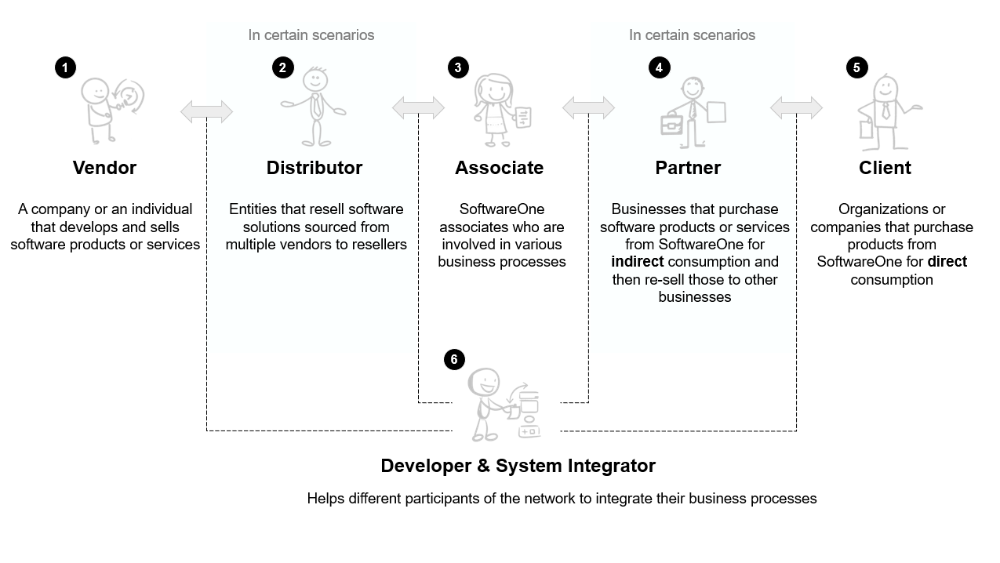
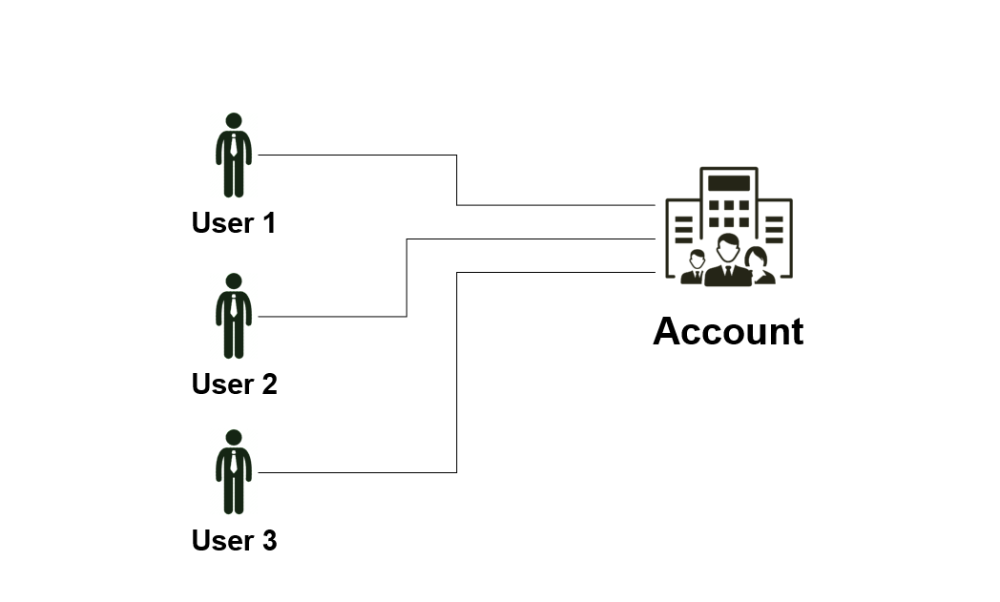
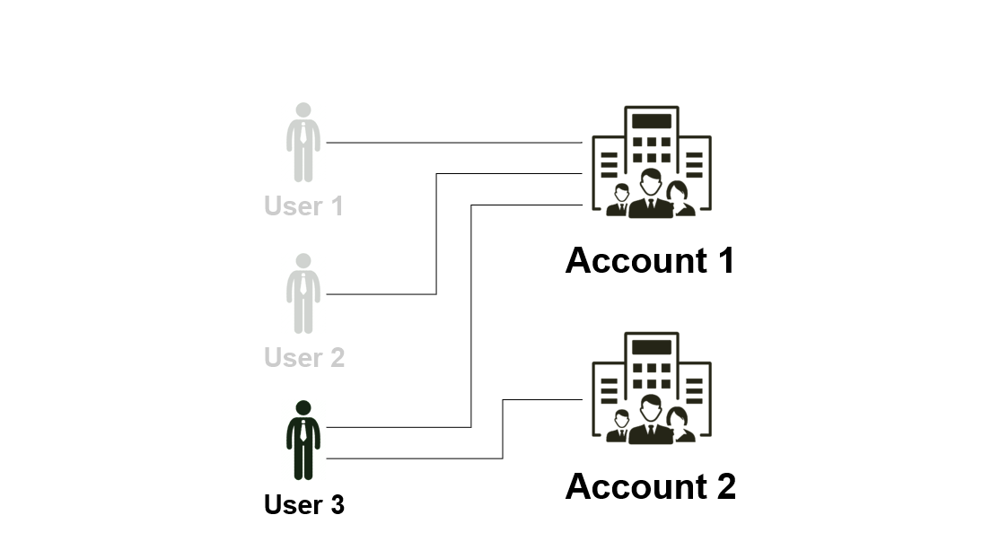
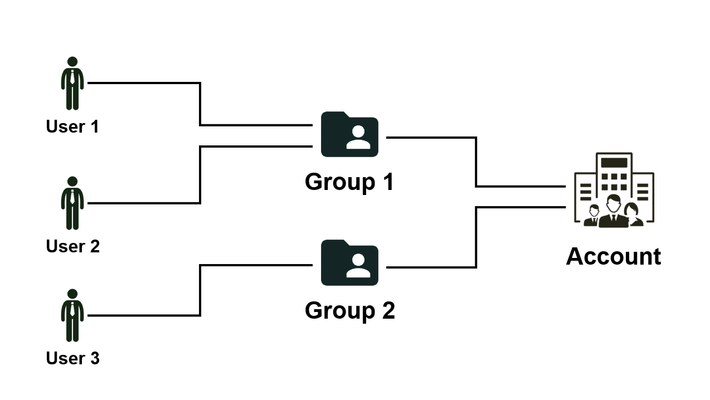
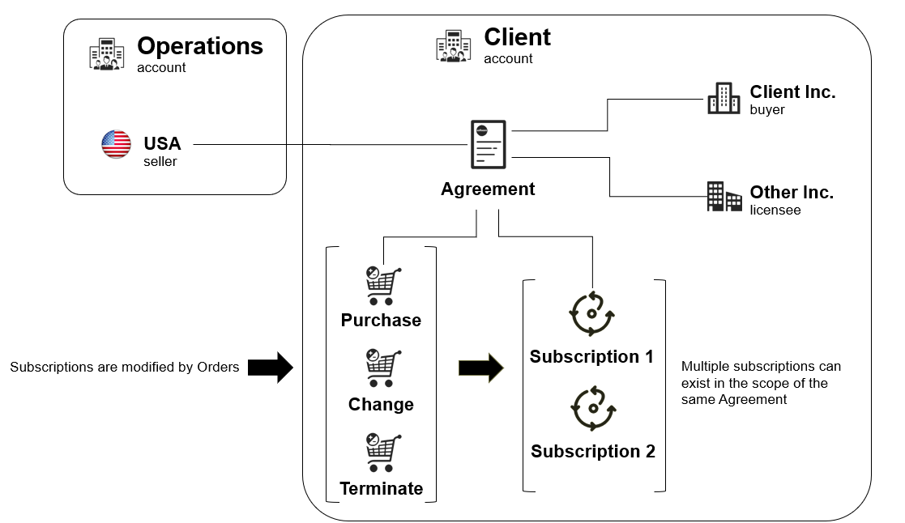

# Key concepts

Certain concepts and terms are central to the functionality and design of the Marketplace Platform.&#x20;

We recommend that you familiarize yourself with the terminology, as it's often referenced in our platform and documentation. This will allow you to interact with the platform effectively and maximize its use. &#x20;

### Actors

SoftwareOne Marketplace seamlessly brings together various actors to facilitate the buying, selling, provisioning, and billing of software products.&#x20;

Actors are different entities that interact with the platform for procurement, fulfillment, and other platform-specific operations.&#x20;

* **Vendors** - A vendor is a company or person from whom SoftwareOne buys software solutions. Vendors develop and sell their products and services. Examples include Microsoft, Dropbox, and more.
* **Distributors** - A distributor is an entity that resells software solutions sourced from multiple vendors to resellers. Distributors facilitate software procurement when direct relationships with vendors are not feasible.
* **Associates** - Internal SoftwareOne associates who administer the business network. Our associates are involved in various processes throughout your journey with both SoftwareOne and the platform.
* **Partners** - Partners represent entities or businesses that buy products or services from SoftwareOne for resale to other businesses.&#x20;
* **Clients** - A client is a company or organization that uses our platform to buy software products for their own use or direct consumption.
* **Developers and systems integrators** - Developers and systems integrators are entities that build integrations within the business network.

<figure><figcaption>
Vendors, distributors, associates, partners, and clients are the key actors.
</figcaption></figure>

### Users, Accounts, and Groups  

#### Users

A user is an individual who can sign in to the platform using their credentials and perform operations according to their permissions. Users include both individual users and admins managing account-wide configuration and properties.&#x20;

The SoftwareOne Marketplace allows users to belong to multiple accounts or have no account at all. Additionally:

* Users with multiple accounts can switch between them without signing out.
* Users who don't belong to any account have limited capabilities. Such users can only sign in and adjust their profile settings. They cannot access any module.

To learn more about user management, see [Users](../../modules-and-features/settings/users/).

#### Account

&#x20;An account represents a company or an organization using the platform. The platform supports the following account types:&#x20;

* **Client account** - Represents an account used by clients and partners to establish agreements and procure software solutions for their enterprises.
* **Vendor account** - Represents an account used by vendors to define the product structure and configuration, and make those products available for ordering through the Marketplace.&#x20;
* **Operations account** - Represents an account used by SoftwareOne associates.

In the SoftwareOne Marketplace, an account can contain a single user or multiple users.

<figure><figcaption>
An account can contain a single or multiple users.
</figcaption></figure>

Additionally, users are not restricted to a single account. They can belong to multiple accounts and switch between those accounts.&#x20;

<figure><figcaption>
A user can belong to multiple accounts in the platform.
</figcaption></figure>

#### Group&#x20;

A group facilitates the management of permissions within an account.&#x20;

Groups contain users, and all users within a group share the same role and permissions. This means that permissions are assigned at the group level, rather than individually to each user.

You can create multiple groups and add users to these groups. Users can also belong to several groups simultaneously; for example, they can be in both the Administrator and Finance groups. Additionally, they can have different roles across different accounts, such as being an Operations user in one account and an Administrator in another.&#x20;

To learn more about creating and managing groups, see [Groups](../../modules-and-features/settings/groups/).

<figure><figcaption>
A user can belong to multiple groups within an account.
</figcaption></figure>

### Sellers, Buyers, and Licensees 

#### Seller 

A seller is a SoftwareOne entity that buys software solutions from vendors, like Microsoft, and sells them to clients and partners. Examples include SoftwareOne Canada, SoftwareOne UK, and more.

Sellers are responsible for issuing invoices to the buyer entities of clients and partners. They act as an intermediary in the transaction process.

Account admins can view the sellers on the [Sellers](../../modules-and-features/settings/sellers/) page.

<figure><figcaption>
Sellers within the Marketplace Platform.
</figcaption></figure>

#### Buyers 

Buyers are responsible for engaging in commercial activities with sellers.&#x20;

They are also the recipients of invoices issued by SoftwareOne, and are essential for placing orders, creating agreements, and ordering subscriptions.&#x20;

Account admins can view and manage buyers from the [Buyers](../../modules-and-features/settings/buyers/) page.

<figure><figcaption>
Buyers engage in commercial activites with sellers.
</figcaption></figure>

#### Licensees

A licensee is a specific person or a department within an organization that consumes the product or service procured by the buyer.&#x20;

Licensees receive the license to use the product, and they are critical in establishing agreements alongside buyers and sellers.&#x20;

There can be multiple licensees within an account, but each licensee can only be connected to one buyer and one seller at a time. Account admins can view and manage licensees from the [Licensees ](../../modules-and-features/settings/licensees/)page.&#x20;

<figure><figcaption>
Licensee consumes the service.
</figcaption></figure>

### Agreements, Orders, and Subscriptions

#### Agreement

An agreement outlines the relationship between entities, such as the seller, buyer, and licensee. &#x20;

They are foundational for placing orders and creating subscriptions. They also establish the terms and conditions under which transactions occur. Placing an order without an agreement is not allowed.&#x20;

All agreements are listed on the [Agreements](../../modules-and-features/marketplace/agreements/) page, allowing you to view and manage them easily.

<figure><figcaption>
Agreements are mandatory for placing an order.
</figcaption></figure>

#### Order

An order is a business transaction under the framework of an established agreement.&#x20;

The platform supports various types of orders to support different scenarios and requirements of our clients and partners, including:

* **Purchase order** - This type of order is created when you buy a new product or service by establishing a new agreement.&#x20;
* **Change order** - This type of order is created when you modify your agreement or adjust quantities, such as reducing the number of licenses or buying additional resources.
* **Terminate order** - This type of order is created when you terminate your agreement or subscription.&#x20;
* **Configuration order** - This type of order is created when you enable or disable the automatic renewal of a subscription.

You can view, track, and manage your orders from the [Orders](../../modules-and-features/marketplace/orders/) page.

#### Subscription

A subscription is a service provisioned over a specified period.&#x20;

Subscriptions are associated with an agreement, and an agreement can contain one or more subscriptions.&#x20;

Changes to a subscription can only be made through an order. For example, to terminate a subscription, you must place a termination order. Similarly, to add more licenses, you must submit a change order.&#x20;

Direct modifications to a subscription are not allowed without placing an order. All subscriptions are listed on the [Subscriptions](../../modules-and-features/marketplace/subscriptions/) page in the platform.

<figure><figcaption>
Subscription is a service provisioned over a specified period.
</figcaption></figure>

### Products, Items, and Parameters

#### Product

A product is a solution or service provided by a vendor through the SoftwareOne Marketplace. Examples of products include Adobe VIP Marketplace for Commercial, Microsoft 365 Business, Enterprise & Apps - Education, and so on.&#x20;

Each product consists of individual items and parameters set by vendors. Additionally, products include a detailed description, a list of purchasable items, and supporting resources such as media files, terms and conditions, and price lists to assist you.&#x20;

You can explore products, make purchases, and review details on the [Products](../../modules-and-features/catalog/products.md) page.&#x20;

#### Items&#x20;

An item refers to an individual stock-keeping unit (SKU) within a product. A product can contain several items, each with its own name and price.&#x20;

For example, within the Microsoft 365 Business, Enterprise & Apps - Education product, you may find items, such as Copilot for Microsoft 365 (Education Student 13+), Defender Threat Intelligence (Education Student Pricing), Microsoft 365 A3 (Education Student Pricing), and more.&#x20;

The [Items](../../modules-and-features/catalog/items.md) page displays a list of individual items. You can also view items on the **Items** tab within the product details page. You can add items to your order when placing an order through the platform.

#### Parameters

A parameter is structured data used by vendors to collect information during the ordering process.&#x20;

Examples include contact details, address information, domain name, and more. Parameters are also used by vendors to pass information during provisioning.&#x20;

<figure><figcaption>
Product, items, and parameters in the Marketplace Platform.
</figcaption></figure>

### Price lists

A price list contains pricing information for each item within a product.

Price lists are created by vendors and are specific to particular regions and sellers. All price lists are organized through an object called Listing.&#x20;

The Listing object is created by SoftwareOne associates after they have reviewed the product. This object connects the product price list with the seller, ultimately making the product available for purchase in the Marketplace.

<figure><figcaption>
Price lists contains pricing information for each item in the product.
</figcaption></figure>

### Notifications

A notification is an email alert about an event in your account. It can cover things like order status changes, subscription upsizes or downsizes, invoice generation, and other account events.

Notifications are managed from the [Notifications](../../modules-and-features/settings/notifications/) area. Account admins can configure recipients and categories there, and individual users can manage their own preferences from **My profile**.&#x20;

### Programs, Certificates, and Enrollments

#### Program

A Program is a set of requirements, or parameters, that vendors ask clients to meet.&#x20;

In the Marketplace Platform, programs are used to view available programs for enrollment, request certificates after requirements are met, and manage related settings, documents, media, and terms.

See [Programs](../../modules-and-features/program/programs.md) for details on how they appear in the platform.

#### Certificate

A certificate is an object that confirms a client or partner meets a vendor’s requirements for a specific program.&#x20;

It serves as proof of eligibility to purchase or access the program’s products and benefits. You can view certificates from the **Certificates** page. For more details, see [Certificates](../../modules-and-features/program/certificates/).

#### Enrollment

An Enrollment is the process of formally registering for a vendor program. It gives access to the program’s benefits and incentives, such as reduced pricing, special offers, and renewal discounts.

In the Marketplace Platform, an enrollment usually includes the program you are joining, the buyer or licensee it applies to, required parameters and supporting details, and a status that shows where it is in the workflow. For more details, see [Enrollments](../../modules-and-features/program/enrollments/).

### Invoices and Statements

#### Invoice

An invoice is a billing document you receive at the end of a billing period.&#x20;

It summarizes the charges on your account and is issued monthly for a specific Marketplace agreement. It's issued as a PDF containing subscription details and consolidated charges.&#x20;

It can be either compact or detailed, depending on how many charges are on the statement, but it's always inked to a statement, which contains the full itemized breakdown. For more details, see [Invoices](../../modules-and-features/marketplace/billing/invoices/).

#### Statement

A statement is a billing document issued at the end of a billing period, together with the invoice PDF.

It's delivered as an Excel (`.xlsx`) file and includes detailed invoice data, such as individual charges, subscriptions, and orders. For details on how to view statements, see [Statements](https://docs.platform.softwareone.com/modules-and-features/billing/statements).
