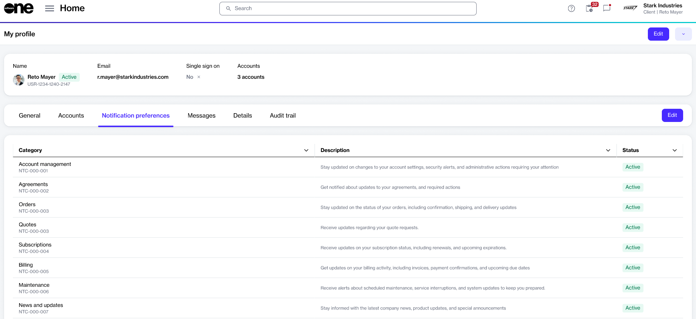

# Manage notifications

The Marketplace Platform sends email alerts for specific account-related events based on the notification categories enabled for your profile.

You can manage categories to choose which notifications you receive.


* Some categories are enabled by default, and you can't disable them.
* These settings apply to your user profile only. Account administrators manage account-level notification settings separately on the [Notifications](../../modules-and-features/settings/notifications/) page.


### Manage notifications from your profile

To manage notifications from **My profile**:

1. Sign in to your account.
2. Select your profile menu, then select **My profile**.
3. Select the **Notification preferences** tab, then select **Edit**.

<figure><figcaption>
Select <strong>Edit</strong> on the <strong>Notification preferences</strong> tab to manage your categories.
</figcaption></figure>

4. Under **Edit notification preferences**, use the checkboxes to enable or disable categories.
5. Select **Save**.

Your changes are saved immediately and apply to future notification emails.

### Manage notifications from an email

To update preferences using the notification email:

1. Open your notification email.
2. Scroll down to the footer and select the **Manage notifications** link. The **Manage notifications** form opens in your browser.
3. Use the checkboxes to enable or disable categories.
4. Select **Save**. Your changes are saved immediately and apply to future notification emails.

### Related topics


[manage-profile.md](manage-profile.md)



[notifications](../../modules-and-features/settings/notifications/)

