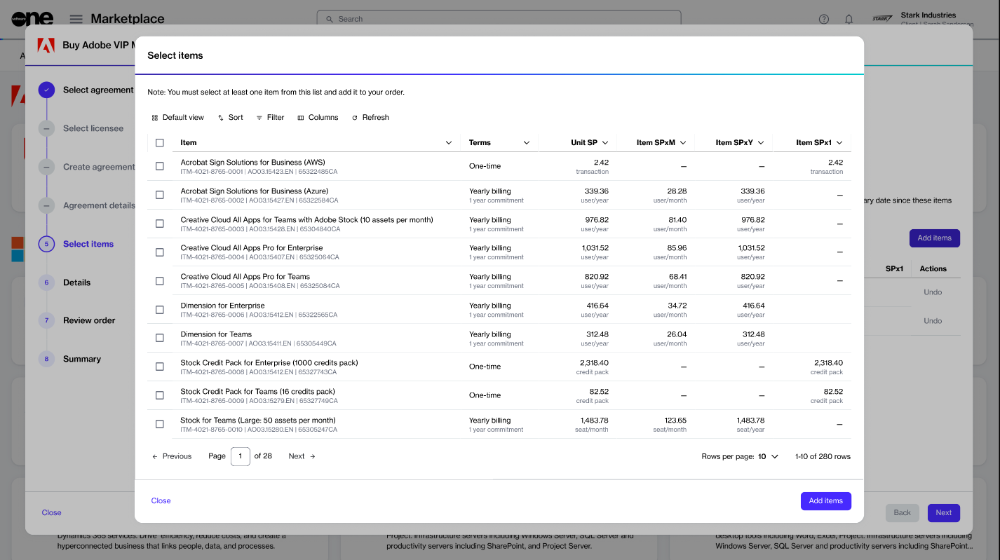

# How to Add Items to Your Agreement

You can add new items to your agreement using the **Buy more** option on the agreement details page.&#x20;

Items can only be added to the agreements in the active state. If the agreement is not active, the **Buy more** option will be unavailable.&#x20;

When you click **Buy more**, the platform automatically detects the agreement and takes you directly to the **Items** section of the purchase wizard, where you can select the items and complete the ordering process.

## Adding items to your agreement 

To add new items to your agreement:

1. Navigate to the **Agreements** page in the platform.&#x20;
2. Select the required agreement. Make sure that the agreement is active.
3. On the agreement details page, select **Buy more** to start the purchase wizard. &#x20;

<figure><figcaption>
Buy more option on the agreement details page
</figcaption></figure>

4. On the **Items** page, do the following:
   1. Click **Add items**. A new window (also called **Select items**) will open displaying the available products that are available for you to order under this agreement.
   2. Select the checkboxes for the items you want to order. You can use filters to find the items easily. When selecting items, be sure to verify the billing terms and the duration of the subscription.
   3. Click **Add items**. Your selected items are added to the agreement, and the **Select items** step is displayed again.
   4. Set the quantity of your newly added items in the **New qty** field and click **Next**.

<figure><figcaption></figcaption></figure>

5. On the **Details** page, add or update the reference ID and your comments as necessary. Then, select **Next**.
6. On the **Review order** page, verify the information and select **Place order**_._

A change order is created for the agreement and sent to the vendor for fulfillment. Select **View details** to go to the order details page or select **Close** to close the wizard.

When your order has been placed, the agreement's status changes from **Active** to **Updating**. It means that the agreement is temporarily locked, and no further orders can be placed under this agreement until the current change order is completed. You can check the status of the order on the **Orders** page or within the **Orders** tab on the agreement details page.
