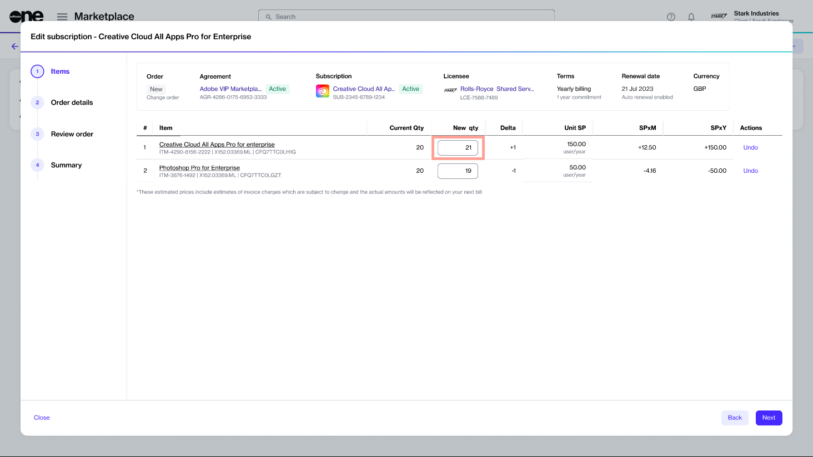

# How to change the number of licenses

The SoftwareOne Marketplace allows you to manage your licenses easily.&#x20;

If you need more licenses, you can alter the subscription to add additional licenses. You can also reduce the number of licenses if you no longer require them. When reducing licenses, the following rules apply:&#x20;

* If your subscription contains only one item, you can't reduce its quantity to zero. In this case, you must terminate the subscription.&#x20;
* If your subscription contains multiple items, at least one item must have a quantity greater than zero. You can't change the quantity of all items to zero.

### Increasing or reducing the number of licenses

To increase or reduce the number of licenses:

1. Go to **Marketplace** > **Subscriptions**.
2. Select the required subscription.
3. On the subscription details page, select **Edit**.
4. In the **Edit subscription** wizard, do the following:&#x20;
   1.  **Items** - Update the quantity in the **New qty** field, then select **Next**.&#x20;

       
<figure><figcaption></figcaption></figure>

   2. **Details** - Enter any additional information and select **Next**.
   3. **Review** - Verify the order details. Then, select **Place order** to submit your order.
   4. **Summary** - Select **View details** to open the details page. Otherwise, select **Close**.

A change order is created and sent to the vendor for processing. The new order is also displayed in your list of orders on the **Orders** page.&#x20;

When the change order is being processed, the status of the subscription and the agreement change to **Updating**. This indicates that the agreement is temporarily locked, and no further orders can be placed under this agreement until the change order is completed.
