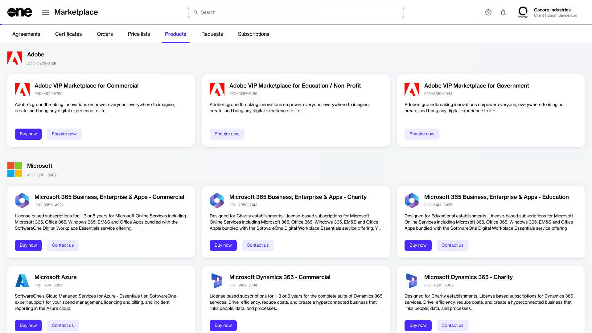

# How to Buy Products

The Marketplace Platform is designed to simplify the complex process of software licensing and procurement. It aims to simplify your buying journey by making it easier for you to find and compare products from multiple software vendors in one place.&#x20;

Ordering products from the SoftwareOne Marketplace involves a series of steps, depending on the product's vendor. This topic describes these steps at a high level.&#x20;

## Buying products from the Marketplace



**Accessing the product catalog**

The **Products** page contains all products available for you to order.&#x20;

You can access this page by signing in to your account and selecting the main navigation menu. All products are categorized by the vendor name and displayed as cards.&#x20;

To view detailed information for a product, select the product name.&#x20;

<figure><figcaption>
The products page in the platform.
</figcaption></figure>



**Starting the ordering process**

When you are ready to order, select **Buy now** on the details page. The ordering process begins, containing a series of steps that must be completed to place the order.

<figure><figcaption>
The purchase wizard containing a series of ordering steps.
</figcaption></figure>



**Placing the order**

The ordering steps might vary slightly depending on the product you are ordering and the information you need to provide. At a high level, the following steps are involved:

1. **Select agreement** - Select an existing agreement or create a new one. The option you select in this step determines the next step. For instance, when you create a new agreement, the **Select licensee** page is displayed. However, if you use an existing agreement, the **Select items** page opens.
2. **Select licensee** - Choose an existing licensee or create a new one.&#x20;
3. **Agreement details** - Fill out the contact form.
4. **Select items** - Choose the items you want to order and adjust the quantity of the selected items.
5. **Additional information**  - Add the additional IDs for the order and agreement.&#x20;
6. **Review order** - Review the order details, read the terms and conditions, and place your order.
7. **Summary** - Review your order summary.


For products like Adobe and Microsoft, you'll need to complete additional steps when placing the order. For step-by-step guidance on these products, see [Adobe Tutorials ](../../../extensions/adobe-vip-marketplace/tutorials-and-videos/)and [Microsoft Tutorials](../../../extensions/microsoft-cloud-solution-provider/additional-resources/tutorials-and-videos/).




After the order is placed, we verify the details and process the order. The **General** tab on the [order details page](../../../modules-and-features/marketplace/orders/#order-details) displays the order's status. If there are any issues, the same details page provides information about the problem and the actions you must take so your order can be processed.
