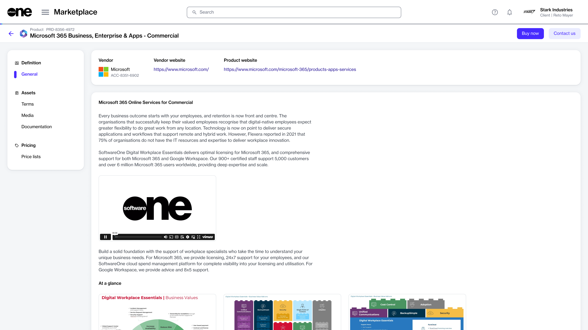

# How to Buy Products in the Marketplace

The Marketplace Platform is a centralized hub designed to streamline the discovery and ordering of subscription-based software products.&#x20;

The platform simplifies the complex process of software licensing and procurement, making it easier for you to find and compare products from multiple software vendors in one place. Each product on our marketplace undergoes a process, where vendors define the product including its terms of use, and submit it to SoftwareOne. Products become available for ordering only after they have been accepted by SoftwareOne.



### Accessing the marketplace

You can access the SoftwareOne Marketplace by signing in to your account and selecting **Marketplace** > **Products** from the main menu.



### Browsing and selecting products

The **Products** page shows different products that are available for you to order. The products are categorized by the vendor name and displayed in the form of cards. You can view detailed information about a product by selecting the product name. To learn more, see [Products](../../../modules-and-features/marketplace/products.md).

<figure><figcaption>
Products page
</figcaption></figure>



### Placing an order

When you are ready to start the ordering process, select **Buy now** in the upper right on the details page.

<figure><figcaption>
Buy now option
</figcaption></figure>

When you select the **Buy now** button, the Purchase Wizard starts. The wizard is designed to guide you through all the necessary steps in placing your order.

<figure><figcaption>
Purchase Wizard
</figcaption></figure>

The steps within the wizard will vary depending on the product and the vendor. At a high level, you'll need to complete the following steps:

1. **Select an agreement** - You have the option to use an existing agreement or create a new one. The option you select in this step determines the next step in the wizard. For instance, if you create a new agreement, the **Select licensee** step is displayed. If you use an existing agreement, the **Select items** step is displayed.
2. **Select a licensee** - Choose a licensee from the list of your licensees or create a new one.
3. **Provide agreement details** - Fill out the contact form.
4. **Select items** - Choose the items you want to order and the quantity of those items.
5. **Additional information**  - Add the additional IDs for the order and agreement.&#x20;
6. **Review order** - Preview the order details and place your order.
7. **Review summary** - See your order summary and the latest status message.


For products, like Adobe and Microsoft, you'll need to complete additional steps when placing the order. For step-by-step guidance on these products, see [Adobe Tutorials ](../../../extensions/adobe-vip-marketplace/tutorials-and-videos/)and [Microsoft Tutorials](../../../extensions/microsoft-cloud-solution-provider/tutorials-and-videos/).



