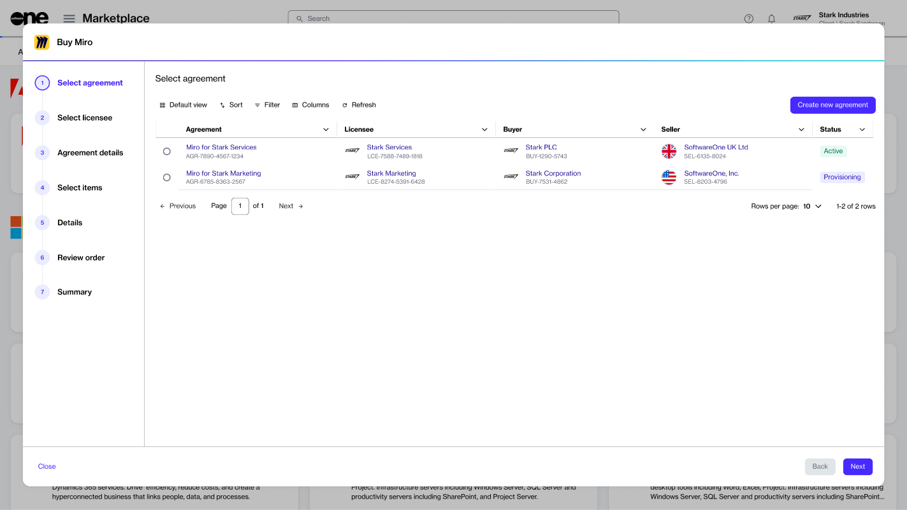

# How to Buy Products

The SoftwareOne Marketplace is designed to simplify the complex process of software licensing and procurement. It aims to simplify your buying journey by making it easier for you to find products from multiple software vendors in one place.&#x20;

Ordering products from the SoftwareOne Marketplace involves a series of steps, depending on the vendor. This topic describes these steps at a high level.&#x20;

### Buying products from the SoftwareOne Marketplace



**Accessing product catalog**

To access the catalog, navigate to the **Products** page.&#x20;

This page contains the products available for you to order. To view detailed product information, select the product name.&#x20;

<figure><figcaption>
The products page showing all products available to order.
</figcaption></figure>




**Starting the ordering process**

When you are ready to order, select **Buy now** on the product details page. The ordering process contains a series of steps that must be completed to place an order.

<figure><figcaption>
The purchase wizard containing a series of steps.
</figcaption></figure>




**Submitting the order**

The ordering steps and the information you need to provide might vary depending on the product and its vendor. At a high level, you'll need to complete these steps:&#x20;

1. **Select agreement** - You have the option to either select an existing agreement or create a new one. The option you select in this step determines the next step. For example, if you create a new agreement, the **Select licensee** step is displayed. However, if you select an existing agreement, the **Select items** step appears.
2. **Select licensee** - You can either choose an existing licensee or create a new one.&#x20;
3. **Agreement details** - You may need to complete the contact form containing details, such as your company name, address, and more.&#x20;
4. **Select items** - You can choose all the items you want to order and adjust the quantity for each item.
5. **Additional information** - You can enter reference details, like additional IDs for both the order and the agreement.&#x20;
6. **Review order** - You can review the order details, read the terms and conditions, and then submit your order.
7. **Summary** - You can review your order summary to ensure everything is correct.


For products like Adobe and Microsoft, you'll need to complete additional steps when placing the order. For step-by-step guidance on these products, see [Adobe Tutorials ](../../../extensions/adobe-vip-marketplace/tutorials-and-videos/)and [Microsoft Tutorials](../../../extensions/microsoft-cloud-solution-provider/additional-resources/tutorials-and-videos/).




After the order is placed, we verify the details and process the order. The **General** tab on the [order details page](../../../modules-and-features/marketplace/orders/#order-details) displays the order's status. If there are any issues, the details page provides information about the problem and the steps you must take to ensure your order can be processed.
