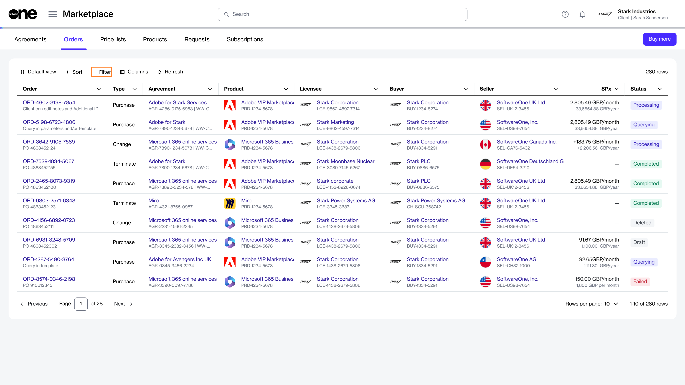

# How to View and Filter Orders

The Marketplace Platform supports various types of orders, including change, purchase, configuration, and termination orders. All orders are displayed on the **Orders** page.&#x20;

If you need to find a specific order, you can use the filter option to search for it. There are several filter options to help you narrow down the list. You can apply a single filter or create a combination of filters by selecting different fields, operators, and values. This topic describes how to use these filters.

## Viewing and filtering orders 

To find an order using a filter, such as status:

1. Navigate to the **Orders** page, then select the  **Filter** option.

<figure><figcaption>
The filter option on the Orders page.
</figcaption></figure>

2. Select **Add another condition** to open a menu of conditions.&#x20;
3. Define the conditions:
   1. In the first field, choose the property. For example, to filter your orders by their status, select **Status**.
   2. In the second field, choose the search operator. Different operators are displayed depending on the condition you selected in the first field. For this example, leave the value set to **Equal**.
   3. In the third field, type or select a value from the list of preconfigured values. The values displayed in this field are determined by your selection in the first field. To see your draft orders, select **Draft**.
   4. If needed, select **Add another condition** to specify additional conditions as needed.

Your list of orders is refreshed according to the filters. To reset the filters and revert to the default view, select **Reset filters** in the filter box.&#x20;

## Viewing your order's details

To view detailed information for an order, select the ID in the **Order** column. You can then view basic order information and specific order details such as items, subscriptions, and more.

From the order details page, you can complete these additional tasks:

* [Add or update your order notes](../../../modules-and-features/marketplace/orders/manage-order-notes.md).
* [View and download the files attached to your order](../../../modules-and-features/marketplace/agreements/view-and-download-attachments.md).
* [Delete draft orders.](../../../modules-and-features/marketplace/orders/delete-draft-orders.md)
* [Submit your draft order for processing](../../../modules-and-features/marketplace/orders/submit-draft-orders.md).
* [Change the status of your order to Processing](../../../modules-and-features/marketplace/orders/set-an-order-to-processing.md).
