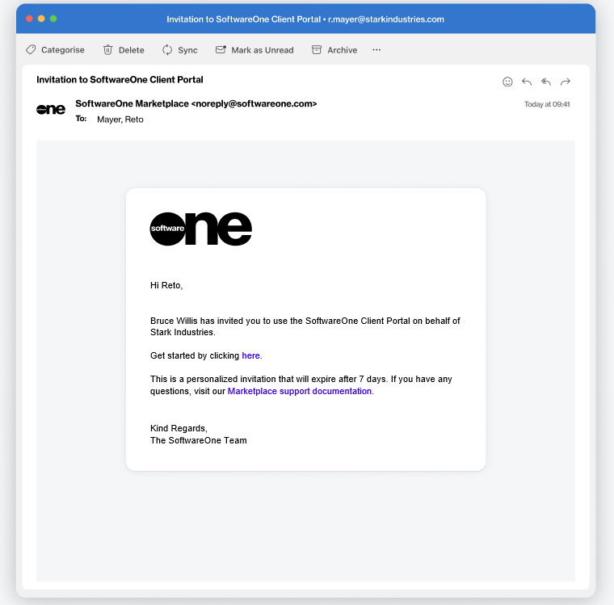

# How to Invite Users to Your Account

Account administrators can invite new users to the account from the **Users** page in the platform. The page is available under **Settings** in the main menu.

Admins can invite individuals who may already have an account as well as individuals who don't yet have an account. When an administrator invites someone, an invitation email is sent. It's important to take action once the invitation has been emailed. Account invitations are valid for only 7 days from the send date. After 7 days, invitations expire and will need to be resent.&#x20;

<figure><figcaption>
New account invitation
</figcaption></figure>

## Inviting users to your account

Administrators can invite users through the **Add** option on the **Users** page.&#x20;

<figure><figcaption>
Add new users
</figcaption></figure>

The **Add** option starts the **Add user** wizard. When inviting an individual, you'll need to enter their details, such as name, email address, and contact information. You'll also need to select all the **groups** that the individual should belong to.&#x20;

For detailed instructions, see [Add New Users](../../../modules-and-features/settings/users/add-new-users.md).&#x20;

<figure><figcaption>
Add user wizard
</figcaption></figure>
