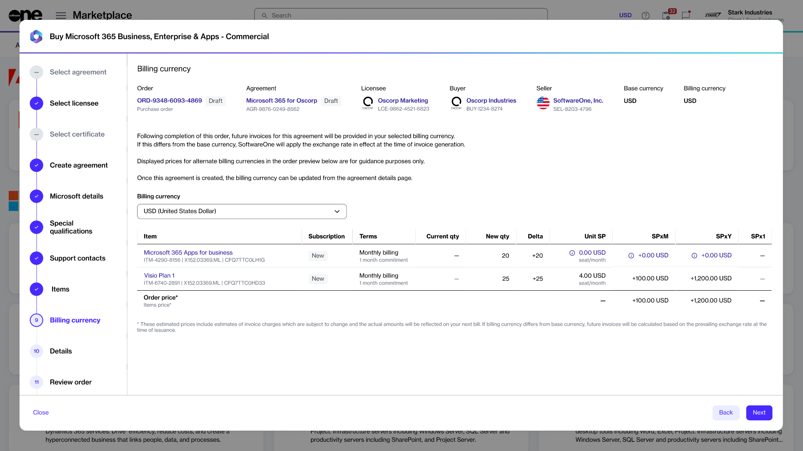
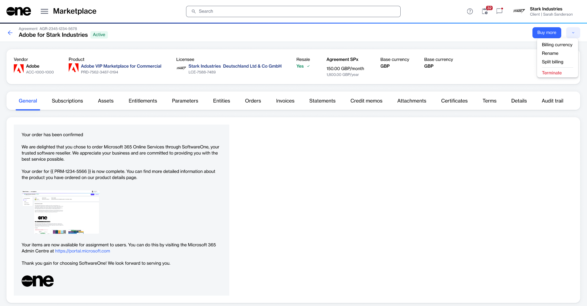

# How to set or change your billing currency

In SoftwareOne Marketplace, you can select the currency in which you want to receive your invoices. There are two ways to choose your billing currency:

* You can select it when creating a new agreement for a purchase order.
* Alternatively, you can change it after the order has been placed.

SoftwareOne issues invoices at the agreement level, meaning that invoices are generated based on a specific agreement. Therefore, selecting or updating the currency must be done at the agreement-level.&#x20;

If the selected currency is different from your base currency, SoftwareOne applies the exchange rate in effect when the invoice is generated.&#x20;

You can change your billing currency at any time. The selected currency is not permanent and can be updated whenever needed.

### Choosing a billing currency when creating a new agreement

You can choose a currency when creating a new agreement.&#x20;


If you don't see the option to change the **Billing currency**, it means switching to a different billing currency is not possible. This happens if the seller doesn't offer additional billing currencies.


To choose a billing currency when creating a new agreement:

1. On the **Products** page, select the desired product.
2. Select **Buy now** to start the Purchase Wizard.
3. In the **Select agreement** step, select **Create agreement**.
4. Complete all steps until you reach the **Billing currency** step.

<figure><figcaption>
Select a billing currency for the new agreement.
</figcaption></figure>

5. From the **Billing currency** list, select the desired currency for future invoices. As you update the currency, the item prices adjust to display in your selected currency. Select **Next**.
6. Complete the remaining steps to finalize your order.

You'll receive your future Marketplace invoices in your selected billing currency.

### Changing the billing currency for an existing agreement

Changing the billing currency for existing agreements only affects future invoices. Past invoices remain in the original currency.&#x20;

To change your billing currency for an existing Marketplace agreement:

1. Go to **Marketplace** > **Agreements**.
2. Select the agreement whose currency you want to update. The agreement details page opens.
3. Select the down arrowand choose **Billing currency**.

<figure><figcaption>
Select the Billing currency option to choose a new currency for an existing agreement.
</figcaption></figure>

4. In the **Select billing currency** dialog, choose the new currency, then select **Save**. The billing currency is updated and used for future invoices.
