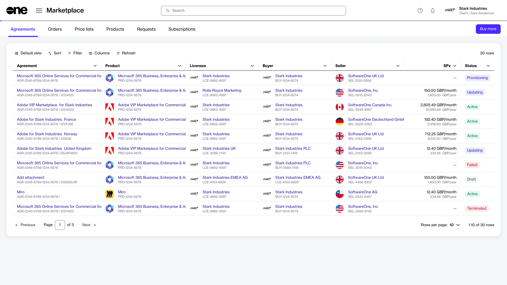

# Where to Find Your Agreements

The **Agreements** page is where you can access all your agreements in one place.&#x20;

As agreements contain subscriptions, having access to your agreements in one place makes it easier to manage and keep track of subscriptions. Agreements also store important documents that are relevant to the agreement, such as PDF files, terms and conditions, and more.

## Accessing your agreements 

To view a list of your agreements, select the main menu of the Client Portal and then choose **Marketplace** > **Agreements**.

From here, you can view your agreement name, the product you ordered, agreement status, and other details. To learn more, see [Agreements Interface](../../../modules-and-features/marketplace/agreements/#agreements-interface).

<figure><figcaption>
Agreements page
</figcaption></figure>

## Viewing an agreement's details 

You can get detailed information for an agreement by selecting the agreement.&#x20;

The details page shows all subscriptions linked to the agreement, parameters, the buyer, seller, and licensee entities mapped to the agreement, and more.&#x20;

From the details page, you can self-manage your agreement and do the following:

* [Terminate your agreement](https://docs.platform.softwareone.com/~/changes/mVP8mnWO2wFE1657Z1oX/modules/marketplace/agreements/manage-your-agreements/terminate-agreements).
* [Edit the name of your agreement.](../../../modules-and-features/marketplace/agreements/rename-an-agreement.md)
* [Edit your agreement's default ID and assign a new ID](../../../modules-and-features/marketplace/agreements/edit-agreement-id.md).

## Related topics


[Agreements](https://app.gitbook.com/s/rouC21YfVpuUxysQFTrr/modules-and-features/marketplace/agreements)



[Agreement States](https://app.gitbook.com/s/rouC21YfVpuUxysQFTrr/modules-and-features/marketplace/agreements/agreement-states)

