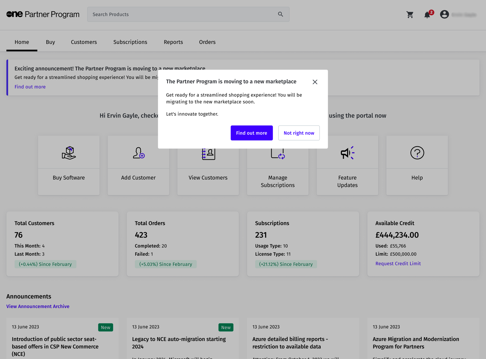

# How Does Partner Portal Migration Work?

SoftwareOne's legacy Partner Portal is being transitioned to the Marketplace Platform.

The Marketplace Platform offers the same self-service capabilities as the Partner Portal, but also includes several additional features that enable you (our partners) to expand your service offerings. The platform provides a more unified and streamlined experience, allowing you to take advantage of features that are specifically designed for you.

This topic outlines what you can expect during the transition and details the steps you must take to continue transacting with us.&#x20;

## Before migration

Before we begin the migration process, you'll see a message in the Partner Portal indicating that your account will be migrated soon.

<figure><figcaption>
Before migration
</figcaption></figure>

At this stage, you don't need to take any action.&#x20;

However, we recommend that you use the following links to become familiar with the terminology and experience of the new Marketplace:

* [Key Concepts](../key-concepts.md) - Describes the key concepts and the terminology used within the Marketplace Platform.
* [Platform Interface](../interface/) - Describes how to navigate and use the interface.

## During migration

We plan and execute the entire migration process. It means you don't need to take any action.

## After migration

When your account has been migrated, we'll send you an email.&#x20;

You'll also see a message within the Partner Portal confirming that your account has been migrated.&#x20;

<figure><figcaption>
After account migration
</figcaption></figure>

Post migration, the legacy portal will switch to an **Archive** mode. You'll still have access to your historical orders and invoices, but you won't be able to make new transactions.

You'll also receive an invitation to join the account on the Marketplace Platform. For details on how to accept the invitation and complete account registration, see [Respond to Invitations](../../../modules-and-features/settings/users/respond-to-invitations.md).

After accepting the invitation, you can sign in and access your [agreements](../../../modules-and-features/marketplace/agreements/), [subscriptions](../../../modules-and-features/marketplace/subscriptions/), and customers ([licensees](../../../modules-and-features/settings/licensees/)).

## Next steps

After joining the account, you must enroll in the SoftwareOne Cloud Solution Provider Partner Program (**SWO CSP Partner Program**).

This enrollment is required to transact with all CSP products in the Marketplace Platform. For instructions on how to enroll, see [Enroll in CSP Partner Program](../../../extensions/microsoft-cloud-solution-provider/partner-programs/enroll-in-csp-partner-program.md).&#x20;

Once you are enrolled and have your certificate, you can start transacting through the Marketplace. If you need assistance, you can[ contact Marketplace Platform Support](../../../help-and-support/contact-support.md).

You'll also receive invitations to webinars after the migration, where you can learn how to effectively use the Marketplace Platform.
