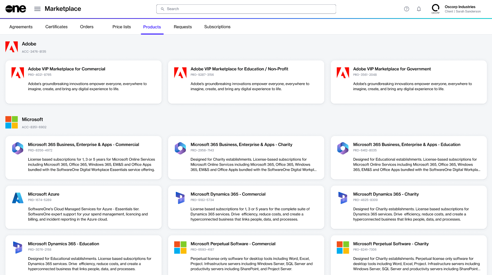

# How to Buy Products for Resale

The **Products** page in the Marketplace Platform displays all products that are available for partners to order. This includes products for self-consumption and reselling to other businesses.&#x20;

The first step in the ordering process is to choose whether you want to use an existing agreement or create a new one. New agreements give you the flexibility to select a licensee based on the consumption model (reselling or self-use) and then complete the buying process. If you choose to use an existing agreement, you'll need to make sure that the agreement is mapped to a Resale Licensee.&#x20;



### Accessing the Marketplace

Partners can access the SoftwareOne Marketplace by signing in to their account and selecting **Marketplace** > **Products** from the main menu.

<figure><figcaption>
Products page in the platform
</figcaption></figure>



### Starting the ordering process &#x20;

The **Products** page shows all the products you can order. All products are categorized by vendor name and displayed in the form of cards.&#x20;

Click a product to open its details page and then click **Buy now** in the upper right. The ordering process begins.

<figure><figcaption></figcaption></figure>



### Placing the order



