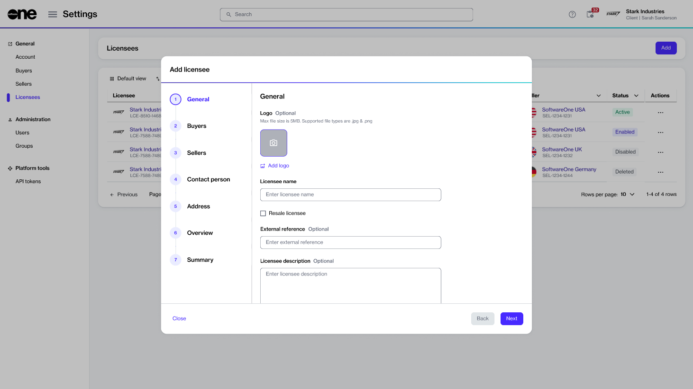

# How to Configure Licensees for Resale

This tutorial describes how SoftwareOne partners can set up resale licensees within the platform.

Licensees are the entities that use the software products or services procured by the buyer. Partners who wish to order products from the Marketplace and resell them to other organizations must configure these licensees as resale licensees.&#x20;

A resale licensee is defined as a licensee that engages in resale activities, specifically ordering products for resale rather than for their self consumption.

### Prerequisites

Make sure you have permissions to create new licensees. Only account administrators can create and manage licensees in the platform.

### Configuring licensees for reselling products



**Start the Add Licensee** **wizard**

To start the wizard:

1. Navigate to the **Licensees** page.&#x20;
2. On the **Licensees** page, select **Add** to start the **Add Licensee** wizard.



**Set up your new licensee**

<figure><figcaption>
The Add licensee wizard in the platform.
</figcaption></figure>



1. **General** - Provide the following details and select **Next**:&#x20;
   1. **Logo** - (Optional) Add a logo for the licensee. You can upload an image or drag the image into the field.
   2. **Licensee name** - (Required) Provide a name for the licensee, which could be your company name, department name, or username.&#x20;
   3. **Resale licensee** - (Optional) Select this checkbox to configure the license as a resale licensee, so they can order software products and services for resale.&#x20;
   4. **External reference** - (Optional) Enter a reference number or identifier for the licensee.
   5. **Licensee description** - (Optional) Provide a brief description of the licensee.
2. **Buyers** - Choose the buying entity you want to link with the license, then select **Next**.&#x20;
3. **Sellers** - Choose the SoftwareOne entity you want to order from. Only the sellers that are mapped to the buyer you've selected in the previous step are displayed. When done, select **Next**.
4. **Contact person** - Choose if you want to assign a contact person to the licensee, then select **Next**:
   1. **None (leave unassigned)** - Choose this if you don't want to assign a contact person.
   2. **Select an account user** - Choose this to assign an existing user within your account as the contact person.
   3. **Add contact details manually** - Choose this to enter the details manually. You'll need to provide the person's name, email address, and optional contact details.
5. **Address** - Enter the address for the new licensee and select **Next**. Note that the **Create a new licensee address** option is selected by default.&#x20;
6. **Overview** - Review all the details you've entered and select **Add**. The licensee is configured as a resale licensee in the platform.
7. **Summary** - Select **View details** to open the licensee details page. Otherwise, select **Close**.&#x20;



### Next steps 

After you have configured the licensee, you can order products for resale through the **Products** page in the platform. See [How to Order Products for Reselling](how-to-order-products-for-resale.md) for details on how to start the ordering process.
