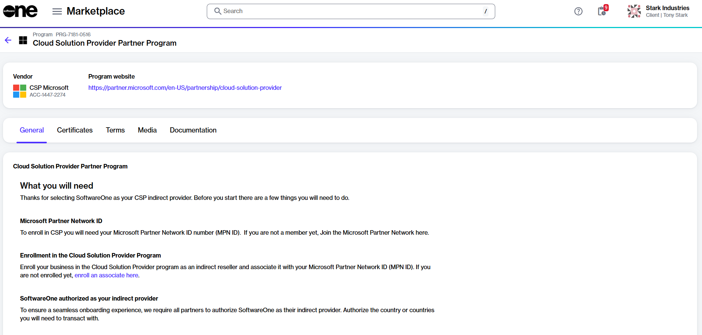

# How to Enroll in the CSP Partner Program

The **Cloud Solution Provider Partner Program** allows you to partner with SoftwareOne as your indirect CSP provider. To learn more about this program, see [Partner Programs](../../../extensions/microsoft-cloud-solution-provider/partner-programs.md).

## Prerequisites 

You can enroll in this program if you meet these conditions:

* You have a Marketplace account with partner capabilities. For details, see [How to Verify If Your Account Has Partner Capabilities](how-to-verify-if-your-account-has-partner-capabilities.md).
* You are signed up for the Microsoft Cloud Solutions Provider (CSP) program as an indirect reseller. For details on how to enroll, see [Enroll as an indirect reseller](https://learn.microsoft.com/en-us/partner-center/enroll/enrolling-in-the-csp-program).
* You are signed up for the SWO CSP Partner Program. For details, see [How to Enroll in the SWO CSP Partner Program](how-to-enroll-in-the-softwareone-csp-partner-program.md).
* You have the Microsoft Partner Network (MPN) ID and email address for your Microsoft partner account. To find the ID in the Microsoft Partner Center, select the **Settings** (gear) icon > **Account settings** > **Organization Profile** > **Identifiers**. Then, find the PartnerID with the **Type Location** that matches the country/region of this CSP account.

## Enrolling in the CSP Partner program



**Open the CSP Partner Program details page**

To open the details page:

1. In the Marketplace Platform, navigate to the **Programs** page, located under **Marketplace** in the main navigation menu.
2. Select **Cloud Solution Provider Partner Program**. The program's details page opens.

<figure><figcaption>
Cloud Solution Provider Partner Program
</figcaption></figure>



**Start the Add Certificate wizard**

To start the wizard:

1. On the details page, select the **Certificates** tab.
2. Select **Add** to start the **Add certificate** wizard.



**Use the Add Certificate wizard to enroll**

Complete the following steps in the wizard. Make sure to enter or verify the required information on each page.

1. **Certificant** - Choose the buyer who will represent this certificate and select **Next**.
2. **Partner details** - Do the following, then select **Next**:&#x20;
   1. Authorize SoftwareOne as your indirect provider. You must select a country that is within your region. For regional markets, see [Microsoft Regions](https://learn.microsoft.com/en-us/partner-center/enroll/regional-authorization-overview).&#x20;
   2. Enter the email address associated with your Microsoft partner account. We will use this email address to link your CSP customers with your Microsoft reseller account.
   3. Enter the MPN ID associated with your Microsoft partner account. We'll associate your Microsoft subscriptions with the MPN ID.
3. **Details** - Enter a unique name for the certificate. When done, select **Next**.
4. **Overview** - Review the details and select **Add.**
5. **Summary** - Select **View details** to open the enrollment details page. Otherwise, select **Close**.



## Next steps

The enrollment takes a few minutes to complete as we verify the details. Once the enrollment is complete, a certificate is created.&#x20;

When your certificate becomes active, you can use it during the ordering process. This means that when you create a new agreement using a [licensee set up for resale](how-to-configure-licensees-for-resale.md), the certificate will be displayed. You'll need to select the certificate to associate it with your agreement.
