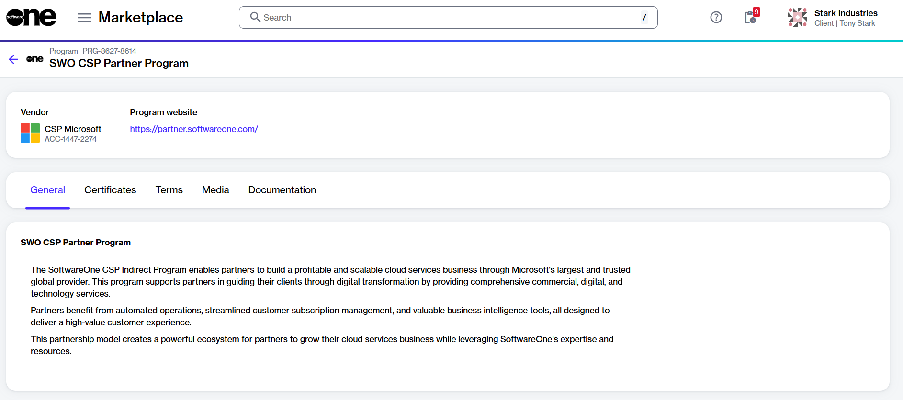

# How to Enroll in the SWO CSP Partner Program

The SoftwareOne (SWO) CSP Partner Program is designed for SoftwareOne partners to ensure compliance with our established terms and conditions.&#x20;

All SoftwareOne partners must enroll in this program to obtain a compliance certificate. This must be done before ordering products for resale. To learn more about this program, see [Partner Programs](../../../extensions/microsoft-cloud-solution-provider/partner-programs.md).

## Prerequisites 

You can enroll in the **SWO CSP Partner Program** if your account has been set up as a partner account. For details on how to check this, see [How to Verify If Your Account Has Partner Capabilities](how-to-verify-if-your-account-has-partner-capabilities.md).

## Enrolling in the SWO CSP Partner program



**Open the SWO CSP Partner Program details page**

To open the details page:

1. In the Marketplace Platform, navigate to the **Programs** page. The page is located under **Marketplace** in the main navigation menu.
2. Select **SWO CSP Partner Program**. The program's details page opens.

<figure><figcaption>
SWO CSP Partner Program details page
</figcaption></figure>



**Start the Add Certificate wizard**

To start the wizard:

1. On the details page, select the **Certificates** tab.
2. Select **Add** to start the **Add certificate** wizard.



**Use the Add Certificate wizard to enroll**

To enroll in the program, complete all steps within the wizard. Make sure to enter or verify the required information on each page.

1. **Certificant** - Choose the buyer you want to enroll in the program, then select **Next**.
2. **Details** - Provide a name for the certificate and select **Next**.&#x20;
3. **Overview** - Review the details and then select **Add**.
4. **Summary** - Select **View details** to open the enrollment details page. Otherwise, select **Close**.



## Next steps

Upon successful enrollment, a certificate will be created. You'll need to select this certificate when ordering CSP products and services through the platform.
