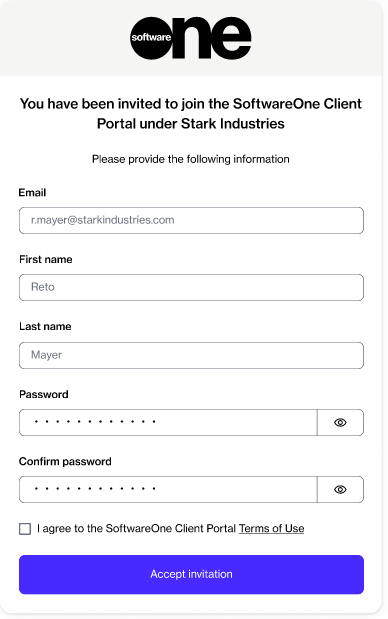
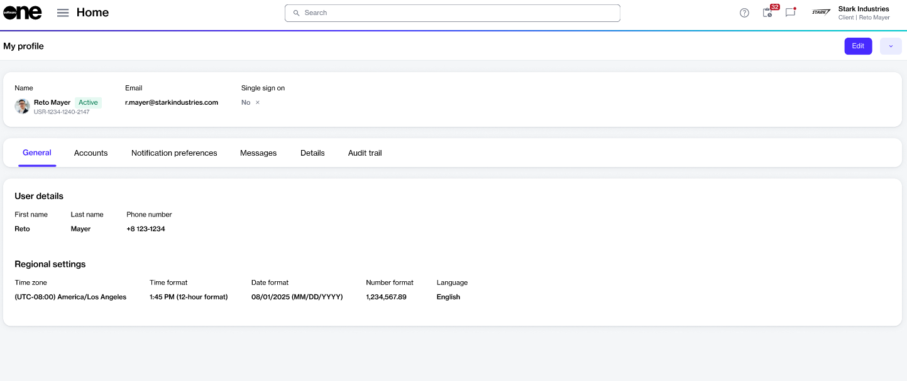
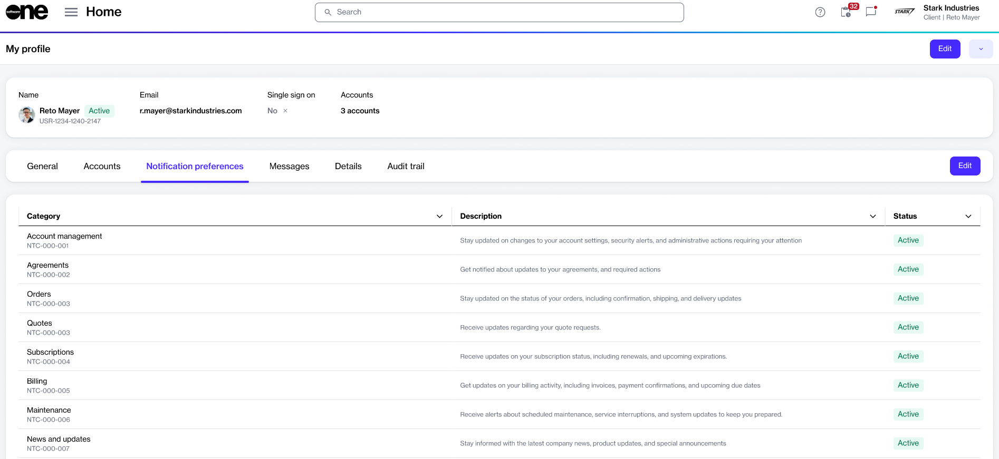
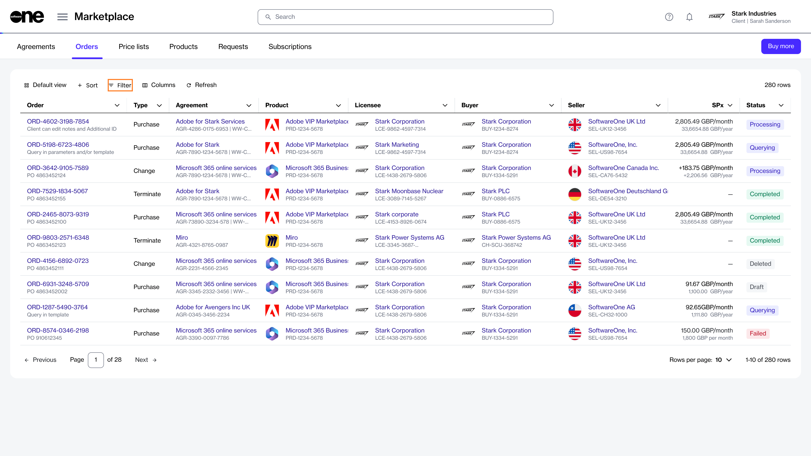
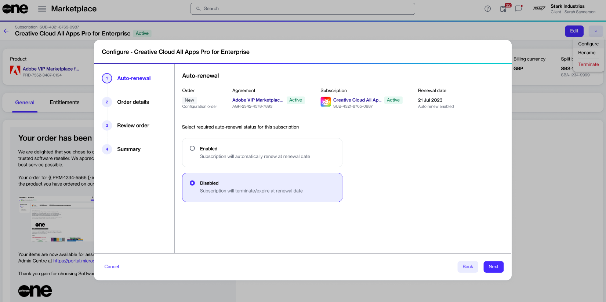

# Quickstart Guide

This quickstart guide explains how to get set up in the Marketplace Platform, make your first purchase, track orders, and self-manage your subscription.

The page is split into tasks. Each task contains information and further links to detailed instructions.&#x20;



### Get access to the platform

To get started, you’ll need to have an account on the platform.

Confirm your organization has Marketplace access

* If your organization already uses the Marketplace Platform, ask your account administrator to invite you. Administrators can follow the [Add New Users](../../modules-and-features/settings/users/add-new-users.md) page for information on inviting members.
* If your organization does not have an account, [contact us](https://www.softwareone.com/en/contact-us) to get started.

Accept the invitation and sign in

When your administrator or SoftwareOne adds you to an account, you will receive an invitation email. This email contains a link to join the account.&#x20;

**To accept the invitation**

1. Select the invite link in your email.&#x20;
2. Select **Accept invitation**.&#x20;
3. On the registration page, do the following:
   1. Enter your first name and last name.
   2. Enter a new password and then confirm that your new password matches the one you entered in the **Password** field.&#x20;
   3. Select the terms of use.
   4. Select **Accept invitation**.

<figure><figcaption>
Register your account
</figcaption></figure>

4. [Sign in to your account](https://portal.platform.softwareone.com/) using your email address and password.




### Set up your account

After signing in to your account, set up your profile and define preferences, including your name, profile picture, account language, and timezone.&#x20;

If you are an account administrator, you can perform additional account setup tasks, like creating user groups and inviting additional users to your account.

Customize your profile

You can configure your profile using the **My profile** option in your account menu.&#x20;

**To update your profile**

1. On the **My profile** page, select **Edit**.&#x20;
2. Do the following as necessary:&#x20;
   * Update your name and contact information.
   * Add a profile picture.
   * Set your timezone and language preferences.

<figure><figcaption>
Select the Edit option to update your profile
</figcaption></figure>

Manage your notifications

You can subscribe to email alerts or opt out of notification categories from your profile page.&#x20;

**To manage notifications**

1. Navigate to **My profile** page.
2. &#x20;Select the **Notification Preferences** tab, then select **Edit**.

<figure><figcaption>
Use the Edit option to manage notifications
</figcaption></figure>

3. Use the checkboxes to enable or disable a category.&#x20;
4. Save your changes.


You can also update your preferences using the **Manage notifications** link in the footer of your notification email. This option allows you to update preferences without signing in to your account. For more details, see [Manage Notification Preferences](../platform-overview/preferences-and-settings/manage-notification-preferences.md).


Create user groups (Administrators only)

Administrators can create new groups and assign members to those groups. Additionally, administrators can select modules that group members should have access to and restrict group members to certain buyers.

**To create a new group**

1. Navigate to the [Groups page](../../modules-and-features/settings/groups/), then select **Add**.
2. In the **Add group** wizard, configure the group:
   1. Add a group name and description.
   2. Select the required modules.
   3. Choose the required buyers.
   4. Select available users.

For more information, see [Create New Group](../../modules-and-features/settings/groups/create-new-group.md).

Invite additional users if needed (Administrators only)

Administrators can invite additional users to their account.

**To add a new user**

1. Navigate to the [Users page](../../modules-and-features/settings/users/), then select **Add**.
2. In the **Add user** wizard, enter the user's details and select the required user groups.

For more information, see [Add New Users](../../modules-and-features/settings/users/add-new-users.md).

<figure><figcaption>
Add a new user to your account
</figcaption></figure>




### Make your first purchase

When you’re ready to make your first purchase, browse the catalog to view the available products, then place your order.

Find the desired product

There are two primary ways of finding products in the Marketplace.

**To find products**

* Use the [global search bar](../platform-overview/interface/#using-the-search-feature). Start by typing the product name, ID, or vendor. The platform will display results that match your search term.
* [Visit the Products page](../../modules-and-features/catalog/products.md).

Start the purchase wizard

The purchase wizard contains guided steps to submit an order. After you have identified the product to buy, starting the purchase wizard is straightforward.

**To start the purchase wizard**

1. On the **Products** page, select the desired product.
2. Review the product description, list of available items, and other details.
3. Select **Buy now**. The purchase wizard starts.

<figure><figcaption>
The purchase wizard containing guided steps to place an order
</figcaption></figure>

Submit your purchase order

To submit an order, make sure you have completed all the necessary steps in the purchase wizard.&#x20;

The ordering steps might vary slightly depending on the product you are ordering. Generally, the following steps are needed:

1. **Select agreement** - Choose an existing agreement or create a new one. The option you select in this step determines the next step. For example, selecting a new agreement takes you to the **Select licensee** step, while choosing an existing agreement directs you to the **Select items** step.
2. **Select licensee** - Choose an existing licensee or create a new one.
3. **Agreement details** - Complete the contact form with the required information.
4. **Select items** - Choose the items you want to order and adjust the quantities as needed.&#x20;
5. **Additional information** - Provide any additional IDs for the order and agreement.
6. **Review order** - Review the order details, read the terms and conditions, and place your order.

For product-specific tutorials, see the following pages:

* [Order Adobe Subscription](../../extensions/adobe-vip-marketplace/tutorials-and-videos/order-adobe-subscription.md)
* [Order FinOps for Cloud from Marketplace](../../extensions/finops-for-cloud/order-finops-for-cloud-from-marketplace.md)
* [Order Microsoft 365 Subscription for New Tenant](../../extensions/microsoft-cloud-solution-provider/tutorials-and-videos/order-microsoft-365-subscription-new-tenant.md)
* [Order Microsoft 365 Subscription for Existing Tenant](../../extensions/microsoft-cloud-solution-provider/additional-resources/tutorials-and-videos/microsoft-365/order-microsoft-365-subscription-existing-tenant.md)
* [Order Azure Subscription for New Tenant](../../extensions/microsoft-cloud-solution-provider/additional-resources/tutorials-and-videos/microsoft-azure/order-microsoft-azure-subscription-new-tenant.md)
* [Order Azure Subscription for Existing Tenant](../../extensions/microsoft-cloud-solution-provider/additional-resources/tutorials-and-videos/microsoft-azure/order-microsoft-azure-subscription-existing-tenant.md)
* [Buy Perpetual Software Licenses](../../extensions/microsoft-cloud-solution-provider/additional-resources/tutorials-and-videos/perpetual-software/buy-perpetual-software-licenses.md)
* [Create New AWS Account](../../extensions/amazon-web-services/tutorials/create-new-aws-account.md)




### Track your order

After placing the order, use the **Orders** page to view detailed information and check the status.

Check the status of your order

**To track your order's status**

* Use the **Status** column on the **Orders** page, or select the order number to open the details page.

<figure><figcaption>
View your orders and track status
</figcaption></figure>

When tracking orders, look for key statuses such as:&#x20;

* **Querying** - Indicates that you need to provide additional information before we can process your order. For querying orders, the **General** tab on the details page will outline the required information and the steps you need to take.
* **Processing** - Indicates that we are processing your order.&#x20;
* **Completed** - Indicates that your order has been processed.
* **Failed** - Indicates that the order has either been failed by the vendor or SoftwareOne. The failure reason is displayed on the order details page.

For additional order statuses, see [Order States](../../modules-and-features/marketplace/orders/order-states.md).




### Manage your subscription

After your order has been provisioned, manage your subscription from the **Subscriptions** page. This includes increasing or reducing the number of licenses and managing your subscription's renewal.

Increase or reduce licenses

You can adjust the number of licenses for a subscription by submitting a change order for the subscription.&#x20;

**To increase or reduce licenses**

1. Navigate to the **Subscriptions** page.
2. Select the desired subscription.
3. Select **Edit**, then follow the steps in the **Edit subscription** wizard to increase or reduce licenses.
4. When done, select **Place order** to submit your change order.

For detailed information, see the following pages:

* [Downsize Adobe Subscription](../../extensions/adobe-vip-marketplace/tutorials-and-videos/downsize-adobe-subscription.md)
* [Upsize Adobe Subscription](../../extensions/adobe-vip-marketplace/tutorials-and-videos/upsize-adobe-subscription.md)
* [Buy More Licenses for Microsoft 365 Subscription](../../extensions/microsoft-cloud-solution-provider/tutorials-and-videos/buy-more-licenses-for-microsoft-365-subscription.md)

Disable automatic renewal

You can disable the automatic renewal for a subscription by submitting a configuration order.&#x20;

**To disable automatic renewal**

1. Navigate to the **Subscriptions** page, then select the desired subscription.
2. On the subscription details page, select the arrow , then choose **Configure**.
3. Choose **Disable** and complete the remaining steps to submit your order.&#x20;

<figure><figcaption>
Select Disable to prevent your subscription from renewing automatically
</figcaption></figure>

Once auto-renewal is disabled, your subscription will expire at the end of the commitment period or renewal date, and you will not be billed after that.&#x20;

For more information, see [Manage Automatic Renewals](../../modules-and-features/marketplace/subscriptions/manage-automatic-renewals.md).




### Next steps 

<table data-card-size="large" data-view="cards"><thead><tr><th></th><th></th><th data-hidden data-card-target data-type="content-ref"></th></tr></thead><tbody><tr><td><strong>Buy more items</strong></td><td>Order new items using your existing Marketplace agreement.</td><td><a href="marketplace-for-clients/add-items-to-an-agreement.md">add-items-to-an-agreement.md</a></td></tr><tr><td><strong>Understand your billing documents</strong></td><td>Understand how to read and interpret your invoices and statements.</td><td><a href="../../modules-and-features/billing/understand-your-billing-documents/">understand-your-billing-documents</a></td></tr><tr><td><strong>View and download invoices</strong></td><td>Access your Marketplace invoice PDFs.</td><td><a href="../../modules-and-features/marketplace/billing/invoices/download-invoices.md">download-invoices.md</a></td></tr><tr><td><strong>View and download statements</strong></td><td>Access your statement spreadsheets.</td><td><a href="../../modules-and-features/marketplace/billing/statements/download-statements.md">download-statements.md</a></td></tr></tbody></table>

### FAQs

If I need assistance with the platform, who should I contact?

You can contact the Marketplace Platform Support team. For details on how to contact us, see [Contact Support](../../help-and-support/contact-support.md).&#x20;

As an administrator, how do I review and manage account settings like added groups, users, licensees, and more?

You can use the [Settings module](../../modules-and-features/settings/) to manage account-wide settings and other properties.

I would like to know more about managing subscriptions and agreements.

For details on self-managing your subscriptions and agreements, including terminations, see the following tutorials:

* [Adobe VIP Marketplace](../../extensions/adobe-vip-marketplace/tutorials-and-videos/)
* [Microsoft 365](../../extensions/microsoft-cloud-solution-provider/additional-resources/tutorials-and-videos/)
* [Amazon Web Services](../../extensions/amazon-web-services/tutorials/)

Do you offer public APIs that allow programmatic interaction with the platform?

Yes, you can download the [OpenAPI 3.0 specification](../../developer-resources/rest-api/openapi-specification.md) of our [REST APIs](../../developer-resources/rest-api/) and use them with tools of your choice.&#x20;

I'm a SoftwareOne Partner. What do I need to know to get started?

Partners accounts include all the features and functionalities of client accounts, along with additional features to facilitate transactions and procurement for reselling software.&#x20;

The [Marketplace for Partners](marketplace-for-partners/) section contains a video guide and help pages describing how to use the Marketplace Platform as a SoftwareOne partner.

I have additional questions on certain topics.

If you need more information, see the following pages for detailed answers and resources:

* [Adobe VIPM Marketplace FAQs](../../extensions/adobe-vip-marketplace/faqs/)
* [Amazon Web Services FAQs](../../extensions/amazon-web-services/faqs/)
* [Microsoft CSP FAQs](../../extensions/microsoft-cloud-solution-provider/faqs/)
* [Platform FAQs](../../help-and-support/faqs/)
* [Partner FAQs](marketplace-for-partners/partner-faqs.md)

