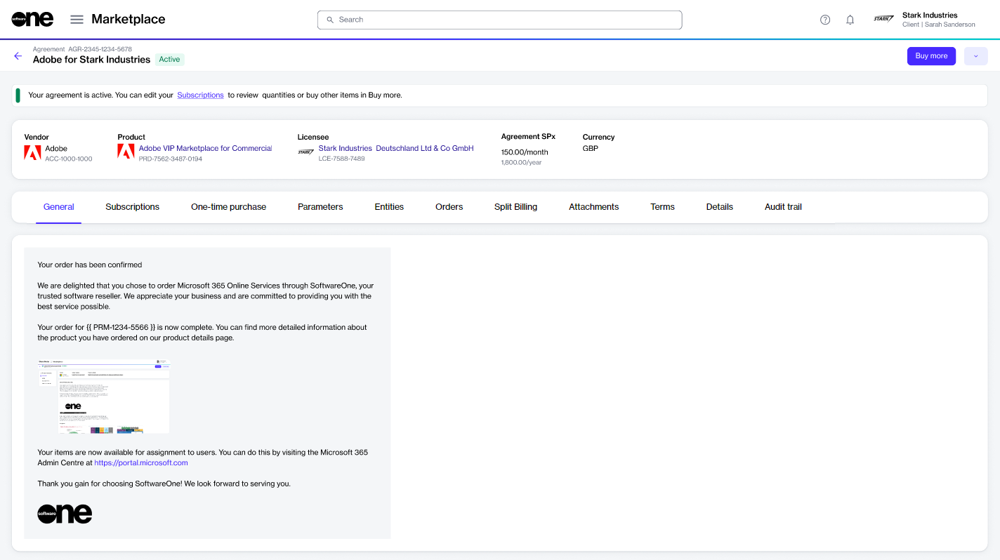
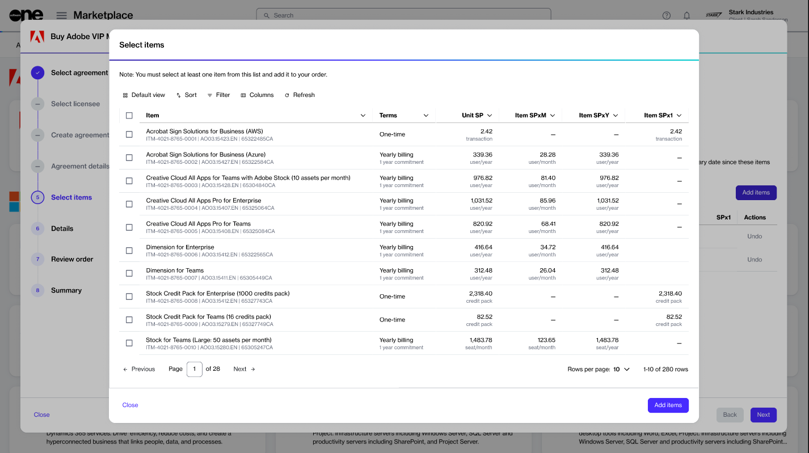

# How to add more items to an agreement

This tutorial describes how to add more items to your existing Marketplace agreement.

New items can be added using **Buy more** on the **agreement details** page. When you start from **Buy more**, the purchase wizard opens directly on the **Items** step.


You can add items only to active agreements. If the agreement is not active, the **Buy more** option is unavailable.


### Adding new items to an agreement



**Start from the agreement**

1. Go to **Marketplace** > **Agreements**.
2. Select the agreement you want to update.
3. On the **agreement details** page, select **Buy more**.

<figure><figcaption>
Select Buy more to start from the Items step.
</figcaption></figure>




**Add the new items**

1. Under **Items**, select **Add items**.
2. In **Select items**, choose the items you want to order. Make sure to check the billing terms and duration.
3. Select **Add items** again.
4. Set the quantity of your newly added items in the **New qty** field.
5. Select **Next**.

<figure><figcaption>
Select the items you want to add to the agreement.
</figcaption></figure>




**Review and submit**

1. Under **Details**, add or update the reference ID and your comments. Select **Next**.
2. Under **Review**, verify the information, then select **Place order**.
3. Select **View details** to open the order details page, or select **Close**.



### Next steps

After you place the order, a change order is created for the agreement and sent to the vendor for fulfillment.

The agreement status also changes from **Active** to **Updating**. While the agreement is updating, you cannot place more orders under that agreement.

You can track the order on the **Orders** page or in the **Orders** tab on the **agreement details** page.
