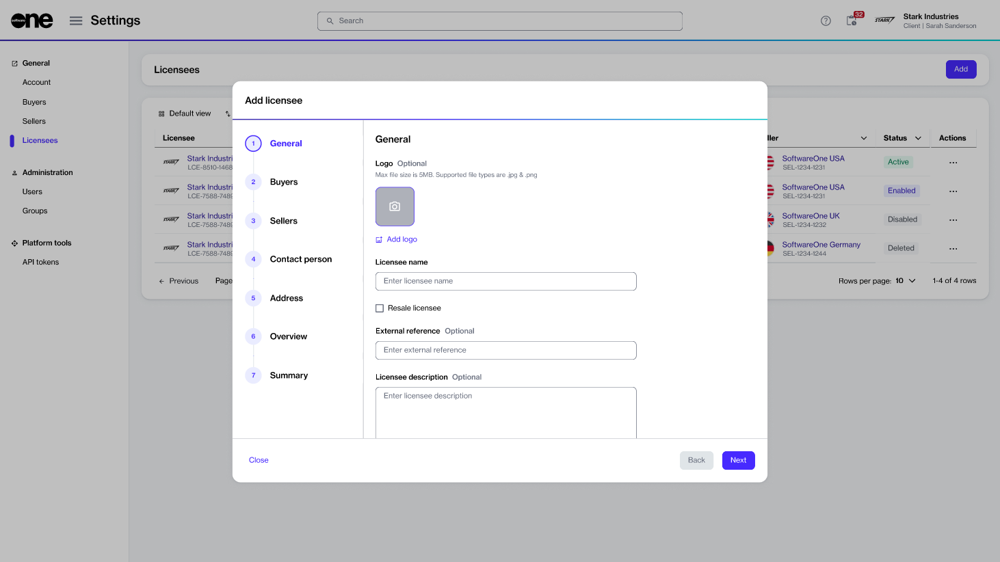

# How to configure a licensee for resale

This tutorial describes how SoftwareOne partners can set up resale licensees.

You must mark a licensee for resale if you want to order products for resale instead of your own consumption.

### Prerequisites

Before you start, make sure you have account administrator permissions. Only admins can create new licensees.

### Configuring a licensee for resale



**Start the Add Licensee wizard**

1. Go to **Settings** > **Licensees**.
2. Select **Add**.

<figure><figcaption>
The Add licensee wizard in the platform.
</figcaption></figure>




**Enter the licensee details**



1. **General** – Enter the licensee details, then select **Next**:
   1. **Logo** – Upload a logo or drag it into the field.
   2. **Licensee name** – Enter a name for the licensee. This can be your company name, department name, or username.
   3. **Resale licensee** – Select this checkbox to use the licensee for resale ordering.
   4. **External reference** – Enter your internal reference or identifier for the licensee.
   5. **Licensee description** – Add a short description.
2. **Buyers** – Select the buyer to link to the licensee, then select **Next**. A licensee can link to one buyer only.
3. **Sellers** – Select the seller to order from, then select **Next**.
4. **Address** – Use the same address as the buyer or enter a new one, then select **Next**.



**Review and create the licensee**

1. **Overview** – Review the details, then select **Add**.
2. **Summary** – Select **View details** to open the licensee details page, or select **Close**.



### Next steps

After you create the licensee, you can order products for resale through the **Products** page. For details, see [How to order products for resale](how-to-order-products-for-resale.md).
