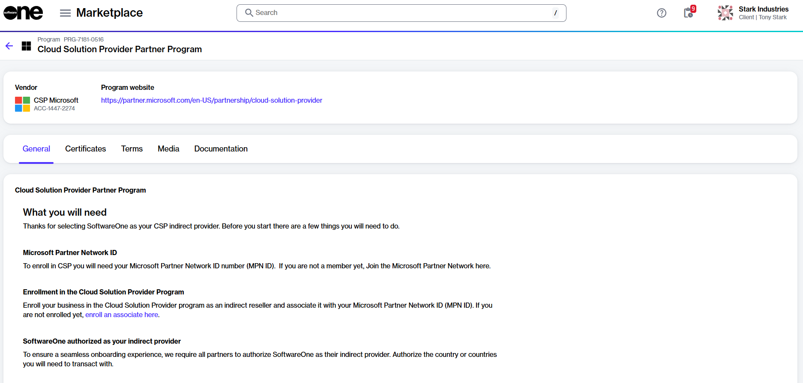

# How to enroll in the CSP partner program

The **Cloud Solution Provider Partner Program** allows you to partner with SoftwareOne as your indirect CSP provider. To learn more about this program, see [Partner Programs](../../../extensions/microsoft-cloud-solution-provider/products-and-programs/partner-programs.md).

### Prerequisites 

To enroll in the CSP partner program:

* You must have a Marketplace account with partner capabilities. For details, see [How to verify if your account has partner capabilities](how-to-verify-if-your-account-has-partner-capabilities.md).
* You must be signed up for the Microsoft Cloud Solutions Provider (CSP) program as an indirect reseller. For details, see [Enroll as an indirect reseller](https://learn.microsoft.com/en-us/partner-center/enroll/enrolling-in-the-csp-program) in Microsoft documentation.
* You must be signed up for the SWO CSP Partner Program. For details, see [How to enroll in the SWO CSP partner program](how-to-enroll-in-the-softwareone-csp-partner-program.md).
* You must have the Microsoft Partner Network (MPN) ID and email address for your Microsoft partner account. To find the ID in the Microsoft Partner Center, select the **Settings** (gear) icon > **Account settings** > **Organization Profile** > **Identifiers**. Then, find the PartnerID with the **Type Location** that matches the country/region of this CSP account.

### Enrolling in the CSP Partner program



**Open the CSP Partner Program details page**

To open the details page:

1. Go to **Program** > **Programs**.
2. Select **Cloud Solution Provider Partner Program**.

<figure><figcaption>
The details page of the Cloud Solution Provider Partner Program.
</figcaption></figure>




**Start the Add Certificate wizard**

To start the wizard:

1. On the **program details** page, select the **Certificates** tab.
2. Select **Add**.



**Use the Add Certificate wizard to enroll**

1. **Certificant** - Choose the buyer for this certificate, then select **Next**.
2. **Partner details** - Do the following, then select **Next**:&#x20;
   1. Authorize SoftwareOne as your indirect provider. You must select a country that is within your region. For regional markets, see [Microsoft Regions](https://learn.microsoft.com/en-us/partner-center/enroll/regional-authorization-overview).&#x20;
   2. Enter the email address associated with your Microsoft partner account. We will use this email address to link your CSP customers with your Microsoft reseller account.
   3. Enter the Microsoft Partner Network ID associated with your Microsoft partner account. We'll associate your Microsoft subscriptions with the MPN ID.
3. **Details** - Enter a certificate name, then select **Next**.
4. **Overview** - Review the details, then select **Add**.
5. **Summary** - Select **View details** to open the enrollment details page, or select **Close**.



### Next steps

The enrollment takes a few minutes to complete as we verify the details.&#x20;

When it completes, a certificate is created. You can use this certificate when placing your order.&#x20;
