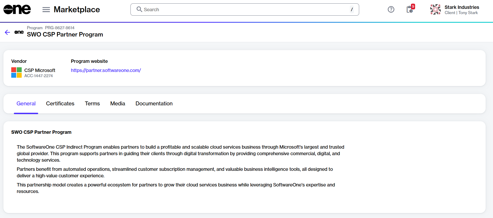

# How to enroll in the SWO CSP partner program

The SoftwareOne CSP Partner Program is for SoftwareOne partners to ensure compliance with our established terms and conditions.&#x20;

All SoftwareOne partners must enroll in this program to obtain a compliance certificate. This enrollment is required to order products for resale. To learn more about this program, see [Partner programs](../../../extensions/microsoft-cloud-solution-provider/products-and-programs/partner-programs.md).

### Prerequisites 

Make sure your account has been set up as a partner account. For details, see [How to verify if your account has partner capabilities](how-to-verify-if-your-account-has-partner-capabilities.md).

### Enrolling in the SWO CSP Partner program



**Open the SWO CSP Partner Program details page**

To open the details page:

1. Go to **Program** > **Programs**.
2. Select **SWO CSP Partner Program**.

<figure><figcaption>
The details page of the SWO CSP Partner Program.
</figcaption></figure>




**Start the Add Certificate wizard**

To start the wizard:

1. On the **program details** page, select the **Certificates** tab.
2. Select **Add**.



**Complete the enrollment**

1. **Certificant** – Choose the buyer you want to enroll, then select **Next**.
2. **Overview** – Review the details, then select **Add**.
3. **Summary** – Select **View details** to open the enrollment details page, or select **Close**.



### Next steps

When the enrollment completes, a certificate is created. You can select this certificate when ordering CSP products and services.
