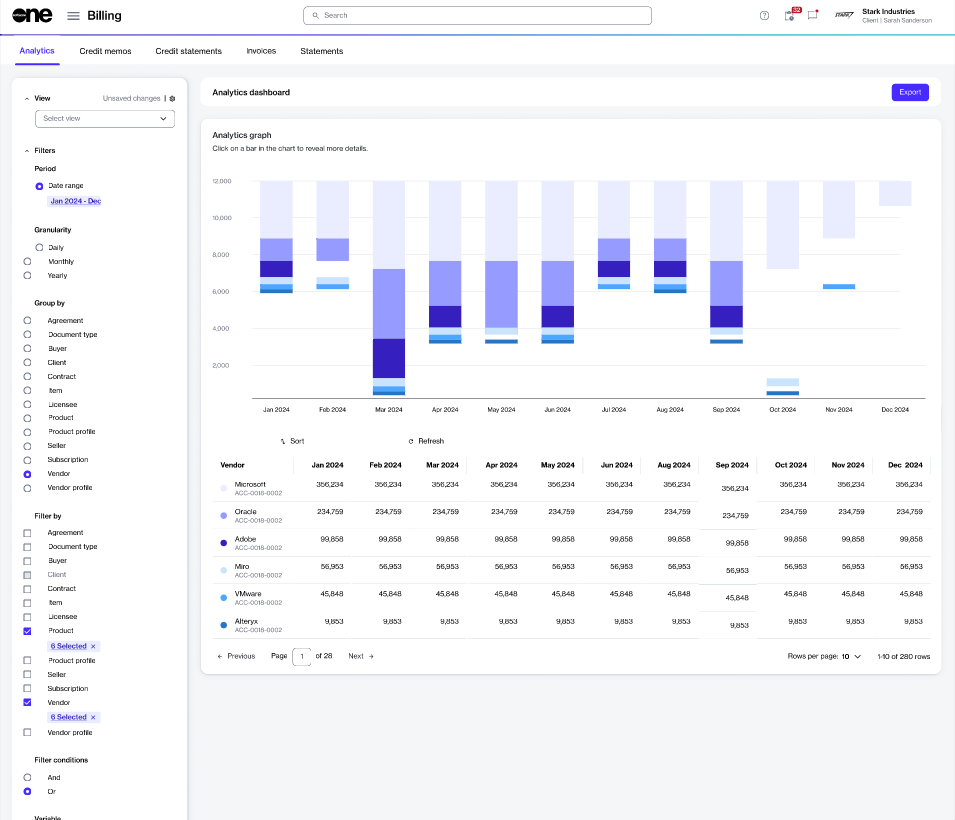

# Export billing data

The **Export** option on the **Analytics** page enables you to download your billing data in Excel, CSV, and PDF formats. This allows you to share your data with others by email or other methods.

When you download data, the exported file includes all data currently displayed on the **Analytics** page, which is determined by the filters and grouping criteria you have applied. You can create specific views and export the data for further analysis or reporting.

### Exporting billing data

To export the data:

1. Navigate to the **Analytics** page.
2. Under **Analytics dashboard**, select **Export** to download the file.

<figure><figcaption>
The Export option on the Analytics page to download data.
</figcaption></figure>

