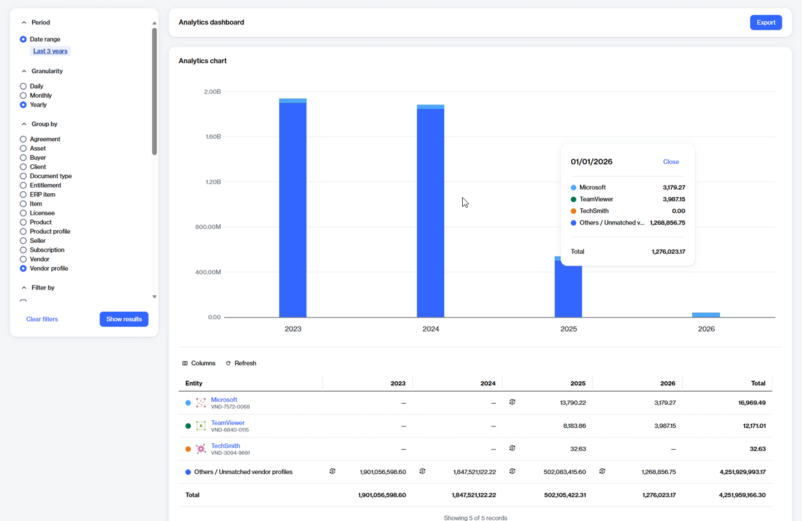

# Export billing data

The **Export** option on the **Analytics** page allows you to download your billing data as an Excel file, so you can share it with others by email or other methods.

While the visual chart within **Analytics** displays only your top 10 grouped entities, the Excel file provides you with a complete, unfiltered dataset.

### Exporting billing data

To export your billing data:

1. Go to **Billing** > **Analytics**.
2. In the left sidebar, apply your desired filters, then select Show **results**.
3. Under **Analytics dashboard**, select **Export** to download the file.

<figure><figcaption>
Use the Export option to download your complete billing data.
</figcaption></figure>

