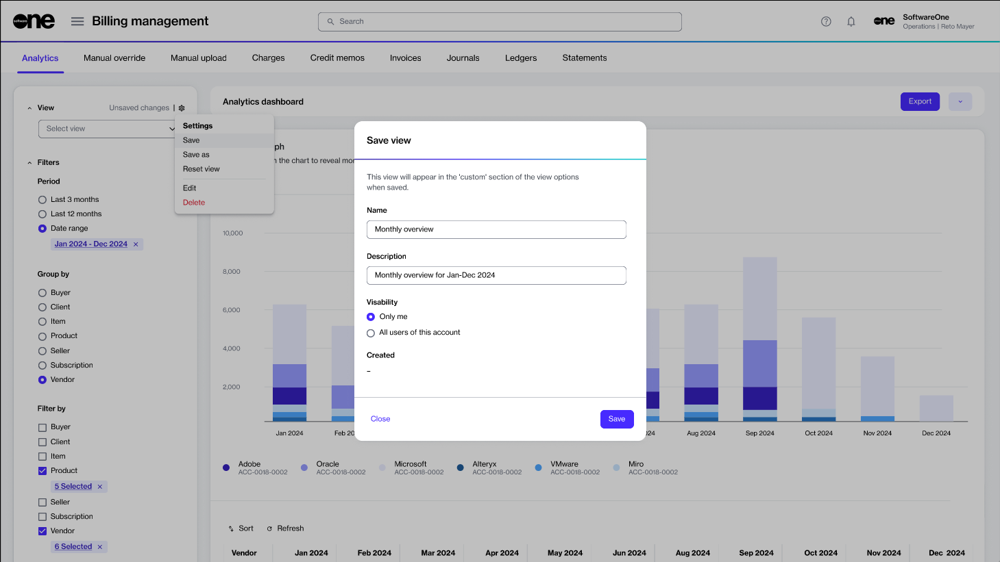

# Save and manage views

In **Analytics**, you can save your view containing filters and other settings for easy access to your frequently used insights.&#x20;

You can define a name for the view and choose whether you or anyone within your account should have access to this view. You can create multiple views.&#x20;

Saved views appear under the **View** list in the left sidebar. After creating a view, you can manage it by editing the group name and description and adjusting visibility. You can also delete a view permanently if it's no longer needed. Additionally, you can reset or save a copy of the view.

### Saving your current view

To save a view:

1. Navigate to the **Billing** > **Analytics** page.
2. Apply filters and other customizations as necessary.
3. Select the **Settings** icon , then choose **Save**.
4. In the **Save view** dialog, do the following:
   1. **Name** - Enter a name for the view.
   2. **Description** - Provide a brief description of the view.
   3. **Visibility** - Choose whether you want to restrict the visibility or allow others within your account to have access to this view.
   4. Select **Save**.

<figure><figcaption>
Save a view in Analytics to access it later.
</figcaption></figure>

### Editing or deleting saved views

To edit or delete a saved view:

1. Navigate to the **Billing** > **Analytics** page.
2. Under **Views** in the sidebar, select a view from the list.
3. Do the following as necessary:
   * To edit the view, select **Edit**, then update the name, description, and visibility.
   * To permanently delete the view, select **Delete**.&#x20;

### Selecting a saved view

To open a saved view:

1. Navigate to the **Billing** > **Analytics** page.
2. Under **Views** in the sidebar, select the required view.
