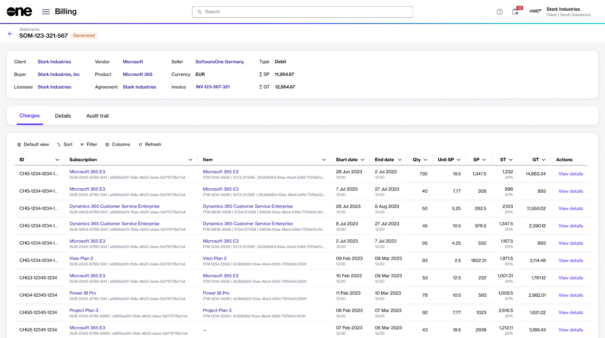

# View statements

This topic describes how to view statements in your account, as well as details about a specific statement.

### Viewing statements

To view your statements:

1. Go to **Billing** > **Statements**.&#x20;
2. View the list of statements displayed on the page.
3. Review properties, such as statement ID, the total amount due, status, and more. You can also view the statement type. A **Debit** type means that the total amount is positive or zero, and a **Credit** type means that the total amount is negative.

<figure><figcaption>
The Statements page in the Marketplace Platform.
</figcaption></figure>

### Viewing statement details 

On the **statement details** page, you can view detailed information for the statement. Some information is read-only, while others include links that allow you to navigate to further details.

To view statement details:

1. Go to **Billing** > **Statements**.
2. (Optional) Use filters to find the desired statement.
3. Select the statement ID. The details page of the statement opens.

<figure><figcaption>
The details page of a statement.
</figcaption></figure>

4. Use the tabs on the **statement details** page to access different types of information:

<table><thead><tr><th width="164">Tab</th><th>Description</th></tr></thead><tbody><tr><td><strong>Charges</strong></td><td>Displays a list of charges and subscriptions for the billing period.</td></tr><tr><td><strong>Attachments</strong></td><td>Allows you to view and download the statement. </td></tr><tr><td><strong>Details</strong></td><td>Displays reference information, like the additional IDs and timestamps.</td></tr><tr><td><strong>Audit trail</strong></td><td>Displays a record of events related to the statement. For details, see <a href="../../settings/audit-trail.md">Audit Trail</a>.</td></tr></tbody></table>
