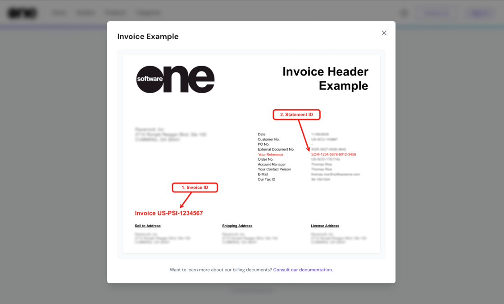

# Billing FAQs

This page contains frequently asked questions about your financial documents, including invoices and statements.&#x20;

Where can I find my invoice ID and statement ID?

You can find these IDs in the [invoice header](./#invoice-header).

<figure><figcaption>
An invoice header containing your invoice and statement IDs. 
</figcaption></figure>

How do I access my invoices?

You can view and download your invoices from the **Invoices** page in the platform. For details, see [View and Download Invoices](../../marketplace/billing/invoices/download-invoices.md).

What is the difference between a compact invoice and a detailed invoice?

A compact invoice is issued for statements with a large number of charges. All charges for a product or service are grouped into summarized invoice lines, and quantities are shown as `1` to represent the aggregate charge for each item.&#x20;

In contrast, a detailed invoice is for statements with fewer charges. Each charge is shown as a separate line.

For more information, see [Understand Your Billing Documents](./).

How can I identify the type of invoice I have?

The type of invoice you receive is specified in the [description column on the invoice](./#invoice-line-item-details).&#x20;

* If you have a detailed invoice, it will state: _“See statement for this DETAILED invoice at:”_&#x20;
* If you have a compact invoice, the message will read: _“See statement for this COMPACT invoice at:”_

Both invoice types include a link to the relevant statement, so you can download a complete breakdown of the charges if necessary.

Can I download statements without signing in to the account?

Yes, if you don’t have access to your account, you can download a statement from the [Billing Statement Download](https://mystatements.platform.softwareone.com/) page. You'll need to provide your Invoice ID and Statement ID.&#x20;

To learn more, see [Download Statements](../../marketplace/billing/statements/download-statements.md).

Why does my invoice only show a single line per item with a quantity of 1?

On [compact invoices](billing-faqs.md#billing-invoices), the quantity is shown as `1` to consolidate all charges at the item level. This is done to simplify the invoice and prevent complexity.&#x20;

For actual item quantities and charges, see your billing statement.

How do I get a detailed breakdown of my charges if I'm only seeing summarized lines?

You can get a breakdown using the statement link at the top of your invoice. This allows you to download or view the full, itemized breakdown.

Can I request a detailed invoice even if I have a high number of transactions or charges?

Currently, detailed invoice formatting is determined automatically by the number of charges.&#x20;

For high-volume billing, the platform uses the compact format by default to ensure compatibility with standard accounting practices and technical limits.

How do I display a purchase order number on the invoice? 

You can include a purchase order number by entering it in the **Additional ID** field, located on the **Details** tab within the agreement details page.&#x20;

For more information, see [How do you handle purchase order numbers in subscription-based models?](../../../help-and-support/faqs/how-do-you-handle-purchase-order-numbers-in-subscription-based-models.md) and [Update Additional Client ID](../../marketplace/agreements/edit-agreement-id.md).

